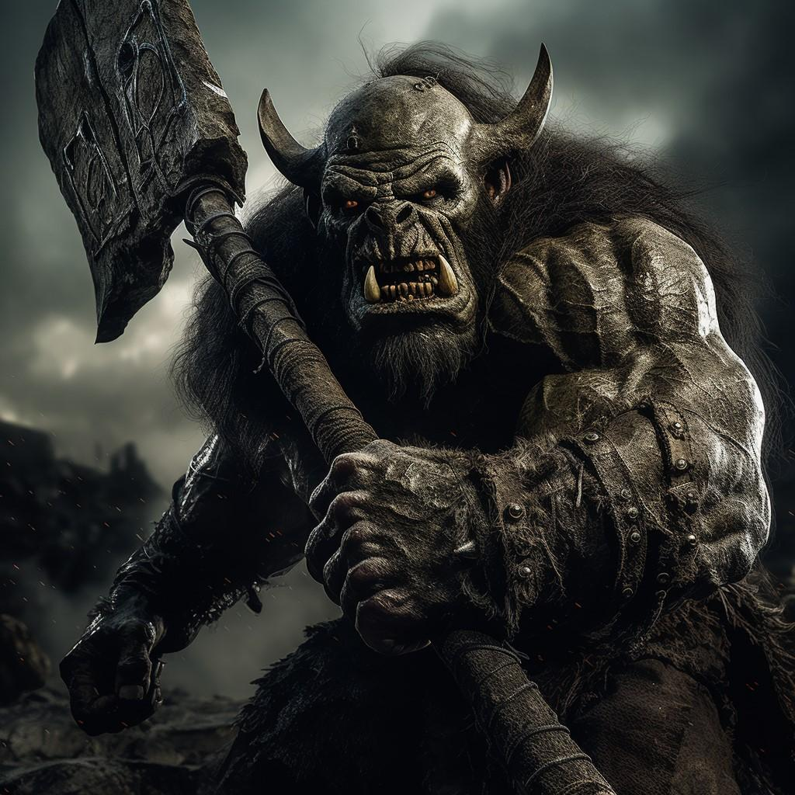

# Wakog

- :octicons-info-24:{ .lg .middle } __Biographical Information__

    An ogre (he/him)  
    Killed in battle by The Heroes of Cleenseau on December 6th, 1719  
    { .bio }

    Lived in [Wakog's Camp](<../../gazetteer/greater-sembara/duchy-of-maseau/wakog-s-camp.md>), the [Duchy of Maseau](<../../gazetteer/greater-sembara/duchy-of-maseau/duchy-of-maseau.md>)

{align="right"; width="320"}An ogre of unclear origin. 

