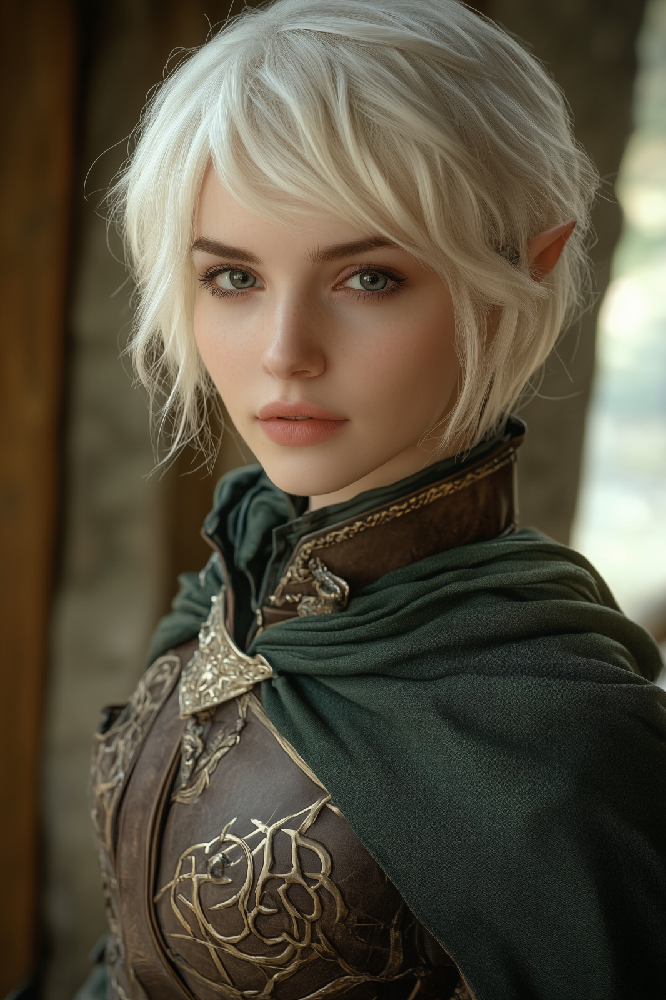

# Drou

- :octicons-info-24:{ .lg .middle } __Biographical Information__

    An [elf](<../../../species/elves.md>) (she/her), ([ka](<../../../background/elven-cycle-of-generations.md>) 37)  
    { .bio }

    Originally from: [Orenlas](<../../../gazetteer/upper-istaros/orenlas/orenlas.md>)
    Based in [Addermarch](<../../../gazetteer/greater-sembara/addermarch/addermarch.md>)
    :simple-dungeonsanddragons:{ .middle} [Character Sheet](https://www.dndbeyond.com/characters/131356005) 

{align="right"; width="400"}Drou is a graceful dancer, singer, and musician from [Orenlas](<../../../gazetteer/upper-istaros/orenlas/orenlas.md>), who has wandering around [Tyrwingha](<../../../gazetteer/greater-sembara/tyrwingha/tyrwingha.md>) and [Addermarch](<../../../gazetteer/greater-sembara/addermarch/addermarch.md>) bringing joy to people's lives through music and dance. 

