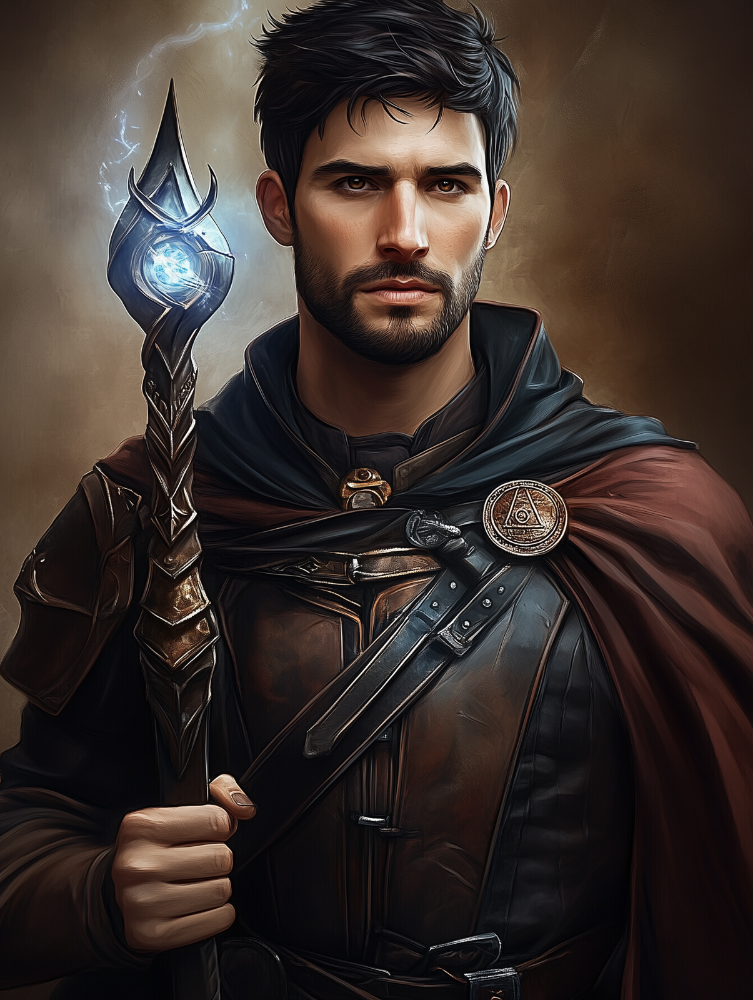

# Fazoth de Brune

- :octicons-info-24:{ .lg .middle } __Biographical Information__

    A [Sembaran](<../../../gazetteer/greater-sembara/sembara/sembara.md>) [human](<../../../species/humans.md>) (he/him)  
    { .bio }

    Originally from: [Eskbridge](<../../../gazetteer/greater-sembara/sembara/heartlands/eskbridge.md>), the [Duchy of Wisford](<../../../gazetteer/greater-sembara/sembara/heartlands/duchy-of-wisford.md>), [Sembara](<../../../gazetteer/greater-sembara/sembara/sembara.md>)
    Based in [Addermarch](<../../../gazetteer/greater-sembara/addermarch/addermarch.md>)
    :simple-dungeonsanddragons:{ .middle} [Character Sheet](https://www.dndbeyond.com/characters/131334028) 

{align="right"; width="400"}Fazoth de Brune, a younger scion of the wealthy de Brune family, grew up with a life of privilege on the outskirts of [Eskbridge](<../../../gazetteer/greater-sembara/sembara/heartlands/eskbridge.md>), thanks to his family's wealth and position. At the age of 22, he left [Sembara](<../../../gazetteer/greater-sembara/sembara/sembara.md>) for [Addermarch](<../../../gazetteer/greater-sembara/addermarch/addermarch.md>). 

