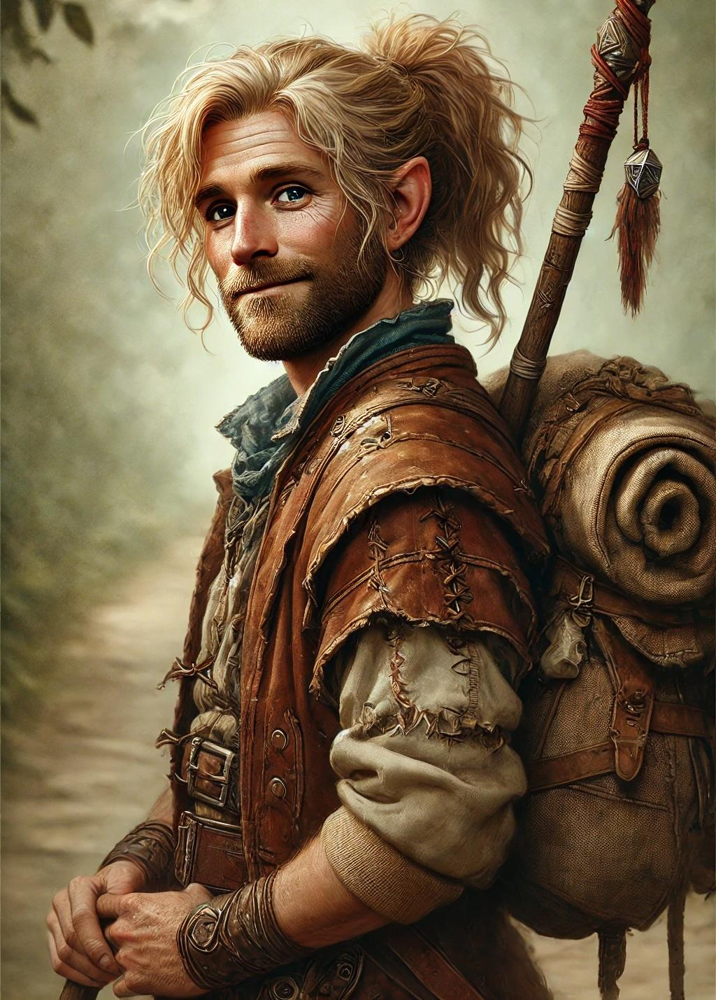

# Yvan Greenrabbit

- :octicons-info-24:{ .lg .middle } __Biographical Information__

    A [halfling](<../../../species/halflings.md>) (he/him), of Greenrabbits  
    { .bio }

    Originally from: [Sembara](<../../../gazetteer/greater-sembara/sembara/sembara.md>)
    Based in [Addermarch](<../../../gazetteer/greater-sembara/addermarch/addermarch.md>)
    :simple-dungeonsanddragons:{ .middle} [Character Sheet](https://www.dndbeyond.com/characters/131340283) 

{align="right"; width="400"}Yvan Greenrabbit is a [halfling](<../../../species/halflings.md>), originally from [Sembara](<../../../gazetteer/greater-sembara/sembara/sembara.md>), who left his family caravan to travel, eventually finding his way to [Addermarch](<../../../gazetteer/greater-sembara/addermarch/addermarch.md>).

