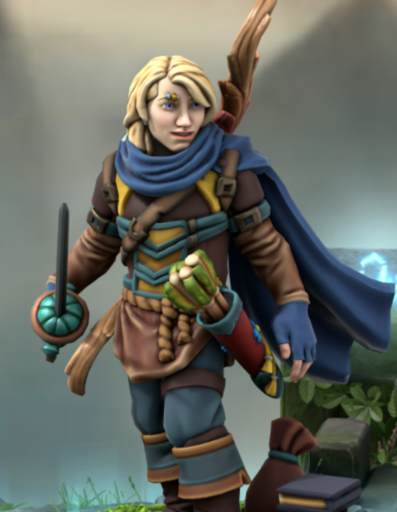
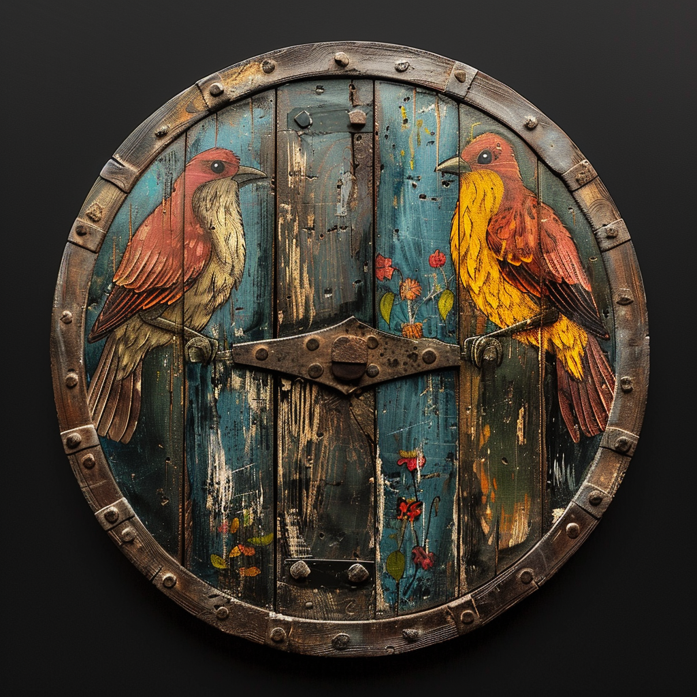
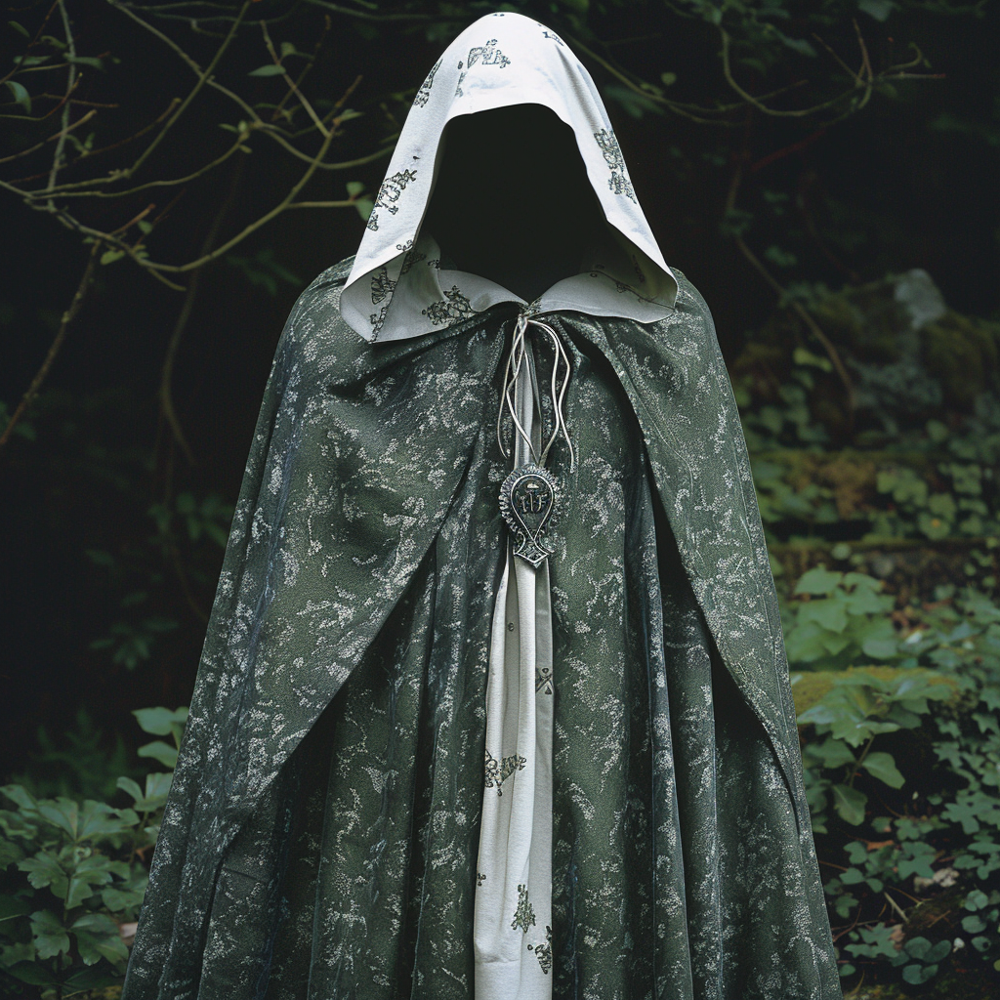

# Celyn

- :octicons-info-24:{ .lg .middle } __Biographical Information__

    A [Tyrwinghan](<../../../gazetteer/greater-sembara/tyrwingha/tyrwingha.md>) [human](<../../../species/children-of-divine-creation/humans/humans.md>) (he/him)  
    Born DR 1697 (52 years old)  
    Member of the [Heroes of Cleenseau](<./heroes-of-cleenseau.md>)  
    Member of the Mahaut's Miracle Players (December 1717 - June 29th, 1719)  
    { .bio }

    Originally from: [Clawyn](<../../../gazetteer/greater-sembara/tyrwingha/clawyn.md>), [Tyrwingha](<../../../gazetteer/greater-sembara/tyrwingha/tyrwingha.md>)
    :simple-dungeonsanddragons:{ .middle} [Character Sheet](https://www.dndbeyond.com/characters/90849827) 

:octicons-location-24:{ .lg .middle } Last known location (as of October 17th, 1720): traveling to [Cleenseau](<../../../gazetteer/greater-sembara/sembara/barony-of-aveil/cleenseau-region/cleenseau/cleenseau.md>), the [Manor of Cleenseau](<../../../gazetteer/greater-sembara/sembara/barony-of-aveil/cleenseau-region/manor-of-cleenseau.md>), the [Barony of Aveil](<../../../gazetteer/greater-sembara/sembara/barony-of-aveil/barony-of-aveil.md>)

{align="right"; width="400"}Celyn is a slightly short, pale, blond young human man, probably in his early twenties, with quick hands and a wide, open blue-eyed attention.  His demeanor is generally cheerful if perhaps a bit naive; he appears to be amiably accepting of a number of the foibles of other people around him where someone else might make comment.  Perhaps this is related to the way he is utterly unapologetic about his own quirks, which are reasonably numerous and include frequent references to luck and good fortune, current objects of his apparently infinite curiosity, and off-the-wall commentary.  He does not make eye contact but is very clearly attentive to conversations he’s in; he has small brief rituals that he does when drinking wine.  
  
He wears studded leather armor, and where his leathers are not brown they are largely done in colors of blue and yellow, perhaps because they go with his hair and eyes.  While he is kitted out like a rogue in general, he also carries a small wooden shield (not routinely, but when he’s anticipating trouble), which has been painted (not skillfully) with two blobs of color which vaguely resemble birds and has some interesting nature-y bits tied to it.  He also has a drum which has been painted with dots and swirls and zigzags and which has a lot of sticks, feathers, and such dangling from its lacings; he is not particularly proficient with its use but he can at least keep time.  

He has a distinct rural Tyrwinghan accent and, unsurprisingly for someone from [that nation](<../../../gazetteer/greater-sembara/tyrwingha/tyrwingha.md>), makes commentary about the fey.  He has explicitly claimed that the fey taught him how to misty step, in fact, and that they sent him to this area by dropping acorns on his head.  To anyone with a familiarity with Tyrwinghan culture, “fey-touched lunatic” is a solid guess here.

>[!Info]- Additional Context (Dan's Eyes Only)
> Celyn comes from a vineyard working family and was apprenticed to a boundary-walker/fey tender/fairy faith shrine keeper because he was obviously more suited to that than the vineyard; he had a difficult adolescence and “found peace” with [The Wyrdling](<../../../cosmology/gods/incorporeal-gods/mos-numena-pantheon/the-wyrdling.md>).

>[!Info]- Additional Context (Chris' Eyes Only)
>Celyn is an avid dice gamer.  He is not an avid _gambler_, he just _really loves dice_.  We’re at “the shiny math rocks go clicky-clack” levels of joy at dice.  He is very judicious about the gambling part, clearly only staking what he can afford; it’s all about the throwing the dice and seeing what happens, not the money or even the possibility of winning money, and he accepts all results with that same wide-eyed enthusiasm that he does everything else.  
> 
> He did some work with a traveling theatre troupe at some point but parted ways with them because “they went the wrong way”.  He does not appear to have been a performer, but rather some kind of backstage worker.

> [!INFO]- Celyn's Background (Kiya\'s Eyes Only)
> The child who would become Celyn is from a small village in Tyrwingha.  He was a middle-younger child in a large family who mostly worked in the local vineyard.  He started out as rather a troublesome mooncalf child and rapidly wound up in something of an apprenticeship to the local who was responsible for maintaining the fairy-faith customs, as that is the sort of job that gets given to the people who struck the locals as being fey-touched in some way.  
>
>His deeply mischievous nature continued to cause trouble, especially when he got more difficult rather than sweet-natured about it after puberty hit and dysphoria made him cranky.  He threw himself more thoroughly into his devotions, spending time at sacred sites to try dream incubation (which at least kept him out of other people’s hair), learning how to alter his appearance to look more fey or more masculine or both, and generally wishing for some power - fey or divine - to Make It Better.  
>
>After one of those pilgrimages, he came back changed, including in insisting on a new name (‘Celyn’ means ‘holly’, for the record*), and most people thought for the better; something, at least, had shifted in him to make him less furious at the shape of the world and thus much less likely to be difficult.  It was not clear for some time what the change *was*, though, given his return to minding the fey rites and minor mischief, until he healed someone after a farming accident.  He has resisted having his clerical magic bent into some sort of orderly role or hierarchy, both on his own account and because he will not impose order on his relationship with his god.  
>  
>  He has a deep devotion that is, in manner, almost childlike: there is an innocence about it that is easy to mistake for naivete.  That simplicity, however, and purity of hopefulness and a willingness to trust to chance, led to his cultivation of actual divine attention.  He is still a bit of a bundle of amiable chaos - as one might expect of a Wyrdling devotee - but his teenaged anger is more or less resolved by his embrace of that chaos and ambiguity.  
>  
>  He is not entirely blown by the wind; he trusts his intuition profoundly, along with the guidance of the fey and his god.  (Which puts him in a good position to be at the whims of higher powers.)  It’s likely he wandered out of his home turf a bit ago, following some impulse or other, and those impulses and occasional directives from the Wyrdling or friendly fey eventually steered him to where he is.

### Items
| Image                                            | Name                                                                                    | Type   | Mechanics                                                                        |
| ------------------------------------------------ | --------------------------------------------------------------------------------------- | ------ | -------------------------------------------------------------------------------- |
|                  | [Silverthorn](<../../../Campaigns/Cleenseau Campaign/Treasure/Silverthorn.md>)                   | weapon | [Reference](https://www.dndbeyond.com/magic-items/7793313-rapier-of-surprise)    |
|         | [Shield of False Life](<../../../Campaigns/Cleenseau Campaign/Treasure/Shield of False Life.md>) | armor  | [Reference](https://www.dndbeyond.com/magic-items/7487214-shield-of-life-giving) |
|  | [Cloak of Concealment](<../../../Campaigns/Cleenseau Campaign/Treasure/Cloak of Concealment.md>) | cloak  | [Reference](https://www.dndbeyond.com/magic-items/4606-cloak-of-elvenkind)       |

### Stories about Celyn
There are a number of stories about Celyn, but please only read these if they have been revealed in game.

* Celyn's Story of His Adolescence
* Celyn's Story of Getting His Name, as told to [El](<../../sembarans/el.md>)
* Celyn's Miracle Story, as told to [Robin](<./robin-of-abenfyrd.md>)
* Celyn's Story of Leaving Home
* Celyn's Musings on Magic
* Celyn and Mahaut’s Miracle Players