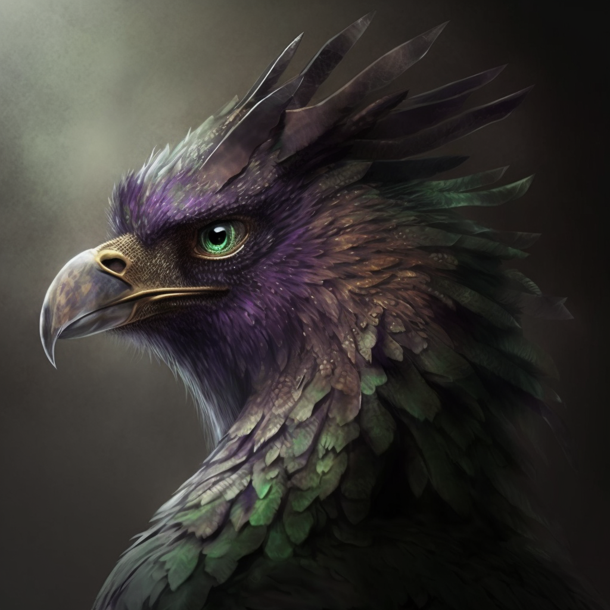
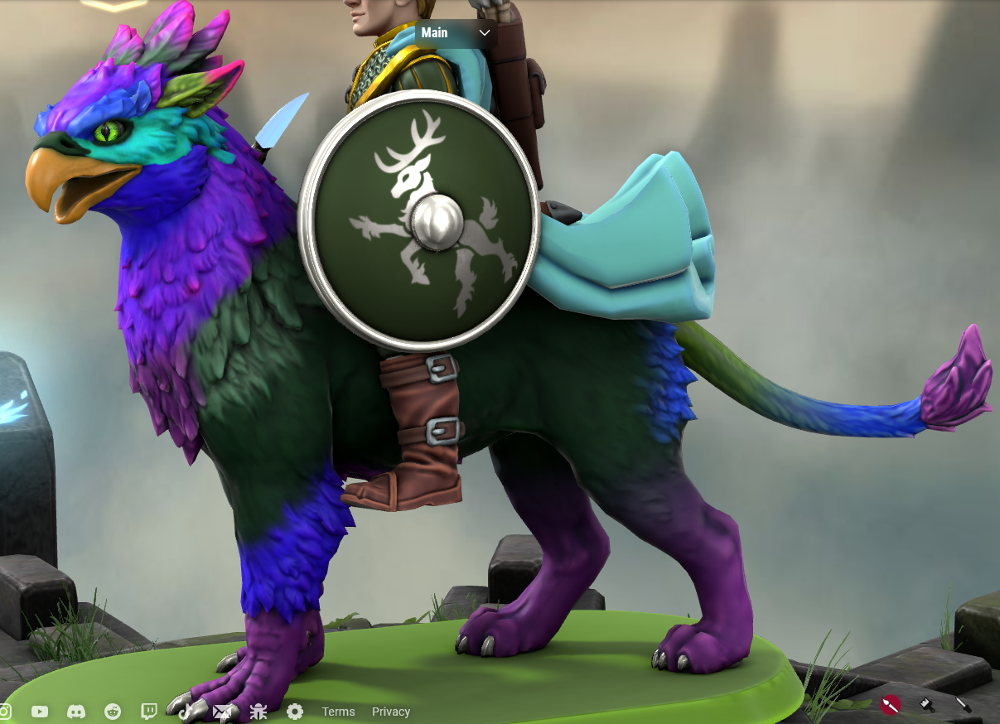

# Greymalkin

- :octicons-info-24:{ .lg .middle } __Biographical Information__

    A griffin (he/him)  
    Appeared from the Feywild on January 7th, 1720 (29 years old)  
    { .bio }

{align="right"; width="320"}A wingless blue and purple griffon who appeared from apparently nowhere (but perhaps the Feywild) to aid [Robin](<./robin-of-abenfyrd.md>) against a zombie horde (yes, his name basically means "grey cat"). He dislikes stables, will not set foot in them, and prefers to hunt his own food. When Robin is not around, he tends to wander off and find some green space to settle in - the more cover and shadows the better. He is often found nested in a clump of bushes and staring intently from the leaves as though waiting to pounce on something. He also tends to give off an air of wary seriousness and is frequently glancing around suspiciously.

