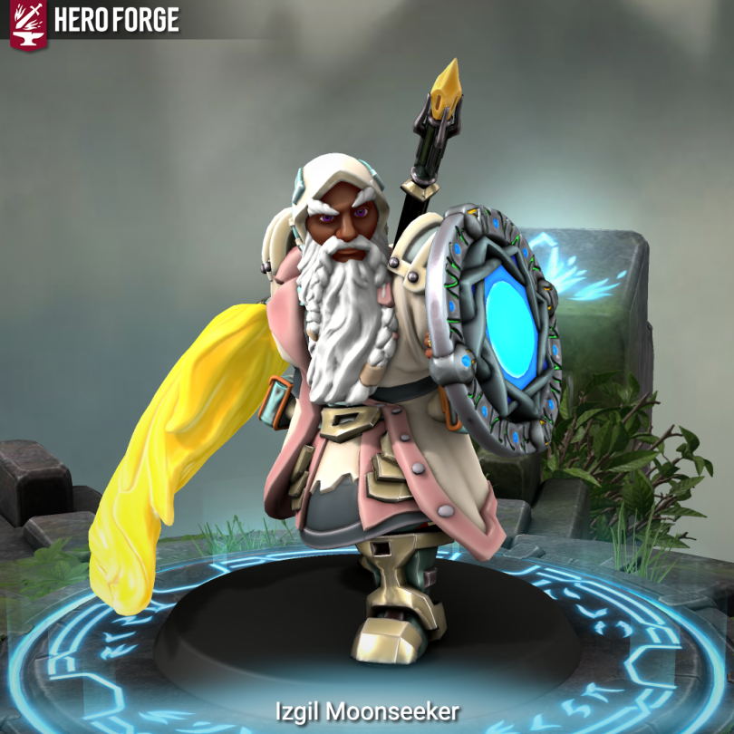

# The Izgil Moonseeker

- :octicons-info-24:{ .lg .middle } __Biographical Information__

    { .bio }

Izgil is a stocky, hardy looking dwarf wearing leather and carrying a shield on his back. He has sort of luminescent white/blue beard and hair worn in braids and often has books and other odd devices strapped to his gear. He comes from the [Gemcrafters](<../../../groups/clans/gemcrafters.md>) clan in [Nidzahar](<../../../gazetteer/sentinel-range/dwarven-kingdoms/nidzahar.md>).

> [!INFO]- Izgil's Background (For Matt's Eyes Only)
Izgil was born in the year 5586 by the ancient count of the dwarves, or 1453 in the reckoning used by the humans. He was born in the backwater kingdom of [Nidzahar](<../../../gazetteer/sentinel-range/dwarven-kingdoms/nidzahar.md>) in the years before the [Great War](<../../../events/1500s/great-war.md>). He never quite fit into the role his family and clan made for him. When he went through his naming ritual he took the name Durgil and earned his thuhr as one of the Travelers, followers of Maganna, and settled into a role of traveling merchant. By 5617, he was traveling amongst the humans, trading minerals and crafted works for food and other fine things from far and wide.  
>
His travels were welcome as they gave him much time to think and he often found himself staring up  at the stars and thinking of the world beyond the dwarven halls he was supposed to be missing. Far from being comfortable when he returned from a trip he tended to itch to get back out on the road but never really able to articulate why.  
>
His life might have continued this way, but the [Great War](<../../../events/1500s/great-war.md>) intervened. His last merchant trip, in 5672, ended as the rumors of war turned to fighting. Hobgoblins, [Orcs](<../../../species/children-of-the-embodied-gods/orcs/orcs.md>), mind flayers and worse turned their eyes on the [Dwarven Kingdoms](<../../../gazetteer/sentinel-range/dwarven-kingdoms/dwarven-kingdoms.md>). Durgil helped as he could, bringing supplies to the front lines, but was thankful that Nizdzahar was spared the destruction of [Ardith](<../../../gazetteer/sentinel-range/dwarven-kingdoms/ardith.md>) to the south. The 5670s and 5680s were a time of war, and then rebuilding. Durgil’s family fared better than most, not a single member of his extended clan died in the war.
>
By 5690, Durgil was back on the road, still looking for something more. His family grew prosperous, but in his increasingly limited time at home he started to hear whispers from his elder relatives: of a bargain made during the [Great War](<../../../events/1500s/great-war.md>) and a price to be paid to the Bahrâzel amongst the future generations.
>
One day in 5807, he was returning from a trading trip south to [Maseau](<../../../gazetteer/greater-sembara/duchy-of-maseau/duchy-of-maseau.md>) and he and his companions headed for an entrance to a dwarven road under the mountains — a mostly disused one, but that was said to be safe. The entrance was high up on the mountainside and his companions set up camp just inside the mountain— but Durgil wanted to see the moon, which was full that night, so camped outside by himself.   
>
He stayed up late watching the moonlight on the mountain peaks and doesn’t remember drifting off. But when he awoke it seemed to still be night, and he seemed to be high up on a mountain peak — similar to where he fell asleep but subtly different somehow. 
>
He could see a path leading toward the peak, and a doorway to the mountain road where his companions were camped. He knew that taking the path would lead him back to [Heart of the Mountain](<../../../cosmology/multiverse/spiritual-realms/divine-realms/heart-of-the-mountain.md>), and that taking it would be accepting a gift? Or obeying an order? Or fulfilling a debt? He isn’t quite sure, but he knows that heading up the peak rather than back into the mountain would accept the offer.  
>
He takes the path and ends up back at [Heart of the Mountain](<../../../cosmology/multiverse/spiritual-realms/divine-realms/heart-of-the-mountain.md>) and it is bathed in bright moonlight and all he sees is swirling runes everywhere. From the swirling runes emerges Karthel and Maganna. Standing before two of the [Bahrazel](<../../../cosmology/gods/embodied-gods/bahrazel.md>) Durgil feels small, and the great figures standing before him command him: Leave, says Maganna. Come, says Karthel. And Durgil is ordered to leave his thuhr, and join the runecrafters and scholars. He takes the name Izgil, and is commanded to study and learn the ways of the moon.
>
Upsetting the normal order of things and alienating his friends for over 200 years, Izgil changed thuhr and began studying the moon and its history and mechanisms. Over several decades, he learned to channel its own energies for rudimentary spells and even began working on a new magical theory for how the metaphysical tides of the moon could be exploited for magical means. But despite the knowledge of astronomy within the dwarven community, he found that few wanted to consider the moon in new ways. Magic, to the dwarves, came from the runes and the earth and the Bahrâzel – not the distant skies and cold moon. 
>
He needed new angles and new sources of knowledge. And so in 5849 (or 1716 in the Drankorian Reckoning used by the humans) , he set out for the road again and has been traveling for a few years now. He had been refining his theories and gathering more stories and details. Recently, he has learned of an eccentric dwarven crafter who is trying to build a new sort of telescope that is said to be ten times more powerful than anything in [Nidzahar](<../../../gazetteer/sentinel-range/dwarven-kingdoms/nidzahar.md>). [Brot Starsearcher](<../../dwarves/brot-starsearcher.md>), they are called, and they live in [Cleenseau](<../../../gazetteer/greater-sembara/sembara/barony-of-aveil/cleenseau-region/cleenseau/cleenseau.md>) with their wife [Diesla Starsearcher](<../../dwarves/diesla-starsearcher.md>). So he sets out for [Cleenseau](<../../../gazetteer/greater-sembara/sembara/barony-of-aveil/cleenseau-region/cleenseau/cleenseau.md>), arriving on a cold morning in late October, looking for [Brot Starsearcher](<../../dwarves/brot-starsearcher.md>).