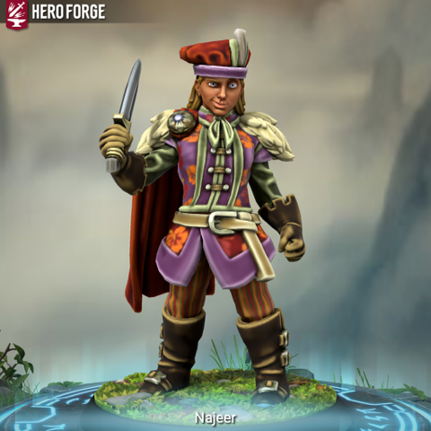
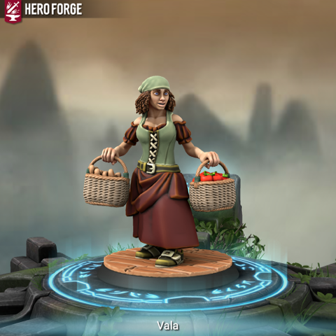
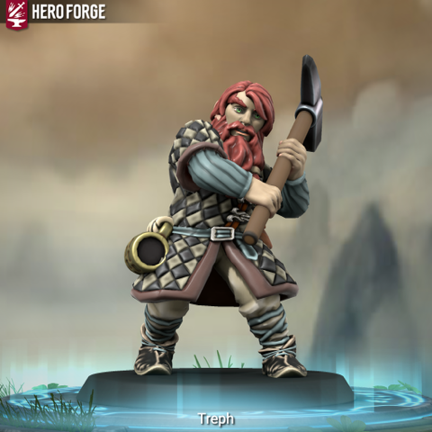
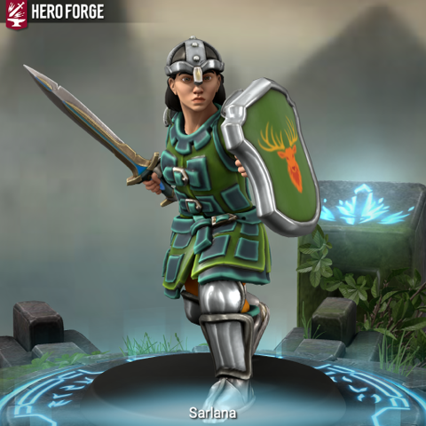

# Viepuck

- :octicons-info-24:{ .lg .middle } __Biographical Information__

    A [human](<../../../species/humans/humans.md>) (he/him)  
    Born October 1st, 1706 (42 years old)  
    Member of the [Heroes of Cleenseau](<./heroes-of-cleenseau.md>)  
    { .bio }

    Originally from: [Embry](<../../../gazetteer/greater-sembara/sembara/heartlands/embry.md>), [Sembara](<../../../gazetteer/greater-sembara/sembara/sembara.md>)

:octicons-location-24:{ .lg .middle } Last known location (as of January 12th, 1720): [Cleenseau](<../../../gazetteer/greater-sembara/sembara/barony-of-aveil/cleenseau-region/cleenseau/cleenseau.md>), the [Manor of Cleenseau](<../../../gazetteer/greater-sembara/sembara/barony-of-aveil/cleenseau-region/manor-of-cleenseau.md>), the [Barony of Aveil](<../../../gazetteer/greater-sembara/sembara/barony-of-aveil/barony-of-aveil.md>)

Najeer Garay is the fourth son of [Susanne Garay](<../../sembarans/susanne-garay.md>), the matriarch of a wealthy cloth merchant family in [Embry](<../../../gazetteer/greater-sembara/sembara/heartlands/embry.md>). He is not set to inherit but has a job in the family and seems interested in finding something of his own in the world. He does not like to fight and it makes him uncomfortable after, but he seems to be solid while it’s happening.  Alternates between solidly responsible and a little immature.  Obviously has something else going on -- he appears to have some magic, at least.  A little class-struck by being invited to the manor for dinner, kind of kept more quiet than expected. 

He has a weird egg in Brot’s forge that isn’t a topic of public conversation but he seems willing to talk to Izgil about (because Izgil knows Brot mostly) eventually. He is mildly confused by Ceyln but seems to have dropped the initial paranoia. 

A little enamored with Robin probably from the rescue, will tend to defer to any strong-decision Robin puts forth for the time being.

> [!INFO]- Najeer's Background (For Chris' Eyes Only)
Viepuck was born in the capital city of [Sembara](<../../../gazetteer/greater-sembara/sembara/sembara.md>), [Embry](<../../../gazetteer/greater-sembara/sembara/heartlands/embry.md>), in the year 55 Cece I (or 1641 in the ancient Drankorian reckoning, still used by the learned and scholarly today). He is not sure of this date, it could have been the year before, or perhaps the year after. Viepuck doesn’t remember when his parents died, or what caused it.  He has some vague memories of them, selling…. something.  Though not sure if it was their shop or not.  He was told by the staff at the [Queen’s Own Home for Children](<../../../gazetteer/greater-sembara/sembara/heartlands/queens-own-home-for-children.md>) that they died in a fire, which is a common enough occurrence in the poorer neighborhoods piled up against the city walls.  
>
He has few memories of the Queen’s Own, although in his hazy memories it was a place where he always had a sound roof and adequate food. It was spread over two dormitories set around a central courtyard, and Viepuck fondly remembers the shortcuts he took between the north dormitory, where his friend [Tal](<../../sembarans/tal.md>) was housed, and the south one, for the younger kids like himself.
> 
When he was 5, Queen [Cece I](<../../historical-figures/sembaran-royalty/cece-i.md>) died, and over the next several months new staff appeared. Shortly after the new year (1647, by Drankorian reckoning, or 1 Robert I, in the Sembaran style), the north dormitory was sold – to a merchant guild, [Tal](<../../sembarans/tal.md>) said, although who really knows. All the children six years or older were suddenly homeless. The staff did their best to place the children with apprenticeships, but the unlucky (including [Tal](<../../sembarans/tal.md>) and Viepuck) were left with few prospects other than the [Dock Workers Great and Honorable Charitable Home for the Lost and Wretched](<../../../gazetteer/greater-sembara/sembara/heartlands/dock-workers-great-and-honorable-charitable-home-for-the-lost-and-wretched.md>). Rumor had it that the dock workers were not really great, honorable, or charitable and simply saw it as a source of free labor. Ok enough for the unusually strong, but for a weak 6 year old like Viepuck, probably just an invitation to be crushed to death unloading bales of wool at the Embry docks.
>
Viepuck and [Tal](<../../sembarans/tal.md>) slipped through the cracks and spent a hard spring and summer of 1 Robert I  before falling in with a small group of thieves and pickpockets in the fall. It wasn’t good work or care, but it was a reliable place to sleep and some protection as part of the group.
>
After about 2 years with the thieves, several of the older ringleaders were caught and hanged by the city watch and the group fell apart. Viepuck and [Tal](<../../sembarans/tal.md>) ended up at the [Lord Mayor’s Workhouse](<../../../gazetteer/greater-sembara/sembara/heartlands/lord-mayors-workhouse.md>), a safe enough place for older children. The work was long and hard – making fine clothes, mostly – but it was well-suited to small fingers, and the place provided a solid two meals a day, meat on feast days, and a small stipend of coins each month. Even though the older children stole most of the coins, it was a safe and secure place, such as these things go. A year passed quickly, and [Tal](<../../sembarans/tal.md>) got a job as a cabin boy on a riverboat trading along the [Semb](<../../../gazetteer/greater-sembara/rivers/semb-watershed/semb.md>) and moved on, although they ran into each other for a bit when [Tal](<../../sembarans/tal.md>) was in town now and then.
>
As 4 Robert I dawned, changes came to the [Lord Mayor’s Workhouse](<../../../gazetteer/greater-sembara/sembara/heartlands/lord-mayors-workhouse.md>). A elderly woman with a thick body and stern face took charge, and work slowed down. More and more children were sent out to various ‘external apprenticeships’ and few or none returned. Rumors spread both good and bad: few truly believed that she was able to find so many apprenticeships for orphaned children.
>
One day, in the early winter of 6 Robert I, Viepuck was selected for an apprenticeship with a scholar. This turned out to be a formative experience, where he [met his patron and was almost sacrificed to a dark portal](<../../../events/1700s/1718/01/viepuck-s-ritual-experience.md>). He came out of the experience alive, and with a new iridescident sphere reminscent of a robin's egg, and a new mysterious alien mind watching the world through him.
>
By summer, the sphere had grown from a robin’s egg to the size of a small apple, and the dreams and compulsions began. His master, he believed, was learning, in its strange and alien way, asking for things: what a white rat sees; the taste of a centipede; the sound of water running through the gutters; the dreams of a lonely farmer; the prayers of a pregnant priest; the hopes of a street performer; the socNoble of the ephran dirt (he didn’t understand that one, and the compulsion eventually went away). Finding these is not always easy, and Viepuck drifted away from the Lord Mayor’s Workhouse, where time to search was scarce. 
>
He found another small band of thieves to join, but didn’t like them when one of them was drunk and tried having his way with another of the children.  He was killed rather quickly and the group scattered (Viepuck was able to collect the regrets of a dying bully for his master), Viepuck taking charge of the younger ones. 
>
And so a year passes. The compulsions lessen in their specificity but the constant sense of wanting the dream-life of those around him stays. What money he acquires he donates to the Lord Mayor’s Workhouse, or other orphanages, as he can. The egg grows to be the size of an ostrich egg and with it Viepuck’s magic. He takes to doing less pickpocketing and more street performance with a few of the other children, supplementing with illusions to help them do seemingly impossible tricks.  It pays well enough to keep them housed and fed.
>
Viepuck has always been in the city and never left.  It is home, all of it, and a creature unto itself, sprawling and incomprehensible and full of layers folding in on themselves, like his master. 
>
The iridescent sphere is an egg and a connection to his master, never is more than a few feet away. Viepuck has considered trying to find the woman in white metal that helped save him, but to what end? 
>
When there is time alone, Viepuck often just hides somewhere.  Alone and hidden is quiet and safe and free of demands for the moment, calm. 
>
In the spring of 7 Robert I, he awakes one morning with a terrible sense of dread. Something is wrong in the city. The dread passes, but over the next few weeks, he starts seeing and hearing various signs. At first, they are unclear and jumbled: a red sparrow that seems to float in his vision, always just flying away. A green drip he constantly seems to hear (how do you hear green he wonders?). But by the end of April, he hears a voice, of sorts: lEaⓥⅇ. It booms and echoes around his head, and as it fades, Viepuck collapses, exhausted. Luckily it is evening, and he rests the night and the full next day before he feels recovered enough to stand. 
>
But once he recovers, refusing the direction of the voice is unthinkable. He gathers his meager belongings and departs the city on May 5th, 7 Robert I (1719 in Drankorian reckoning). He travels along the [Great South Road](<../../../gazetteer/greater-sembara/roads/great-south-road.md>), across the [Wistel](<../../../gazetteer/greater-sembara/rivers/wistel-enst-watershed/wistel.md>) to [Wisford](<../../../gazetteer/greater-sembara/sembara/heartlands/wisford.md>). But the voice comes again: ℓ𝕖Ave. And so in June, he continues south along the road, along the [Enst](<../../../gazetteer/greater-sembara/rivers/wistel-enst-watershed/enst.md>), to [Fellburn](<../../../gazetteer/greater-sembara/sembara/heartlands/fellburn.md>). He spends some time there performing, cities, even small ones like [Fellburn](<../../../gazetteer/greater-sembara/sembara/heartlands/fellburn.md>) being more comfortable than the road. But again, the voice says LἐaVe. By August, he is in [Rinburg](<../../../gazetteer/greater-sembara/sembara/barony-of-aveil/rinburg.md>), the head of navigation of the river, watching the river boats dock. It is a small town, much smaller than Embry, but there is a cozy inn, the River’s Edge, where he is given room and board in exchange for performing four nights a week in the common room. And there are newcomers most days, and plenty of opportunity to find dreams for his master.
>
But in October, the voice of his master returns, clearer now than it ever has been: leAve, noT sAfE HeRe. NoT SaFE AnywHEre. And so Viepuck returns, reluctantly, to the road. October 17th, he comes to the small trading town of [Cleenseau](<../../../gazetteer/greater-sembara/sembara/barony-of-aveil/cleenseau-region/cleenseau/cleenseau.md>). Smaller than [Rinburg](<../../../gazetteer/greater-sembara/sembara/barony-of-aveil/rinburg.md>), but larger than the hamlets he passed on the road, it is a wet and cold night and he spends the night at [The Fox's Flagon](<../../../gazetteer/greater-sembara/sembara/barony-of-aveil/cleenseau-region/cleenseau/the-fox-s-flagon.md>) just outside the walls. 
>
That night, he sleeps restlessly, and his dreams are full of odd visions of iridescent windows. When he awakes, he senses the egg he has been carrying is close to hatching, but it needs heat - a lot of heat. Over the next few days Viepuck finds an eccentric dwarven couple, Brot and their wife Diesa, who seem willing to bury his egg in the hot coals of their forge. 
> 
He awakes the morning of October 20th, a Saturday, with a new feeling: the egg needs the blood of something from far away to hatch. Viepuck doesn’t quite understand what the egg means by far away, but senses it means something strange or unnatural.

> [!INFO]- Najeer's Additional Character Info (For Chris' Eyes Only)
>  This section lists the disguises Viepuck has used, so I can keep track if nothing else.
>
>**Vala Xendra** (she/her)
>A poorly dressed lower class servant woman from whereever she needs to be. Usually seen carrying a basket or laundry or some other mundane item. In her late teens.
>
>
>
>**Najeer Garay** (he/him)
> The son of [Susanne Garay](<../../sembarans/susanne-garay.md>), a cloth merchant from [Embry](<../../../gazetteer/greater-sembara/sembara/heartlands/embry.md>). Richly dressed, but lacking the finery (belt, shoes, jewelry) that would usually be associated with fine clothes. An asipiring merchant, looking to expand his family's cloth trade. Talkative and a little bit pompous. In his mid-20s.
> 
> 
> **Treph Hardpick** (he/him)
> A dwarf, traveler from [Nardith](<../../../gazetteer/greater-dunmar/realms/nardith/nardith.md>). A laborer, looking more concerned with the evening's dice-and-drinking than apperances, but not poor per-se. Has a grumpy vibe. On the young side of middle-aged, about 200.
> 
> 
> 
> **Sarlana Silversword** (she/her)
> A human warrior and aspiring paladin from [Tollen](<../../../gazetteer/western-green-sea/tollen/tollen.md>). Confident bordering on overconfident and wearing well-taken-care-of brigandine armor. Braid comes out from under her helm, otherwise only her stern jaw is visible. 
> 
> 

