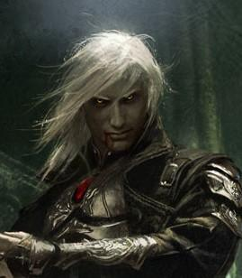

# Delwath

- :octicons-info-24:{ .lg .middle } __Biographical Information__

    { .bio }

> [!WARNING]- Delwath's Backstory
> 
> Delwath was born a hundred years before the coming of [Cha'mutte](<../../extraplanar-powers/cha-mutte.md>), and skirmished in some of the minor conflicts of that time, but was never a true combatant. During the cataclysmic battles at the end of the Great Wars, he was aiding a small company of elves as a quartermaster and cook, when they were surrounded and defeated by a great force of hobgoblins, lead by a mysterious cloaked figure who called down bolts of dark lightning and spread from the sky.
> 
> Although the company was killed to the last elf (save for Delwath), the elven company was still powerful and, in turn, they destroyed the orcish company. In the final duel, the commander of the elven company killed the cloaked figure before succumbing to her wounds.
> 
> Delwath lay dazed for several days, as rains fell and the sky was torn asunder by the destruction of [Cha'mutte](<../../extraplanar-powers/cha-mutte.md>), in shock and despair. Finally, he recovered enough to start dragging the bodies of the dead from the field, when he noticed a dark circlet upon the arm of the wizard. His curiosity got the better of his, and he touched it, and was instantly pulled into a land of shadow. This realm was a vast open plain, with only dim light and a fading horizon. Vast shadowy mountains arose in all directions, and no matter where Delwath walked, he kept returning to the battlefield in which is comrades died. He time he returned, the he was caught, forced to watch the slaughter, and each time, it seemed, the dying elves died faster, and the [Orcs](<../../../species/children-of-the-embodied-gods/orcs/orcs.md>) were more brutal. He was neither hungry, nor tired, nor thirsty, and time passed in strange ways.
> 
> After a timeless period, he found he could, if he stretched his will in just the right way, move the shadowy world around him.
> 
> After another timeless period, he found himself falling.
> 
> He appeared, falling from the sky, on the edge of a ruined city (he later learned was called [Kharsan](<../../../gazetteer/greater-dunmar/dunmari-basin/kharsan.md>)). He reached out with his will, and found himself on the ground, having teleported there.
> 
> He walked west, and found the Dunmari. For several months he recovered under the care of an elderly herdsman and his unwed daughter, from which he learned what history he could. He was wild and barely spoke at first, but under their care regained some of his old self. After several months, he learned to tame the shadow magic within, and has even heard a voice at times, speaking to him in whispers from far away.
> 
> What the voice is, he knows not, although he doesn't fully trust it. After after four months, he left his herdsman savior and went west, to seek the Mysteries of [Shakun](<../../../cosmology/gods/incorporeal-gods/dunmari/shakun.md>), as his nearest, if not best, hope of finding out more about what might be going on. He has been living in [Karawa](<../../../gazetteer/greater-dunmar/realms/dunmar/eastern-dunmar/karawa.md>) for the since January, learning what he can about the Mysteries.

> [!WARNING]- Delwath's Dream of the Shadow Realm, Session 5
>
> ## Dream of the Shadow Realm [Session 5 (DuFr)](<../../../campaigns/dunmari-frontier/session-notes/session-5-dufr.md>)
>
>As you drift off to sleep, everything fades, and you see before you an androgynous figure, standing, wreathed in shadows. Tendrils of darkness seem to be pouring off of them, pooling at their feet. You cannot tell if they are trapped, or if they are controlling the darkness. When they speak, it is in the voice you have heard since you found a way to leave the shadow realm: "Delwath. You can see me."
>
>As they speak your name, you realize they are speaking in Shadowkar, and you can feel that the currents of shadow flowing to you. From their open mouth, a torrent of darkness pours, and you see a wordless scream as blackness rushes towards you. For a moment, the power threatens to overwhelm you, but with effort you are able to stabilize it. A thread of power remains, hanging in the empty space, and you can feel the energy of the shadow realm at the other end. As you concentrate, you can feel power through this thread, you can feel your control over this connection between you and this shadow realm -- channeled through this being -- growing.
>
>Suddenly as if ripped away by a current, the figure is gone, pulled by a rushing torrent of shadows towards the darkness behind them.

> [!WARNING]- Tharandos' Warning, Session 7
> 
> ## Centaur's Warning, [Session 7 (DuFr)](<../../../campaigns/dunmari-frontier/session-notes/session-7-dufr.md>)
> 
> [Tharandros](<../../other-nonhumans/tharandros.md>), leader of a centaur tribe traveling in the north of [Dunmar](<../../../gazetteer/greater-dunmar/realms/dunmar/dunmar.md>): "You are tethered to shadow, elf. If you are not careful, this thread will grow to destroy you and the godling you serve."

> [!WARNING]- The Shadow Voice Returns, Session 19
> 
> ## The Shadow Voice Returns, [Session 19 (DuFr)](<../../../campaigns/dunmari-frontier/session-notes/session-19-dufr.md>)
> 
> As you are drifting off to sleep, the gravely shadow-voice that you have not heard in since you left [Karawa](<../../../gazetteer/greater-dunmar/realms/dunmar/eastern-dunmar/karawa.md>) to hunt gnolls begins to whisper in the back of your mind. 
> 
> As it begins to speak, the shadows around you seem to grow darker, and you find you can almost perceive something -- a face maybe? -- from the corner of your eye, flickering in and out the shadows. 
> 
> "Delwath."
> 
> The voice seems to breath a sigh of relief, almost, and then says, almost as if speaking to itself.
> 
> "This land, here, is used to the presence of gods, the paths to the Divine are well-worn in the place."
> 
> Another pause.
> 
> "Delwath. You must get stronger, you have so little control, no finesse or speed. You are of no use to me yet."
> 
> A final, long pause.
> 
> "I am ………… [Aaviskar](<../../../cosmology/gods/tanshi/yezali.md>)." 
> 
> A name, perhaps, but the voice sounded unsure, almost.
>

> [!WARNING]- Delwath's Karawa Downtime, Session 32
> 
> ## Karawa Downtime (Session 32)
> 
> ### Shield
> 
> Delwath shows the masterwork shield found in [Agata's lair](<../../../gazetteer/greater-dunmar/dunmari-basin/agata-s-lair.md>) around. [Alesh](<../../dunmari/alesh.md>) is back in town, and she recognizes the shield immediately. It is definitely Dunmari in design, and the insignia, a stylized head of a rearing horse in front of two crossed spears, dates it to the Dunmari army during the [Great War](<../../../events/1500s/great-war.md>). This was probably an officer's shield as the craftsmanship is extraordinary. [Alesh](<../../dunmari/alesh.md>) thinks it must have been in someone's family for a while, kept and maintained as an heirloom, before [Agata](<../../fey/agata.md>) acquired it, as it would not be in this good shape had it been just abandoned somewhere for 200 years. But it could also be something like a trophy [Agata](<../../fey/agata.md>) took from someone she killed that she maintained as a form of gloating or remembrance of her victories. Or even something that was lost in a dry, buried location somehow protected from rust and decay. 
> 
> In any case, both [Alesh](<../../dunmari/alesh.md>) and [Havdar](<../../dunmari/havdar.md>) think Delwath should take it, given he fought in that war as well, and pass it along with their blessing. 
> 
> [Jasu](<../../dunmari/jasu.md>) is happy to work on the [Dunmari Shield](<../../../campaigns/dunmari-frontier/treasure/treasure-from-agata/dunmari-shield.md>), and in addition to strengthening it with adamantine, he cleans and repairs the insignia, and works some of the magical stone and powder from the mesa into it as well, so it will resist fading and damage. 
> 
> ### Closing Affairs
> 
> Delwath also closes up his affairs in [Karawa](<../../../gazetteer/greater-dunmar/realms/dunmar/eastern-dunmar/karawa.md>). His old house was destroyed, and he does not bother to repair it. During the week and the [Feast of Bhishma](<../../../time/holidays-and-festivals/dunmari-festivals/feast-of-bhishma.md>), he says his goodbyes and give gifts of thanks to a few friends from his time in [Karawa](<../../../gazetteer/greater-dunmar/realms/dunmar/eastern-dunmar/karawa.md>). 
> 
> ### Rumors 
> 
> During the week in [Karawa](<../../../gazetteer/greater-dunmar/realms/dunmar/eastern-dunmar/karawa.md>), Delwath gathers many rumors. 
> 
> **Rumors from [Tokra](<../../../gazetteer/greater-dunmar/realms/dunmar/central-dunmar/tokra/tokra.md>)**
> 
> [Badya](<../../dunmari/badya.md>), who was the serving girl at the tea house below Delwath's apartment, fled with her cousins and uncle to [Tokra](<../../../gazetteer/greater-dunmar/realms/dunmar/central-dunmar/tokra/tokra.md>) along with most of [Karawa](<../../../gazetteer/greater-dunmar/realms/dunmar/eastern-dunmar/karawa.md>), and is now back and happy to catch up with Delwath. She is fascinated by Delwath's stories, and eager to share stories of [Tokra](<../../../gazetteer/greater-dunmar/realms/dunmar/central-dunmar/tokra/tokra.md>). [Tokra](<../../../gazetteer/greater-dunmar/realms/dunmar/central-dunmar/tokra/tokra.md>), she says, was a chaotic mess. Thousands of refugees clustered on the banks of the [Hara](<../../../gazetteer/greater-dunmar/rivers/hara-watershed/hara.md>) river. There was little food, constant worry about disease, and being around so many people, so many strangers, felt overwhelming, especially since no one knew what was happening or if they were about to be attacked. More people would arrive every day, and not just Dunmari. As they were leaving, the armies of the west arrived, under the command of the Samraat's general, riding with a small contingent of what [Badya](<../../dunmari/badya.md>) thought might have been Chardonian mages, telling people to move west, not to return to their homes in the east or they could not be protected. When [Alesh](<../../dunmari/alesh.md>) arrived saying that everything was restored in [Karawa](<../../../gazetteer/greater-dunmar/realms/dunmar/eastern-dunmar/karawa.md>), it was a huge relief and we couldn't wait to come home. 
> 
> [Ikram](<../../dunmari/ikram.md>) talked to lots of folks, doesn't think he met an old monk of any description, but thinks the [Lakan Mystai](<../../../groups/dunmari-mystery-cults/lakan-mystai.md>) could help. He does mention that there is a strange landmark north of [Tokra](<../../../gazetteer/greater-dunmar/realms/dunmar/central-dunmar/tokra/tokra.md>): a giant statue of a stoneborn warrior, about three times life size, seemingly ancient and indestructible. But he doesn't know if that is related to monks at all. 
> 
> From several people, you get the sense that [Tokra](<../../../gazetteer/greater-dunmar/realms/dunmar/central-dunmar/tokra/tokra.md>) was feeling a little overrun towards the end. Full of chaos, people going missing, even rumors, probably fanciful, that something was stolen from the [Archives](<../../../gazetteer/greater-dunmar/realms/dunmar/central-dunmar/tokra/archives.md>) 
> 
> **Rumors about [Sura](<../../dunmari/sura.md>)'s Disapperance**
>
>It was quite the scandal at the time, and a tragedy, so many people are happy to talk about this. 
>
>The story you gather is that, for a long time, rule of [Dunmar](<../../../gazetteer/greater-dunmar/realms/dunmar/dunmar.md>) had been passed down from parent to child among the Samraat's of the Nayan dynasty, breaking with tradition and the natural order of things, for who is to say that the current ruler's child is particularly god-chosen. During the succession crisis of DR 1736, the hereditary line was broken and after much controversy the rule of [Dunmar](<../../../gazetteer/greater-dunmar/realms/dunmar/dunmar.md>) and the divine blessing passed not to a relative, but to Marathu, an elder of one of the clans with territory south of [Tokra](<../../../gazetteer/greater-dunmar/realms/dunmar/central-dunmar/tokra/tokra.md>). He was a caretaker ruler, and yet did a lot almost at once to reconnect east and west and reestablish some of the traditional Dunmari ways, in particular, setting up a traveling court. 
>
>[Sura](<../../dunmari/sura.md>), from a prominent family from around [Darba](<../../../gazetteer/greater-dunmar/realms/dunmar/coastal-dunmar/darba/darba.md>), raised in a traditional lifestyle but with cultural and familial ties to the west, was widely seen as being presented and prepared to take over as Samraat on Nayan Marathu's passing. 
>
>[Sura](<../../dunmari/sura.md>) disappeared between [Bas Udda](<../../../gazetteer/greater-dunmar/realms/dunmar/eastern-dunmar/bas-udda.md>) and [Askandi](<../../../gazetteer/greater-dunmar/realms/dunmar/central-dunmar/askandi.md>), when traveling with the royal court. Marathu insisted on leading the search for her personally, but was tragically killed soon after in an [orc](<../../../species/children-of-the-embodied-gods/orcs/orcs.md>) ambush on the edge of the [Garamjala](<../../../gazetteer/greater-dunmar/garamjala-plateau/garamjala-desert.md>). [Sura](<../../dunmari/sura.md>)'s brother Karnas, who was then the general of the southern armies (based in western [Dunmar](<../../../gazetteer/greater-dunmar/realms/dunmar/dunmar.md>)), was quickly crowned Samraat, and sent an army into the desert, but that force bogged down quickly and few returned. Soon the story became that [Sura](<../../dunmari/sura.md>) brought it upon herself traveling in the eastern wilds. 
>
>**Rumors About Other Bad Stuff Happening While [Shakun](<../../../cosmology/gods/incorporeal-gods/dunmari/shakun.md>)'s Protection Was Down**
>
>There are many rumors but few clear facts. [Havdar](<../../dunmari/havdar.md>) and his troops did fight several smaller groups of gnolls on the road to [Tokra](<../../../gazetteer/greater-dunmar/realms/dunmar/central-dunmar/tokra/tokra.md>), and there are various rumors of those who couldn't make it to safety dying alone on the frontier. Indeed, there are definitely folks returning who lost people, who never made it to [Tokra](<../../../gazetteer/greater-dunmar/realms/dunmar/central-dunmar/tokra/tokra.md>). But it is hard to say if this could have just been the gnolls that you knew about, or something else.
>
>[Alesh](<../../dunmari/alesh.md>), who has ridden probably 1000 miles over the past two months, doesn't think there were any other major fortresses like [Raven's Hold](<../../../gazetteer/greater-dunmar/dunmari-basin/raven-s-hold.md>) with large armies of enemies of [Dunmar](<../../../gazetteer/greater-dunmar/realms/dunmar/dunmar.md>). But could there be a few small lairs of monsters of various kinds that enjoyed the months of hunting and raiding freely on the soft interior of [Dunmar](<../../../gazetteer/greater-dunmar/realms/dunmar/dunmar.md>)? Sure, it is possible and could explain some of the missing people.  
>
>**Rumors about [Agata](<../../fey/agata.md>) and her motives**
>
>No one is particularly eager to talk about [Agata](<../../fey/agata.md>). You get the sense that she was kind of an embarrassed secret of the town. The mystai and the Temple deeply frowned upon her, and given the religious devotion of the Dunmari culture, few people were willing to cross two religious orders to bargain with a creature who was probably going to trick you anyway. Those who did seek her out were universally desperate, incredibly foolhardy, or most likely both. From what you can gather, the general sense of most people is that she just wanted to see more misery in the world, and especially misery for the Dunmari. 
>
>You don't get the sense that anyone in [Karawa](<../../../gazetteer/greater-dunmar/realms/dunmar/eastern-dunmar/karawa.md>) at least believed she was any kind of complicated plotter or anything, just that when choosing between two courses of action she would always choose the one that made the most people miserable. 
>
>Except for magic, that is. She was known to obsess over strange, lost magic, and the only people who ever got something approaching a fair deal from her were people who traded unusual, interesting, or powerful magic to her. 
>
>**Rumors from out east**
>
>Few people travel east of [Gomat](<../../../gazetteer/greater-dunmar/dunmari-basin/gomat.md>), and even fewer since you've been in the village. However, there is one strange thing. As word spreads that you are asking around about traveling out east, an older Dunmari man approaches you one morning, and tells you that he heard you were asking about rumors from the east, and if you knew that the book [Seeker](<./seeker.md>) carries is from the desert? He continues: he was the one who gave the book to [Ikram](<../../dunmari/ikram.md>) for [Seeker](<./seeker.md>), thinking a dwarf might like this strange, blank book with a cover decorated with Dwarven ruins. His cousin found it in the desert, he says, along with two other books with strange writing in them. He sold the other books at the market before the attacks, to an old Chardonian man collecting stories and history just before the [Festival of Rebirth](<../../../time/holidays-and-festivals/dunmari-festivals/festival-of-rebirth.md>), named [Servius](<../../chardonians/servius.md>). [Servius](<../../chardonians/servius.md>) traveled with the refugees to [Tokra](<../../../gazetteer/greater-dunmar/realms/dunmar/central-dunmar/tokra/tokra.md>), but this man isn't sure where he went after that. He also says that if you want to talk to his cousin, he should be back in town by the [Feast of Bhishma](<../../../time/holidays-and-festivals/dunmari-festivals/feast-of-bhishma.md>). 

> [!WARNING]- Delwath's Dream Staff Journey, Session 32
> 
> ### Dream Staff Journey (Session 32) 
> 
> *Part 1: The Dream*
> 
> [Candrosa](<../../dunmari/candrosa.md>) asks Delwath to meet him at the top of the mesa, at dusk. When Delwath arrives, [Candrosa](<../../dunmari/candrosa.md>) is waiting, holding his dream staff, the same staff of white ash with a silver crescent design on the top. He seems relaxed and at peace in a way that you have not seen before. The staff seems to shimmer slightly -- somehow the return of [Shakun](<../../../cosmology/gods/incorporeal-gods/dunmari/shakun.md>)'s Heart has added to its power, allowing it to recharge. [Candrosa](<../../dunmari/candrosa.md>) asks you to focus on an image, an anchor that will guide and shape your experience in the [Dreamworld](<../../../cosmology/multiverse/spiritual-realms/proximate-realms/dreamworld.md>). 
> 
> [Candrosa](<../../dunmari/candrosa.md>) asks Delwath to sit and empty his mind of everything but the image. Delwath settles down on the top of the mesa, concentrating on the vision of a clear pool in a deep forest, lit by moonlight that [Wellby](<./wellby.md>) showed him telepathically earlier that day, somehow associated with his pact weapons.
> 
> He brings the staff down, and it seems to pass through you. Looking down, your body is translucent, and you are floating, the light rapidly fading from the sky. You float, or are pulled, rapidly upward, the ground below vanishing, only a thin line of energy stretching back towards your distant body below. As you ascend, lights begin to appear, almost like stars, but full of dazzling color. They surround you in all directions -- above, below, to all sides -- moving and shifting in a hypnotic pattern. As you stare, dazed, you can hear [Candrosa](<../../dunmari/candrosa.md>)'s voice in the back of your mind, "Concentrate on your anchor!"
> 
> As you refocus on the image of the forest pool, imagining the dappled twilight, the silence of the deep woods, the dazzling stars begin to wash away, as if a dirty window were being cleaned, revealing a forest, stretching for miles in all directions. It is night, although the moon is bright. The landscape below feels somehow familiar -- the forests remind you of home, and in the distance you can see the peaks of a mountain range jutting into the sky.
> 
> As you float, taking in the silent night, time does not seem to pass. You cannot breathe, cannot move, seem pinned in the air above the trees. But the forest shifts, sometimes snowy, sometimes brilliant with autumn colors, sometimes green and leafy, sometimes barren. These changes don't proceed in a regular order, it is not as if one season is passing into the next, just that sometimes the landscape below seems to blur and reform as something else. And, always, the land is covered in twilight, lit by a full moon which neither rises nor sets. 
> 
> After some indeterminate period, you begin to notice occasional fireworks of a kind. Flashes of light, of some kind of energy, a trail of sparks rising from the forest. First one, then another, then another. Never in the same place twice. Some seem to be rapidly swallowed by the darkness, others drift in the air in a shimmering display, still others fall back to earth with streaks of light. Occasionally, much more rarely, you see sparks originate in the sky, cascading down to the forest below.
> 
> As the forest changes more and more rapidly, almost becoming a blur of leaves growing and dropping, growing and dropping, the sparks become more and more numerous and you begin to notice patterns. The most common are simple golden trails of light that end with a brief flash and fade quickly. Less common are the red gold rockets that explode into shimmering shapes, sometimes animals, sometimes abstract designs, and usually followed soon after by what seems to be a reply from the night sky, often a cascade of silvery sparks that drift slowly and brightly to be lost beneath the trees. Rarer patterns also occasionally punctuate the sky: bright silver flashes that streak absurdly high into the sky before gracefully arcing to the forest below; dark, deep red sparks that are barely perceptible in the night and seem to hover close to the ground; burnished bronze flares that shine brightly for a long time before slowly fading to blackness.
> 
> Watching this display below, you take a breath and find you can move. Delwath concentrates for a moment, watching the sky, and leaps after a red golden flash. Time does not seem to work normally here, and as you leap into the sky the world slows down, almost frozen, the motion of the sparks through the sky nearly halted. A wind lifts you up as you cast Fly, and with each step through the air, a shower of silver sparks rains down on the forest below. 
> 
> You find yourself looking down on a swiftly running stream through the forest, filling a natural pool of deep water in the center of a clearing before cascading over rocks. On the edge of the pool, a cairn has been constructed, almost resembling an altar. While it rises to a conical point perhaps 8-10' off the ground, on the side facing away from the pool a flat stone platform forms a table at about waist height. This is the place that [Wellby](<./wellby.md>) showed you, except the cairn was not there in [Wellby](<./wellby.md>)'s vision. 
> 
> In front of the cairn, two people are kneeling, perhaps in prayer. Their features keep shifting, one moment young, the next old, changing gender and hairstyle and clothing. But they are clearly human. Beside them, a dead deer lays on the ground, its heart cut out. Another human is standing, holding the freshly butchered heart of the deer, placing it in a fire burning on the stone table. His features seem fixed, and he is praying in a language that you cannot place, but you can understand clearly.
> 
> "[Yezali](<../../../cosmology/gods/tanshi/yezali.md>), hear my prayer.
> The fresh blood of the swift, I give to you. Hear my prayer.
> The warmth of the winter's hearth, I give to you. Hear my prayer.
> By the sacred springs of the Adisi Cherka, hear my prayer.
> This I offer from my heart to yours.
> This I offer from my hand to yours.
> 
> [Yezali](<../../../cosmology/gods/tanshi/yezali.md>), these two souls go north, to find who has hunted us this past season, who is behind the raids of hobgoblins and worse on our northern borders. They must travel unseen for as long as possible. Please help them."
> 
> As he speaks, he looks directly at you. You can feel the question in his eyes, the desperation, and you can see echoes of his life. Years of peace, living quietly in the forest. A few years ago, the first attacks, hobgoblins from the north. Rarely killing, but taking captives, never to be seen again. Raids getting worse; villages destroyed, whole families gone missing. Food getting scare as people are afraid to hunt. Many turning south, to flee, perhaps try to hide among the elves. The desperation to know, what is it that is beyond the forests, in the inhospitable northern lands of fire and ice? 
> 
> He waits, eyes turning hopeful as he sees you in the sky, looking at you expectantly, clearly thinking you are [Yezali](<../../../cosmology/gods/tanshi/yezali.md>). You are no longer sure, yourself, who you really are. You can feel the power swelling in you, somehow tinged with the familiar strength you-as-Delwath draw from the shadow realm, but drawn from elsewhere, from some deep, infinite well of mind-boggling everythingness. 
> 
> Delwath reaches into this source of power he seems connected to, and feels the raven cloaks he imagines forming in the sky and floating down on these people. As they land on these people, cloaking them in shadow and protecting them from unfriendly eyes, the world splits apart into a million shards, only the pool of water remaining still. Reflected in the water, you can see the threads of the lives of the people here stretching into the past and the future -- just glimpses of the echoes of this moment, and the reverberations of the past that led to this point. 
> 
> Most are impossible to make sense of, just a blurring sensation of the short lives of humans, one after another, blending into each other. But you get a feeling, somehow, of these people, few in number, coming to this forest, settling here uncounted generations ago, blue eyed and long haired people living and dying in small villages of simple wooden and thatch huts, raising pigs, and tending the forests. The future stretching ahead -- scouts returning, cloaked in raven cloaks, warning of a great army in the land of fire and ice to the north. Bird-people, kenku, raiding and screaming in pain as they are driven by wizards with cruel magic. Hobgoblin armies on the march, short, nasty battles, but always pressing forward, the occasional victory in battle making no difference to the larger war. 
> 
> As visions in the pool of water are overtaken with violence, you see shapes moving around you, vague shadows at first, but they begin to coalesce into scenes of battle: your old army company, fighting and losing against hobgoblins as dark bolts of lightning strike from the sky above. Superimposed over the battle you remember is an image of another battle, fought in the clearing with the sacred pool and clear forest stream. A huge devil, cloaked in shadow, huge wings wrapped around its body, spiked tail lashing as it leads an army through the forest, flames springing up and burning the woods as it walks. With a crash it steps into the pool, the water sizzling and hissing, the people dying by the dozens as they attempt to run in fear and are hunted down. Your sense of this vision is it is happening during the [Great War](<../../../events/1500s/great-war.md>), somewhere far to the north. You later learn this is the Battle of Darkfire happening in what is now the [Forest of Nightmares](<../../../gazetteer/far-north/forest-of-nightmares.md>).
> 
> As you teeter on the brink of the memory of the realm of shadow, [Candrosa](<../../dunmari/candrosa.md>)'s voice reaches out, calling your name, and you feel a tug as if something is forcibly pulling on your consciousness, and you slide along the thin line of energy that connects you to your body, now visible again. 
> 
> You open your eyes in darkness, the stars bright and the waning moon high in the sky above the [Red Mesa](<../../../gazetteer/greater-dunmar/realms/dunmar/eastern-dunmar/red-mesa.md>), [Candrosa](<../../dunmari/candrosa.md>) looking at you with concern. It is around midnight, maybe a bit after.
> 
> [Candrosa](<../../dunmari/candrosa.md>) tells you you should get some rest, but he will be available to talk in the morning if you would like.
> 
> *Part 2: The Vision*
> 
> As you return to your bed and drift into a trance, a different vision:
> 
> You are looking down at a forest grove, an opening in a dense mixed forest of maples, oaks, and birches. In the clearing is a clear pool of water, a running brook flowing out of it into the woods. It is dusk, and fireflies are beginning to emerge from the shadows of the trees, their lights flashing in the opening above the pool. This is the same place you saw in the [Dreamworld](<../../../cosmology/multiverse/spiritual-realms/proximate-realms/dreamworld.md>), but without people, without the cairn of stone. 
> 
> The voice in your head, that calls themselves [Aaviskar](<../../../cosmology/gods/tanshi/yezali.md>), seems to struggle to speak for a moment. Then, almost in awe: "I think I remember this place."
> 
> A pause.
> 
> "A sacrifice. I need a sacrifice. Something swift, something strong hearted. Do this for me, my one disciple."
> 
> The vision fades as you return to your trance, as the sun rises outside on a new day in [Dunmar](<../../../gazetteer/greater-dunmar/realms/dunmar/dunmar.md>).
> 
> *Part 3: The Sacrifice*
> 
> In the morning, without telling either [Candrosa](<../../dunmari/candrosa.md>) or [Cintra](<../../dunmari/cintra.md>) exactly why or what he saw, he will ask them about places nearby where the gods can hear especially well. He would tell them he has been feeling lost, disconnected from his people and his past (all true), and is looking for a place where he could reach out to a god from his past. Without specifically lying he would be happy if they got the impression this was an elven god. But if asked point blank for more details about what he means, or if the questions about god without worshippers prompts them to ask for more, he will tell them that he has had a vision of something, or perhaps some god,  he believes helped him escape a terrible place. And he plans to offer this being an offering of thanksgiving.
> 
> [Candrosa](<../../dunmari/candrosa.md>) points out that [Karawa](<../../../gazetteer/greater-dunmar/realms/dunmar/eastern-dunmar/karawa.md>) itself is a place that is close to the Divine, but under the assumption that elven gods are associated with nature somehow will tell you that he has always found the top of the mesa to be a particularly clear, beautiful, and appropriate place to commune with the gods.
> 
> [Cintra](<../../dunmari/cintra.md>) will pull Delwath aside and say that, yes, [Karawa](<../../../gazetteer/greater-dunmar/realms/dunmar/eastern-dunmar/karawa.md>) is a place that is close to the Divine, and indeed could almost be said to be Divine itself, for the mesa is, in some sense, the body of [Shakun](<../../../cosmology/gods/incorporeal-gods/dunmari/shakun.md>) made manifest. She will also clarify that, while [Shakun](<../../../cosmology/gods/incorporeal-gods/dunmari/shakun.md>) speaks clearly from the mesa, she is not sure that this will be true of the elven gods, because of how tied the mesa is to [Shakun](<../../../cosmology/gods/incorporeal-gods/dunmari/shakun.md>). She will say that she believes this place, the oasis of [Karawa](<../../../gazetteer/greater-dunmar/realms/dunmar/eastern-dunmar/karawa.md>), has an ancient connection to the gods, being a place that was close to the Divine even before the Dunmari arrived, perhaps even before humans settled the lands. She sometimes sees a great forest covering spreading across what are now plains and deserts, full of ancient trees that reach the sky. A few miles west of [Karawa](<../../../gazetteer/greater-dunmar/realms/dunmar/eastern-dunmar/karawa.md>) there is a place where a natural stone arch stands isolated in the rocky desert, and when she has traveled there, the arch is not stone, but living wood, ancient and full of some mysterious divine echo. She suggests this may be a better place to commune with elven gods. 
> 
> Delwath will set out pre-dawn one morning into the desert. He will leave all of his things with the party (and I'll send a separate email to the group about the details, he is also going to speak to [Kenzo](<./kenzo.md>) separately) save for two waterskins, a day's worth of food, and a belt pouch with the mote of fate and some red healing mud, he will set out into the desert.
> 
> He will head to the arch [Cintra](<../../dunmari/cintra.md>) described. He finds the arch clear enough: it is a large stone arch, but as it catches the rays of the morning sun, it seems to shift to curling roots of some great, immense tree. It is well positioned for the ritual you imagine. 
> 
> Delwath spends the day constructing a rough stone altar, as close to what he saw in the [Dreamworld](<../../../cosmology/multiverse/spiritual-realms/proximate-realms/dreamworld.md>) as he can, with the available materials and time. He will build this near the arch, such that at sunset the shadow of the arch will fall on the altar. In the mid afternoon, he will summon his shadowspirit, and send it out to hunt. Hawks are in short supply, but your shadow herds an antelope to you, wounded but alive, one you recognize as a swift runner on the open plains to the north, somewhat out of its element in the hot desert.
> 
> As dusk fails, Delwath will summon a dagger from the shadow realm, and ask the shadows fall onto the altar, he will slay his sacrifice, and cut out the heart, and place it, along with an offering of water, on the altar, and speak:
> 
> Avaiskar, receive my gratitude for your deeds
> For saving me from an endless prison
> For the strength you lend me
> 
> Avaiskar, the fresh blood of the swift, I give to you.
> The fresh water in the dry desert, I give to you.
> By this ancient echo of the forests that here once stood, receive my gift.
> 
> This I offer from my heart to yours.
> This I offer from my hand to yours.
> 
> Avaiskar, with these gifts and prayers be nourished.
> Avaiskar, speak to me, and tell me how you found me!
> 
> His speech over, Delwath will wait for a response, just on the edge of a trance, as the sun sets and the shadow grows longer over the ground.
> 
> As the sun sets and you perform your sacrifice, you wait as the darkness gathers. For a long while, it seems as if nothing is happening, but as the sun sets you feel the shadows are growing deeper around you. 
> 
> Emotions, not your own, begin to wash over you. A sense of deep familiarity, of rightness. Words begin to form in the darkness, in some human language you do not recognize, "I remember.....gifts........before the shadow."
> 
> A moment of quiet, and then the words shift as a deep sense of sadness washes over you. "Memories gone now...... only fire remains."
> 
> Then, after a moment, in deeper darkness, the darkest black you have seen: "Bear witness!"
> 
> In your trance, your vision shifts. It feels like when [Wellby](<./wellby.md>) shares an image with you telepathically, like something is projecting images into your mind, but far more intense and vivid than any you have experienced before. 
> 
> ---
> 
> *You are racing through a dark forest, lit only by the nightmarish red glow of a massive fire burning ahead in the distance. As you run, you are a fox, and then a deer, and then a hawk, and then a wolf, and then back to a fox, jumping from animal to animal as you travel towards the flames. As you run, you feel the heat licking at your feet, even though the fire is ahead of you. With every moment, it feels as if pieces of your flesh are burning, falling away, and you get weaker and weaker. Yet still you run, knowing that if you do not reach your destination in time, all is lost.
> 
> Some moments later -- now swift forest falcon -- you see the wall of flames that is consuming the forest. Running before it are people, some mounted, most on foot. So many fewer than there should be. Hundreds, maybe, when there were thousands upon thousands before. Darkness closes in, there is nothing but the wall of fire and the people fleeing in desperation, offering gifts as they run, calling a name, maybe your name, but you cannot hear them.
> 
> Stepping out of the flames, a devil, a massive creature, large wings fanning the flames as its wicked spiked tail strikes the running people. Slowly, you become aware of hobgoblins behind you, waiting for your fleeing people. There is no escape. The devil is laughing as it raises its mace, looking directly at you though you should not be visible to the eyes of others, swinging the mace at you. Rather than passing through you harmlessly, it cracks your ribs and you cry out in pain and anger.
> 
> You shift form again, to a fox, growing larger and larger, matching the devil with the cool silver of moonlight on water, lunging at it even as you feel more and more pieces of you burn away to the fire and the hobgoblins. You leap at the devil's throat, and it is its turn to be surprised as its flesh cracks as you grasp it in your jaws, and hot fire spurts from its neck. You fight in the burning forest, ripping this creature's wings, tearing its flesh, until you stand triumphant on its steaming corpse, exhausting and limping.
> 
> And yet, the fires still burn, and the sounds of slaughter and crack of dark lightning echo in the distance as the hobgoblin armies massacre your people. You turn, desperate, your form shaky now, flickering from deer to hawk to wolf, outside your control, as you leap at the hobgoblin general. As her vicious blade cuts your skin, you dive at her again and again, ripping her armor to pieces, and then her flesh, and yet still you feel weak, and dizzy, and the song of the world that has accompanied your every thought for time immemorial grows quiet, and slows, and stops. Panting, a wolf now, barely conscious of anything but the flesh of this form, you lunge once more at the general, ripping a dark circlet from its arms as arteries open and blood sprays everywhere. 
> 
> Then, you are a wolf limping across an interminable empty plain, shadowy mountains in every direction, dim light and a fading horizon. Slowly, you heal. Slowly, you wander, seeing nothing but graves, dead bodies of people you should know, but don't. So many graves, stretching to the horizon in all directions. 
> 
> As time passes, understanding begins to come. The nature of this place is not unfamiliar to you. The currents of energy that flow through here are the same energy you once shaped, although you cannot remember why. But there is nothing to do with the energy you can form. 
> 
> Until, after a timeless moment, you sense something new. A creature of some kind, a soul, something you could touch although you cannot remember why it feels familiar. Twisting a little bit of energy towards the creature, watching it shape it to move itself across the featureless space. 
> 
> A timeless moment later, an explosion of energy ripples through the fabric of this land that is not a land. The creature begins to fall, and in desperation you throw energy at it, tether it to you, somehow knowing that such tethers can exist and the reverberations of the extraplanar energy can flow along them. 
> 
> For a long time, it seems, there is quiet, doubt in your mind. Until suddenly you can feel the creature again, elsewhere, a place used to the voice of your kind. You shout into the void, and somehow it hears you, and wakes from its trance, confused. But the energy flow gets stronger, and stronger over time. Shaping shadow around the creature is easier, and you make words appear, but it does not see. You need to open its eyes somehow. 
> 
> You let the tether grow stronger, pouring more and more of yourself into it. The creature takes all you give it, and more, pulling at the shadows, shaping the shadows. It is strong! Pieces of you are pulled away into the darkness, consumed by the tether. And yet you can feel the outside, even sense it dimly sometimes. You try to guide the creature but you have forgotten how. Try to warn it when you can. You try to tell it your name, but nothing comes when you speak, so you call yourself the Shadow, because that is what you are now. 
> 
> For a moment you see clearly, your creature is near pieces of the shadow world made flesh, creatures that seek to drain the essence of those on the outside and send them back here. You shout as loud as you can, your creature must stay away from these creatures! You try to make warnings appear. 
> 
> All the time your creature is growing stronger, you push more and more energy through the tether and it takes all you give.
> 
> After a time you feel something warm, a campfire? No, not fire, fire is the devil's work. A glow, a soft glow. Home, cool water, the moonlight reflected in the clear pool, running through the forest. Your creature is near something that has been blessed by [Anida](<../../../cosmology/gods/high-gods/anida.md>), by the First and the Last! You cannot remember who that is, but you bask in the glow of it, wish your creature would hold it and let its comfort flow over you. Somehow, you realize you need something from your creature, it must give back to you, the scales must not always be one sided. You used to get sacrifices, gifts, did you not? The memory is not clear. Something fast, something swift, that runs through the forest. The next time it is in the place that is thin, that is open to your mind, where you can reach through the tether and speak, you will tell it.*
> 
> ---
> 
> As the flood of memories ends, you open your eyes. The desert night is clear, the stars are bright. It takes you a moment to come back to yourself, to realize you are not the entity that has called itself [Aaviskar](<../../../cosmology/gods/tanshi/yezali.md>), that you are Delwath.
> 