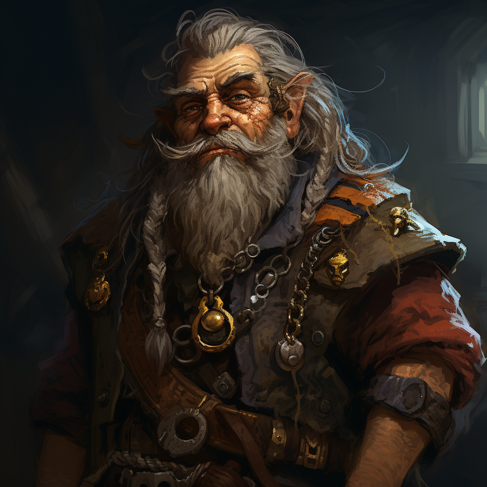
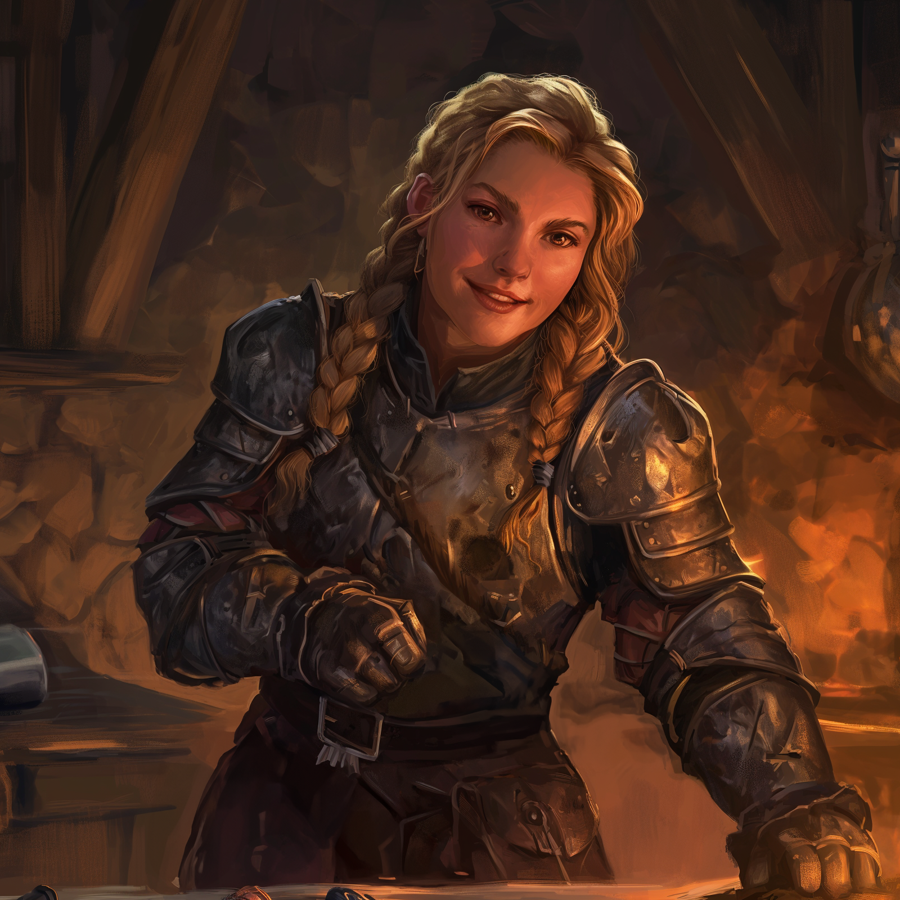

# The Dunmar Fellowship

-
   :octicons-info-24:{ .lg .middle } An adventuring party  

An adventuring party who met in Dunmar and have traveled together from April 1748 through the present. 

Consists of:
- The elven warlock [Delwath](<./delwath.md>)
- The halfling scout [Wellby](<./wellby.md>) and his axebeak mount and companion [Baxter](<companions/baxter.md>)
- The dwarven bard, scholar, and rune master [Seeker](<./seeker.md>)
- The human monk [Kenzo](<./kenzo.md>)

They frequently travel with the dwarven cleric [Riswynn](<./riswynn.md>). The stoneborn druid [Drikod](<guests/drikod.md>) traveled with them from May 23 1748 through June 20 1748. 

In the fall of 1748, they were split up due to magical effects. During this time, they traveled alone.

- Seeker traveled with [Mikasa](<guests/mikasa.md>), [Raven](<guests/raven.md>), [Spirala](<guests/spirala.md>), and [Caulaus](<guests/caulaus.md>) in the Feywild
- Kenzo traveled with [Izzarak](<guests/izzarak.md>) in the lizardfolk jungles to the south
- Delwath traveled with [Iascaire](<guests/iascaire.md>) and [Aristaea](<guests/aristaea.md>) in the battlefields of the far north
- Wellby traveled with [Artem](<guests/artem-novolozek.md>), [Rufus](<guests/rufus.md>), [Shoal](<guests/shoal.md>), and [Alimash](<guests/alimash.md>) in the eastern isles. 
- Riswynn traveled with [Thror](<guests/thror.md>), [Rothfis](<guests/rothfis.md>), and [Merash](<guests/merash.md>) in the [Shadowfolds](<../../../cosmology/multiverse/echo-realms/shadowfolds/shadowfolds.md>) domain of [Morkalan](<../../../cosmology/multiverse/echo-realms/shadowfolds/morkalan.md>).

Kenzo, Seeker, and Wellby were reunited in the Feywild and traveled with [Caulaus](<guests/caulaus.md>) briefly.

The group was reunited on Nov 15 1748 in Dunmar. 

## Followers and Hirelings

-   [Faldrak Bronzehammer](<../../dwarves/faldrak-bronzehammer.md>)
 
    ---
    
     Dwarven artificer, former adventurer, creator of magic items, and aspiring skyship captain.

-  [Kethra Silverspark](<../../dwarves/kethra.md>)

    ---
    
	 A dwarven smith from Tharn Todor, inspired by Riswynn to seek adventure.

The Dunmar Fellowship has acquired a number of followers, hirelings, and traveling companions, including:

- [Faldrak Bronzehammer](<../../dwarves/faldrak-bronzehammer.md>), a Dwarven artificer, former adventurer, creator of magic items, and aspiring skyship captain. Based on Vindristjarna. 
- [Adam Gower](<../../tollenders/adam-gower.md>), a human factor and agent, with a history of working for the Goodbarrel family. Now serves as the party's representative in Tollen, and also manages trade goods and contracts in Tollen. Based in Tollen. 
- [Amil](<../../dunmari/amil.md>) (uh-MEEL), a joyful and upbeat Dunmari monk of the Order of the Awakened Soul, who trained with Pava and Avaras in the [Garamjala Desert](<../../../gazetteer/greater-dunmar/garamjala-plateau/garamjala-desert.md>) before leaving to help record the stories of the ordinary people of the world. Based on Vindristjarna. 
- [Égnir](<../../elves/egnir.md>) (AY-nyeer), a quiet and meditative young elven man, a gardener and a musician, seeking to experience the world in his own quiet way. Based on Vindristjarna. 
- [Nuzkar](<../../orcs/nuzkar.md>) and [Aygul](<../../orcs/aygul.md>), orcs and twin sisters. Nuzkar is an archivist and loremaster; Aygul a brawler who helps in the training rooms.
- [Kethra Silverspark](<../../dwarves/kethra.md>), a dwarven smith and Riswynn's mentee. 
- [Kecha](<../../kenku/kecha.md>), a kenku scout guiding the party to Ursk
- (unnamed mapmaker recruited in Tollen)

