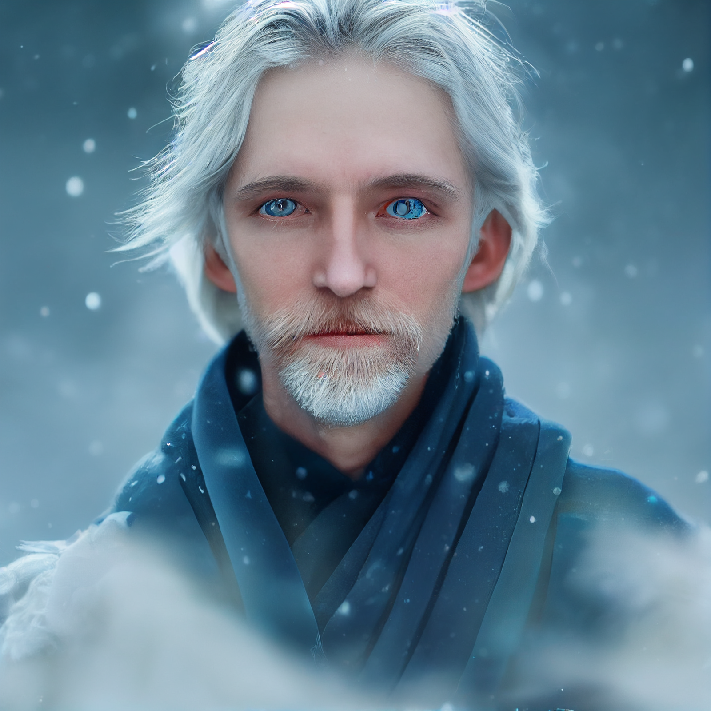

# Artem Novolozek
>[!info]+ Biographical Info  
> A [human](<../../../../species/humans/humans.md>) (he/him)  
>> 

{align="right"; width="320"}Human wizard, originally from [Ursk](<../../../../gazetteer/northern-green-sea/ursk.md>), but fled the magocracy there, bringing a treasure – the crystalline heart of a remorhaz – as payment to a patron in [Medju](<../../../../gazetteer/eastern-green-sea/medju.md>) who will set him free from pursuers. Currently on his way to [Medju](<../../../../gazetteer/eastern-green-sea/medju.md>) after helping [Wellby](<../wellby.md>) and companions kill aboleth, and retrieve his treasure. 
