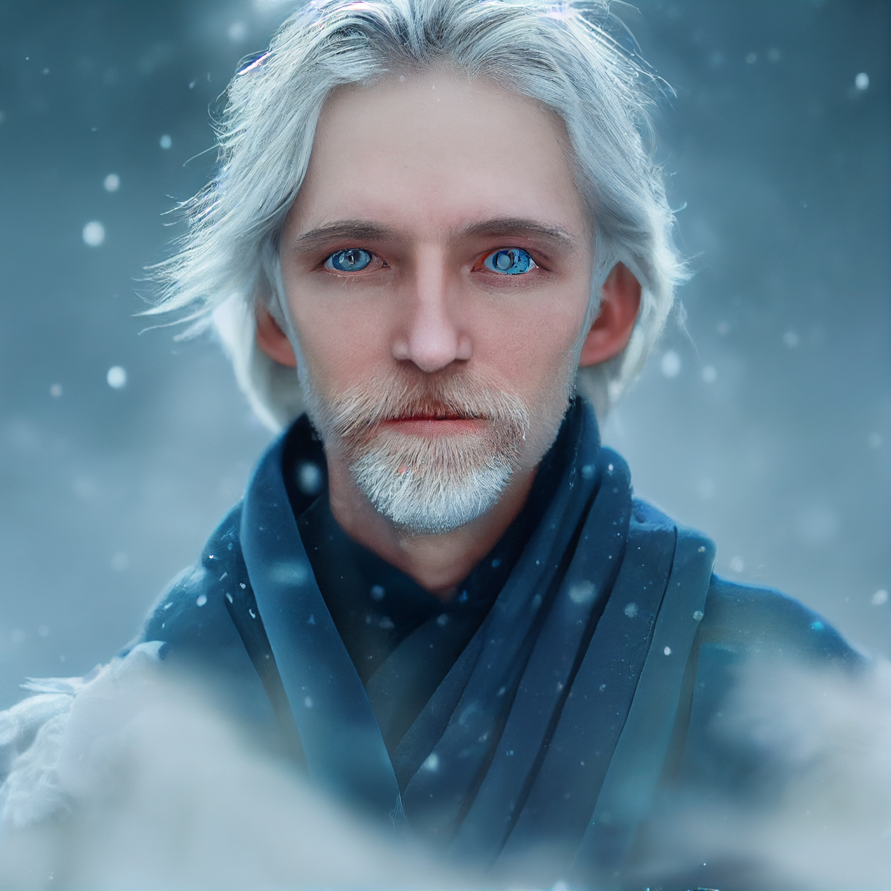

# Artem Novolozek

- :octicons-info-24:{ .lg .middle } __Biographical Information__

    An [Urskan](<../../../../gazetteer/northern-green-sea/ursk/ursk.md>) [human](<../../../../creatures/species/humans.md>) (he/him)  
    Traveled with the [Dunmar Fellowship](<../dunmar-fellowship.md>)  
    { .bio }

    Originally from: [Ursk](<../../../../gazetteer/northern-green-sea/ursk/ursk.md>)

:octicons-location-24:{ .lg .middle } Last known location (as of October 6th, 1748): [Ursk](<../../../../gazetteer/northern-green-sea/ursk/ursk.md>)

    An [Urskan](<../../../../gazetteer/northern-green-sea/ursk/ursk.md>) [human](<../../../../creatures/species/humans.md>) (he/him)  
    Traveled with the [Dunmar Fellowship](<../dunmar-fellowship.md>)  
    { .bio }

    Originally from: [Ursk](<../../../../gazetteer/northern-green-sea/ursk/ursk.md>)

:octicons-location-24:{ .lg .middle } Last known location (as of October 6th, 1748): [Ursk](<../../../../gazetteer/northern-green-sea/ursk/ursk.md>)

{align="right"; width="320"}Human wizard, originally from [Ursk](<../../../../gazetteer/northern-green-sea/ursk/ursk.md>), but fled the magocracy there, bringing a treasure – the crystalline heart of a remorhaz – as payment to a patron in [Medju](<../../../../gazetteer/eastern-green-sea/medju.md>) who will set him free from pursuers. Currently on his way to [Medju](<../../../../gazetteer/eastern-green-sea/medju.md>) after helping [Wellby](<../wellby.md>) and companions kill aboleth, and retrieve his treasure. 

