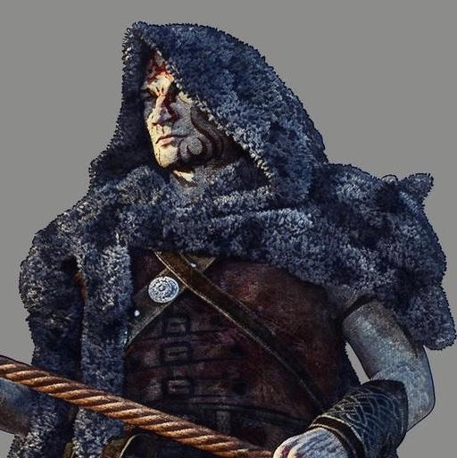

# Drikod

- :octicons-info-24:{ .lg .middle } __Biographical Information__

    A [stoneborn](<../../../../species/children-of-the-embodied-gods/stoneborn/stoneborn.md>) (he/him)  
    { .bio }

    Based in [Kunda](<../../../../gazetteer/sentinel-range/kunda.md>), [Indalas](<../../../../gazetteer/sentinel-range/sentinel-range.md>)

## Pre-Campaign Events

- Apr 29, 1748 DR: Drikod leaves [Kunda](<../../../../gazetteer/sentinel-range/kunda.md>), his village in the mountains.
- May 12, 1748 DR: Drikod arrives in Karawa.