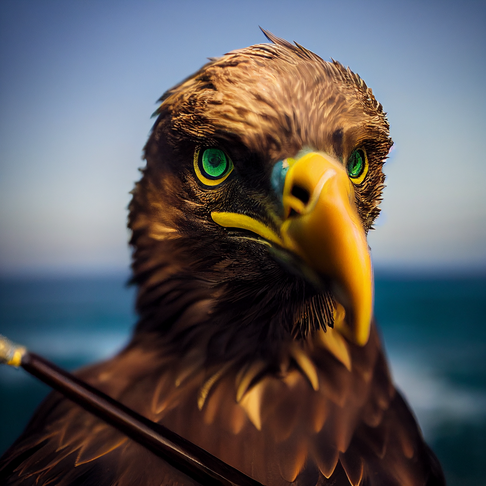

# Rufus

- :octicons-info-24:{ .lg .middle } __Biographical Information__

    A kenku (he/him)  
    { .bio }

{align="right"; width="320"}Kenku monster hunter and unofficial protector of [Wahacha](<../../../../gazetteer/eastern-green-sea/wahacha.md>). Excellent with bow and arrow. Helped kill the aboleth. Now returned to [Wahacha](<../../../../gazetteer/eastern-green-sea/wahacha.md>), continuing to guard against monsters of the deeps. Hates crabs. 

