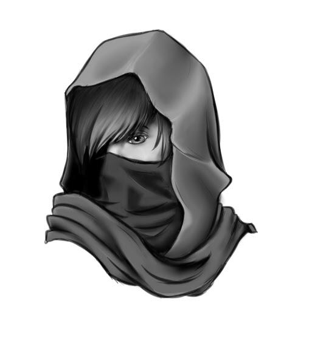
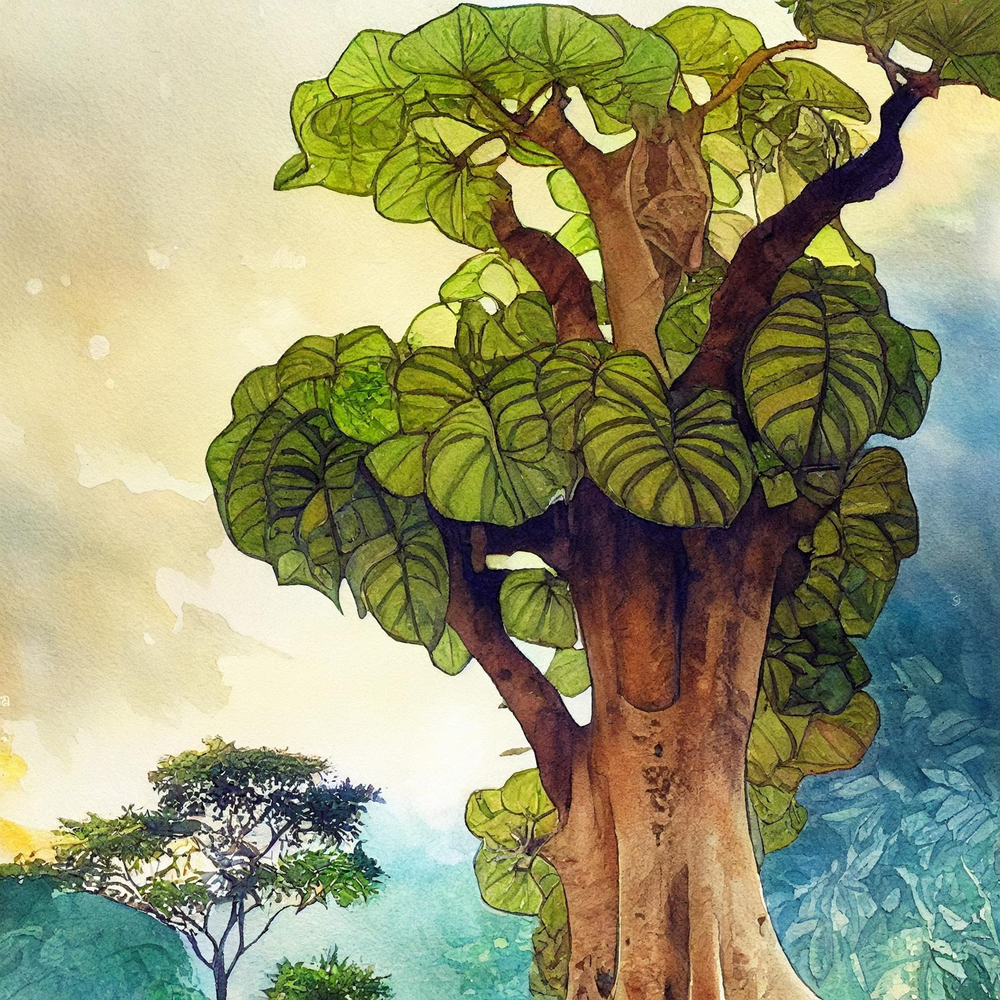

# Kenzo

- :octicons-info-24:{ .lg .middle } __Biographical Information__

    A [Dunmari](<../../../gazetteer/greater-dunmar/realms/dunmar/dunmar.md>) [human](<../../../species/humans.md>) (he/him)  
    { .bio }

## Pre-Campaign Events

- Mar 11, 1748 DR: Kenzo leaves the Lakan Monastery at Tokra, heading for Karawa in search of answers about his dreams, and the jade fragment he carries.

> [!warning]- Kenzo's Backstory
> 
> Kenzo was born in [Chardon](<../../../gazetteer/greater-chardon/chardonian-empire/chardon/chardon.md>), the child of Dunmari immigrants. He has only fragmentary memories of the first years of his life -- flashes of his mother's smile, the smell of his father's hair. When he was five, his parents died, and he grew up on the streets, with only polished shard of [Jade Piece of Rai's Hand](<../../../campaigns/dunmari-frontier-campaign/treasure/jade-piece-of-rai-s-hand.md>) passed down from his family to remember his parents by.
> 
> The next few years of his life were rough. Kenzo was different from most children -- not only was he Dunmari, and an orphan, but he had exceptionally vivid dreams. A few times a year, he would wake from sleep confused, totally convinced he had been teleported to some strange, silent place. Sometimes these were new, but a few always recurred: a forest, lush and vibrant, surrounded by high mountain peaks; an island, barren except for a single tall dark tower; a perfectly circular hill, covered in small white flowers, in the middle of a desert; an impossibly vast forest, stretching without end as far as the eye could see.
> 
> His differences made him vulnerable, and living on the streets he found himself falling in with some unsavory characters, thieves and ruffians and pickpockets. This company kept him fed and alive, but every year he fell deeper in debt and more bound to an endless cycle of crime and violence.
> 
> Lost, and seemingly destined for a short, bitter life, everything changed when he caught the attention of an old wizard and scholar, [Kaeso](<../../chardonians/kaeso.md>) Etendis. [Kaeso](<../../chardonians/kaeso.md>) saw something in him -- some potential to channel magic, some potential for more than the life he had -- and took him in. While [Kaeso](<../../chardonians/kaeso.md>) never shared much about his past, beyond some stories about the [Society of the Open Scroll](<../../../groups/chardonian-organizations/society-of-the-open-scroll.md>), and his former associations with them, he was very good at avoiding attention, and he helped Kenzo disappear from his debtors for a while.
> 
> The next six years of Kenzo's life were eye opening. [Kaeso](<../../chardonians/kaeso.md>) encouraged and supported him, taught him about magic and the arcane arts. [Kaeso](<../../chardonians/kaeso.md>) also taught Kenzo what he knew of the Dunmari, and especially the occult religions and hidden secrets of the Mystery cults. While [Kaeso](<../../chardonians/kaeso.md>) is not Dunmari, he studied widely the occult mysteries of the world, and his insistence on protecting secret knowledge he was told in confidence was a large part of why he was expelled from the [Society of the Open Scroll](<../../../groups/chardonian-organizations/society-of-the-open-scroll.md>).
> 
> This life came to an end when Kenzo was 17, as his former life caught up to him and his debts came due. Rather than return to the unsavory past he had escaped, Kenzo fled the city. Unsure where to go, he headed for [Dunmar](<../../../gazetteer/greater-dunmar/realms/dunmar/dunmar.md>), seeking to return to his ancestral homeland and build a new life, free of his troubled past.
> 
> [Kaeso](<../../chardonians/kaeso.md>) had told Kenzo of the Dunmari mysteries, and especially the Lakan cult, occult students of the god [Laka](<../../../gods-and-religions/gods/incorporeal-gods/dunmari-pantheon/laka.md>), the god of knowledge and time, both the seasonal cycles of agriculture and the deeper, longer cycles of history. Hearing of a temple of [Laka](<../../../gods-and-religions/gods/incorporeal-gods/dunmari-pantheon/laka.md>) outside the Dunmari city of [Tokra](<../../../gazetteer/greater-dunmar/realms/dunmar/central-dunmar/tokra/tokra.md>), Kenzo presented himself to [Lara](<../../dunmari/lara.md>), the Speaker of the Lakan Mysteries. She accepted him as an acolyte and initiate in training.
> 
> For five years, Kenzo trained at the temple, learning to control his movements and his mind, and becoming an initiate of the Lakan Mysteries. As a Mystai, he saw deeply into the truth of the world, and began to realize a connection between his dreams and the necklace, which he had kept safe and hidden for many years. Upon realizing that the necklace is magical, and discussing this with Speaker [Lara](<../../dunmari/lara.md>), she advised him to travel to [Karawa](<../../../gazetteer/greater-dunmar/realms/dunmar/eastern-dunmar/karawa.md>), and seek [Candrosa](<../../dunmari/candrosa.md>), the Speaker of [Shakun](<../../../gods-and-religions/gods/incorporeal-gods/dunmari-pantheon/shakun.md>) there, who might be able to tell him more. With a letter of introduction and his skill and training, Kenzo left for [Karawa](<../../../gazetteer/greater-dunmar/realms/dunmar/eastern-dunmar/karawa.md>).
> 
> These are the images that frequently recur in Kenzo’s dreams:  
> - a lush forest in autumn, leaves turning golden, surrounded by high peaks 
> - an island, in the middle of an ocean, with nothing but a single tall dark tower standing on it 
> - a tall green hill, perfectly round, with small white flowers growing on, surrounded by desert
> - a boat wracked by waves
> - an impossible castle, floating in the air above an expansive patchwork of small farms and cities
> - a vast, endless expanse of forest as far as the eye can see
> - red sandstone mesa in the rocky desert, a small, clear oasis sheltering in the shadow of its cliffs

> [!WARNING]- Kenzo's Meeting with Candrosa, Session 5
> 
> ### Kenzo and [Candrosa](<../../dunmari/candrosa.md>), [Dreamworld](<../../../cosmology/dreamworld.md>), [Session 5 (DuFr)](<../../../campaigns/dunmari-frontier-campaign/session-notes/session-5-dufr.md>)
> 
> In the predawn hours, you awake suddenly to a gentle tapping on your door. Standing outside is [Candrosa](<../../dunmari/candrosa.md>), dressed in his silver-trimmed, ochre robe, walking with a sense of purpose and resolve you have not seen before. He carries a staff of white ash with a silver crescent moon design on top.
> 
> 'Kenzo. Will you walk with me? I intend to retreat for a day or two, in order to pray and meditate on recent events, but would talk with you before I do.'
> 
> [Candrosa](<../../dunmari/candrosa.md>) leads you out of the inn, into the desert to the east, around the village, and to a hidden stairway climbing the side of the [Red Mesa](<../../../gazetteer/greater-dunmar/realms/dunmar/eastern-dunmar/red-mesa.md>). The climb is very steep, but short, and just as the sun is rising you ascend to the top, catching the first rays of morning light. [Candrosa](<../../dunmari/candrosa.md>) says, "The view is beautiful up here." The morning light catches off the stones of the desert, bathing everything in warm reds and golds. [Candrosa](<../../dunmari/candrosa.md>) pauses for a moment, then says, "I need to ask you a question. For several weeks, every time I dream I have seen a vision of a [Jade Piece of Rai's Hand](<../../../campaigns/dunmari-frontier-campaign/treasure/jade-piece-of-rai-s-hand.md>) hand, reaching out to me. The hand is very lifelike, except for a crack that runs down the palm, as if a deep gash had been cut in the stone. Every night I try to grasp it, and every night my hand passes through it, as if it were an illusion. Last night, you were in my dreams. You did something to the hand -- reached out to it somehow and placed something in the gash -- and then your hand closed around it, and you vanished. This feels significant. Do you know what this might mean?"
> 
> Learning that you carry this [Jade Piece of Rai's Hand](<../../../campaigns/dunmari-frontier-campaign/treasure/jade-piece-of-rai-s-hand.md>) shard, he holds up his staff, which seems to pulse with the light of dawn. It seems to have grown, becoming larger and yet also more insubstantial, as if you are seeing it through a faint mist. "I can connect your soul to the [Dreamworld](<../../../cosmology/dreamworld.md>) if you wish. This is not a thing to do lightly, as the [Dreamworld](<../../../cosmology/dreamworld.md>) has its own perils. But it may be the only way to learn more about this item you carry."
> 
> [Candrosa](<../../dunmari/candrosa.md>) touches the staff to your forehead, and you feel yourself falling away from your body. The world turns faint and insubstantial around you, everything fading to mist except the staff and your [Jade Piece of Rai's Hand](<../../../campaigns/dunmari-frontier-campaign/treasure/jade-piece-of-rai-s-hand.md>) amulet. A voice, in the distance: 'Remember the staff, remember your body, or you may not be able to find your way back.'
> 
> The amulet is pulsing with a bright green light, brief flashes of images streaming out of it with each beat, too fast for you to see. As the pace of the beats increase, the images start to stabilize, and you realize you are looking at a hand made of [Jade Piece of Rai's Hand](<../../../campaigns/dunmari-frontier-campaign/treasure/jade-piece-of-rai-s-hand.md>), reaching out as if you take your hand. There is a deep gash down the palm, exactly as [Candrosa](<../../dunmari/candrosa.md>) described.
> 
> As you place your shard of [Jade Piece of Rai's Hand](<../../../campaigns/dunmari-frontier-campaign/treasure/jade-piece-of-rai-s-hand.md>) in the gash, the hand feels warm to the touch, almost like a person. Grasping the hand, you feel yourself pulled through a vortex. You see a brief glimpse of a vast formless expanse, filled with pulsing, flashing, multicolored and vibrantly alive points of color, drifting across the space in impossible ways. For a moment this galaxy of lights assaults your senses and you are overwhelmed. Then a hand is guiding you, pushing you and drawing you in at the same time, until your vision shifts and you are standing on a flat colorless plain. Standing before you is a man, robed and hooded, holding a staff in one hand. His other hand, and seemingly part or all of his arm, is made of [Jade Piece of Rai's Hand](<../../../campaigns/dunmari-frontier-campaign/treasure/jade-piece-of-rai-s-hand.md>).
> 
> He looks at you for a long moment, then in a movement so quick it seems like teleportation, he is standing directly in front of you, his [Jade Piece of Rai's Hand](<../../../campaigns/dunmari-frontier-campaign/treasure/jade-piece-of-rai-s-hand.md>) hand moving towards, and then through, your forehead, as he says "Kenzo, open your eyes and see." You are knocked back, momentarily feeling as though your eyes are opening again, despite being open already, and see yourself and this man standing next to each other, both surrounded by a nimbus of light. This vision lasts for a moment, and then the man in front of you is shattered, split into many pieces, which are held in place for a brief moment and then begin to fly in all directions, visions flashing across your mind's eye too fast to understand. You feel yourself being draw back to your body, as if being pulled by a cord, faster and faster. As you return to your body, in that moment before you are fully conscious, the voice of the man echoes in your mind: "You are not alone. Seek the stories of the [Order of the Awakened Soul](<../../../groups/dunmari-mystery-cults/order-of-the-awakened-soul.md>)." As your eyes open, you realize that you can still sense the energy of wherever you were, you can feel your mind's eye waiting for you to call upon it, and the force of the extraplanar power joining with your ki.

> [!WARNING]- Private Discussion with Vola, Session 11
> 
> ### Kenzo and [Vola](<../../chardonians/vola.md>), [Session 11 (DuFr)](<../../../campaigns/dunmari-frontier-campaign/session-notes/session-11-dufr.md>)
> 
> [Vola](<../../chardonians/vola.md>) comes to sit next to you.
> “Fuck, that was awful”
> I don’t answer but grasp her hand and bring her into meditation with me if she chooses
> She talks quietly, not expecting a response. “I saw some shit growing up in [Chardon](<../../../gazetteer/greater-chardon/chardonian-empire/chardon/chardon.md>). Near the chalyte refineries.”
> I don’t answer but squeeze her hand in acknowledgement
> Her voice moves to your mind. “I had something that might have helped with this, but the [orc](<../../../species/orcs.md>) took it. Must have sent it on as it wasn’t with my stuff. I can forgive your lack of Chardonian ancestry, us humans have to stick together.”
> Interesting…you can communicate with your mind…
> “Sometimes. It comes and goes.”
> …are you from the north bank?
> “Yes. The stinklands. Near the refineries"
> I know those refineries. I’m glad to have left. If you’re from there how did you end up with open scroll? I’ll be honest. When I heard you were from there I put my armor up
> “I met someone. He noticed my talent. He took me to Whitsun Tower, in the academy. I learned there. You should not think poorly of the Society. Remember after the fall of [Drankor](<../../../history/drankorian-era/drankor.md>), oh so many years ago, much was lost and humanity was much poorer for it.”
> Who did you meet?
> “A friend. His name is [Agon](<../../chardonians/agon.md>)."
> And what has the Society done for the neighborhoods in the north bank? A lot of suffering from what I lived and experienced.
> “[Chardon](<../../../gazetteer/greater-chardon/chardonian-empire/chardon/chardon.md>) will rise, I’m sure. When we have more knowledge and power we can help all the true Chardonians who need it.”
> Who are true Chardonians?
> “Everyone who has the spirit of knowledge in them. But I think your friends are right we should rest now."

> [!warning]- The [Land of the Dead](<../../../cosmology/land-of-the-dead.md>), Session 22
> 
> Kenzo's Experience of the [Land of the Dead](<../../../cosmology/land-of-the-dead.md>), [Session 22 (DuFr)](<../../../campaigns/dunmari-frontier-campaign/session-notes/session-22-dufr.md>)
> 
> During the initiation ritual of the [Bhishma](<../../../gods-and-religions/gods/incorporeal-gods/dunmari-pantheon/bhishma.md>) mystai, as the story of [Bhishma](<../../../gods-and-religions/gods/incorporeal-gods/dunmari-pantheon/bhishma.md>) concludes and you agree to sacrifice yourself for [Jeevali](<../../../gods-and-religions/gods/incorporeal-gods/dunmari-pantheon/jeevali.md>), you feel your heart stop, the life fading from you. For a brief moment you see a vast expanse of space, a river flowing through it, the occasional essence of someone or something moving in the distance, some in clumps, some alone. After a timeless moment, something grasps your hand, you feel warmth, and realize that for some eternal time you had felt nothing at all. The presence whispers, "Will you come back with me?"
> 
> As you respond “yes”, the hand begins to pull you, and see the monastery growing larger as you take a step through time and space and find yourself stepping into your body. Behind you, you see [Bhishma](<../../../gods-and-religions/gods/incorporeal-gods/dunmari-pantheon/bhishma.md>) and [Laka](<../../../gods-and-religions/gods/incorporeal-gods/dunmari-pantheon/laka.md>) standing together

> [!warning]- Kenzo's Dream Staff Journey, Session 32
> 
> #### Kenzo's Dream Staff Journey, [Session 32 (DuFr)](<../../../campaigns/dunmari-frontier-campaign/session-notes/session-32-dufr.md>)
> 
> You hold the image of [Dimitaur](<../great-war/companions/dimitaur.md>) and the robed figures in the circular room in your mind as [Candrosa](<../../dunmari/candrosa.md>) raises up the staff and begins to chant. You find yourself slipping into a trance, floating in a weightless space, a constellation of multicolored points of light all around you.
> 
> Behind you, a thin line of energy stretches, anchoring you to [Candrosa](<../../dunmari/candrosa.md>), the staff, and your body. This is what you experienced before, when you had the vision of the [Jade Piece of Rai's Hand](<../../../campaigns/dunmari-frontier-campaign/treasure/jade-piece-of-rai-s-hand.md>) hand a few months ago.
> 
> [Candrosa](<../../dunmari/candrosa.md>)’s voice behind you, echoing faintly, “Concentrate on your anchor!”
> 
> The dazzling array of stars begins to clear, and you are looking down at a dark jungle. It is night, there are no lights, no fires, no landmarks to mark where you are, except the sound of a waterfall somewhere below you.
> 
> As you drift above the dark jungle, the landscape begins to melt, the massive trees pouring away, leaving behind only shadowy echos of themselves. You are pulled down towards a river, wide and languid, as the tangled trees and vibrant growth of the forest below gives way to a great city.
> 
> The city itself is ghostly, insubstantial. Everywhere are monumental buildings - huge domed palaces looming over the streets surrounding great courtyards, gardens of great beauty and splendor, plazas filled with fountains and art, grand apartments lining the streets. But whenever you look closer, or try towards a building, it fades, so it is hard to get more than a brief impression of the city as a place of monumental grandeur.
> 
> There are, however, two buildings that seem to hold their form. One, a circular, low domed building that seems plainer, and yet older and more significant than the surrounding palaces, sitting at the southern end of a great plaza. The other, closer, is partially hidden behind several domed palaces, but as they are fading in and out of sight, you can catch glimpses of a solid structure beyond. It is a small building, a low three story villa with an attached tower, made of plain gray stone, not elaborate like many of the other structures here, but much more solid.
> 
> As you turn towards the first building, the circular domed building, your sense of time is distorted. The buildings are all intact, but ghostly and indistinct, devoid of people, and occasionally there are massive trees growing through the center of a building, coexisting with it, draped with vines and lush green plant life (but no animals). It does not feel like you are in one time, it feels like you are looking at many times at once. In any case, yes, you can fly.
> 
> As you head towards the first building, it grows more substantial while the surrounding buildings grow fainter As you approach, you start to see green growth cracking through the massive paving tiles of the plaza outside, vines and flowers. The building itself is maybe 150, 200 feet in diameter, with a large dome sparkling with silver and gold. The large doors on facing the plaza are open, casting sunbeams into a crowded room. No sound comes from within, but you can see 100 or more people, humans and some that look like they may be elves, praying. The interior of the building is new and bright, in contrast to the exterior which seems faded with time.
> 
> As you enter, the people seem to part for you, but don’t otherwise acknowledge your presence. Once inside, you can here sounds of the prayer, but they sound as if they are coming from a long way away. You do recognize the prayer - it is a prayer of thanksgiving, an acknowledgment of miracles granted. This prayer is being offered to the [Eight Divines](<../../../gods-and-religions/religions/mos-numena/mos-numena.md>), the same gods that are now worshipped in [Chardon](<../../../gazetteer/greater-chardon/chardonian-empire/chardon/chardon.md>). The prayer, as you listen, seems to be describing the Fall of [Hkar](<../../../history/pre-downfall/hkar.md>), it seems to be a prayer of gratitude for the gods who saved the refugees of that disaster. As you listen more, the words splinter, become cacophonous. It is as if you are listening to 100 or more conversations at once. You catch glimpses, fragments, always of thanksgiving: for victories in battle, for the crowning of emperors, for the magic of the gods and arcane magic learned by great effort, occasionally for a birth or marriage. The form of the interior of this temple, apparently, also shifts. First, just a plain room, but then statues appear. First, of the [eight divines](<../../../gods-and-religions/religions/mos-numena/mos-numena.md>), large, arranged in a semicircle at the front of the temple. Then, humans, tombs or monuments to deceased emperors. Over time the whispers and the people begin to fade away, the space starting to empty out.
> 
> You join in the prayer, sensing in the process that this place is somehow, at least in the [Dreamworld](<../../../cosmology/dreamworld.md>), the center of Drankor, physically and metaphysically. As you pray, most of the people fade away. Eventually, all that is left is robed figure, elf-like in appearance but not quite an elf, striding with purpose across the room. The interior is now an elaborate display — statues, altars, tombs, even what seem to magically floating crystal torches casting multi-colored firelight. The robed elf approaches the central altar, and kneels, head bowed, praying softly, words indistinct.
> 
> He begins to grow, then, taller and taller, as the walls of this building become insubstantial, and you see stepping out of the jungle another massive ghostly figure, human, Drankorian in features. The two of them face off, staring at each other. As they do, you can see echoes of other people in each of them, as of as they grow they are not just themselves. 
> 
> You sense that both of their auras are incredibly complex. It actually feels like you are not looking at a single person, but tens or hundreds all smooshed together, layered in top. From the elf-ish creature, you get a hint of a deep joy in the secrets of the world, the thrill of knowledge, the sensation of being at the moment of unlocking hidden meaning in the universe. From the human, a sense of order, or purity, of deep, abiding faith in the nobility of Drankor, the noble purpose of the empire, and especially the lost land of [Hkar](<../../../history/pre-downfall/hkar.md>), the pure and free homeland of humanity where they could be their best selves. As they turn to face each other, you feel a wind come up, and in their auras you feel the burning hatred these two creatures have for each other.
> 
> The first creature, the human, goes to strike. As it swings, you see echoing in its body, what seem like generations, people reflected in its ghostly form, marching into the past. The second creature, the elf-ish one, raises his hand and a light flares. In the light you can see burning bright the forms of others, also what seem like generations. Standing in the light that forms the shield is the figure of [Rai](<../great-war/rai.md>). As the blow hits, you can see there are five holes in this shield of light, five points where there is a gap in the defense. You can start to here voices, echos of sounds from both figure. From the human, a group standing together, mages all, chanting "[Omnis Pura](<../../../groups/drankorian-societies/omnis-pura.md>), [Omnis Pura](<../../../groups/drankorian-societies/omnis-pura.md>)," while tendrils of blue light begin to reach around the shield, hissing noises from them as they try to bury into the elvish form, try to reach behind it to what it is protecting, which you see now is a massive crowd of ghosts, all shapes and sizes and races, but no Drankorians.
> 
> One of the tendrils of blue light reaches for you, and suddenly both figures notice you. They tower above you, at least 20 feet tall. As both figures look down at you, you see them for a moment not as giants, but as strands of history, threads of [Drankor](<../../../history/drankorian-era/drankor.md>). As the blue tendrils reaches you, you feel a burning sensation, but rapidly it cools, feels almost like a gentle, relaxing breeze. You see the line of your ancestors going back to [Hkar](<../../../history/pre-downfall/hkar.md>), the human figure pleased for a moment, until [Rai](<../great-war/rai.md>) grows, filling the form of the elvish figure, and leaps, crying “This one is not for you!” as the blue white tendrils of light shatters against [Rai](<../great-war/rai.md>).
> 
> You can feel the [Jade Piece of Rai's Hand](<../../../campaigns/dunmari-frontier-campaign/treasure/jade-piece-of-rai-s-hand.md>) growing heavy on your neck, and see battle after battle: always [Rai](<../great-war/rai.md>), or someone looking like him, rising up in battle against this human giant. The [Jade Piece of Rai's Hand](<../../../campaigns/dunmari-frontier-campaign/treasure/jade-piece-of-rai-s-hand.md>) is definitely drawn to [Rai](<../great-war/rai.md>), not the human figure. And, in every battle, the human figure remains you of the things you don’t like about [Chardon](<../../../gazetteer/greater-chardon/chardonian-empire/chardon/chardon.md>), and the [Rai](<../great-war/rai.md>) figure reminds you of [Kaeso](<../../chardonians/kaeso.md>).
> 
> Time speeds up, and you see the temple room you are in fall into ruin, fall into decay. The statues crumble. The giant forms shrink, collapsing on themselves. First the human, then the elf/[Rai](<../great-war/rai.md>), but the human falls harder, faster. As the [Rai](<../great-war/rai.md>)/elf figure falls, he throws out a hand, and grabs the floor of the temple, stopping himself from falling away to nothing. He has shrunk now, to a normal size, and pulls himself to standing, in the center of the temple, looking at you.
> 
> You pause for a moment, feel intently into the [Jade Piece of Rai's Hand](<../../../campaigns/dunmari-frontier-campaign/treasure/jade-piece-of-rai-s-hand.md>) and into this figure in front of you, seeing how your aura connects with the [Jade Piece of Rai's Hand](<../../../campaigns/dunmari-frontier-campaign/treasure/jade-piece-of-rai-s-hand.md>) and with [Rai](<../great-war/rai.md>). As you do, you feel almost in the way that the [Rai](<../great-war/rai.md>) figure is claiming you. This figure is not just [Rai](<../great-war/rai.md>), but somehow a thread of people, connected by a common history, or aura, in some way. The [Jade Piece of Rai's Hand](<../../../campaigns/dunmari-frontier-campaign/treasure/jade-piece-of-rai-s-hand.md>), itself, seems to be part of this history. It is a history, an aura that reminds of you [Kaeso](<../../chardonians/kaeso.md>), most closely, but also the ghost of [Karmana](<../../dunmari/karmana.md>), and [Rishi](<../../dunmari/rishi.md>).
> 
> As you contemplate auras, the [Rai](<../great-war/rai.md>)/elf figure raises his hand, which you see is now [Jade Piece of Rai's Hand](<../../../campaigns/dunmari-frontier-campaign/treasure/jade-piece-of-rai-s-hand.md>), and a pale green light begins to expand from this temple, twisting and encapsulating the human form that fell. The greenish light pulses slowly, almost forming a shield or a barrier.
> 
> Still looking at you, the [Rai](<../great-war/rai.md>)/elf figure speaks: “The legacy of Drankor still balances on a knife’s edge, teetering while we were fighting other fights. Will this be your burden? Is the legacy knowledge, shared with all, or the strength and might of Hkaran purity?
> 
> As you ponder for a moment, you drift seemingly into the depths of Drankorian history: the founding of the city, full of hope and determination never to fall victim to the powerful world-shaking magic of [The Downfall](<../../../events/ancient/the-downfall.md>) of [Hkar](<../../../history/pre-downfall/hkar.md>) again; the armies marching across the plains, moving north and the empty land falling under their sway with hardly a fight; the great towers, and mages forming secret societies to pry the hidden mysteries of extraplanar power; and then, as if you are seeing double, the stream splits in half and your vision returns to the crumbling temple room. 
> 
> As your vision clears, you speak, asking him, "This stone -- I believe it to be a part of you. Where are you now? Can I reunite this piece for you?"
> 
> The figure holds up his hand, which you is made of [Jade Piece of Rai's Hand](<../../../campaigns/dunmari-frontier-campaign/treasure/jade-piece-of-rai-s-hand.md>). As you watch, it slowly shatters into five pieces, which drift apart, one fading and merging with the stone in your hand. [Rai](<../great-war/rai.md>) watches, in fascination: “This has not happened yet. You bring a vision of a future yet to occur."
> 
> “I do not know where I am, in your time, in the time after this. In this now, I am here, in this place, in this same place in all the echo realms, at the heart of [Drankor](<../../../history/drankorian-era/drankor.md>), watching.”
> 
> As he speaks, you can see the pale green light that extends from [Rai](<../great-war/rai.md>)’s hand, spreading from the temple, expanding, twisting to encapsulate the human form that fell. It pulses slowly, almost forming a shield, but as the hand fragments, so does the shield. 
> 
> Watching this [Jade Piece of Rai's Hand](<../../../campaigns/dunmari-frontier-campaign/treasure/jade-piece-of-rai-s-hand.md>) hand shatter, you ask him, “How can I reunite this shield, how fix what has happened?”
> 
> [Rai](<../great-war/rai.md>) pauses for a moment, watching in concern, and then speaks. “This has not happened for me yet. Time moves in unpredictable ways here. The me you see, and the me from which that shattered piece of [Jade Piece of Rai's Hand](<../../../campaigns/dunmari-frontier-campaign/treasure/jade-piece-of-rai-s-hand.md>) came, come from different places in the stream of time. You must find what did this in your time, to understand how to undo it.”
> 
> Kenzo: “What force could possibly break this shield?”
> 
> [Rai](<../great-war/rai.md>): “Very little from this plane, but other planes? Even I have not fully explored them. The planes of the gods, the planes of the fears and terrors of the humans, the realms of dragons and giants? There is much out there that me and my companions have tried to catalog and study.”
> 
> Kenzo: “Which companions?”
> 
> [Rai](<../great-war/rai.md>): “Do you know [Kyr](<../great-war/kyr.md>), the lizardfolk? There is much to study, and we have approached this together.”
> 
> The conversation continues, touching on the confusing nature of time in the [Dreamworld](<../../../cosmology/dreamworld.md>), where there is no counting of years, only “past” and “future”, without record of years. 
> 
> Kenzo: “In my time, now that this shield has been broken, what has been unleashed?”
> 
> [Rai](<../great-war/rai.md>): “The worst instincts of the Drankorian Empire. Not just power, not just greed, but a belief in the superiority of humanity, in the glory of the pure Drankorian essence. I am afraid this may infect the world now.”
> 
> Kenzo: “[Drankor](<../../../history/drankorian-era/drankor.md>) is long disappeared. It is ruins in the jungle now.”
> 
> [Rai](<../great-war/rai.md>): “But there are still humans, and there is always a risk that they are corrupted in their heart.”
> 
> Kenzo: “[Chardon](<../../../gazetteer/greater-chardon/chardonian-empire/chardon/chardon.md>). I fear in my time they are corrupted, they seek magic, they seek power.”
> 
> [Rai](<../great-war/rai.md>): “[Drankor](<../../../history/drankorian-era/drankor.md>) was for so many years much more than that, it was a beacon of hope, it was a place where humans could be safe and protected from the evils of the world, where demons could be turned away at the gates. [Chardon](<../../../gazetteer/greater-chardon/chardonian-empire/chardon/chardon.md>) was once this too, [Chardon](<../../../gazetteer/greater-chardon/chardonian-empire/chardon/chardon.md>) was a becon of hope in my lifetime.”
> 
> Kenzo: “Not in my time.”
> 
> [Rai](<../great-war/rai.md>): “Everything that happens here is an echo, a reflection. What you saw is not a literal vision of the world. You may have seen yourself fighting for a better [Chardon](<../../../gazetteer/greater-chardon/chardonian-empire/chardon/chardon.md>), my ancestors fighting for a better Drankor. These fights are never won, not permanently.”
> 
> Kenzo: “If I can find the other pieces, and bring them together, will that change anything?”
> 
> [Rai](<../great-war/rai.md>): “It might. But I cannot see all futures, and I cannot even see all the pasts. This is something you may need to do for yourself. But there is no spell, no wand you can wave, that will magically tell you how to find items of power. You hold what is a part of me, but me in a future I do not see.”
> 
> As you speak, a giant skeletal hand begins to rise from the ground behind the [Rai](<../great-war/rai.md>)-figure, reaching from a crack in the world, pulling itself up.
> 
> [Rai](<../great-war/rai.md>): “We are connected somehow. Look within yourself to find what you need. But you must run now!”
> 
> And with that he starts to grow, becoming larger and larger as he starts to turn to fight the giant skeletal creature, as you are pulled back into your body in [Karawa](<../../../gazetteer/greater-dunmar/realms/dunmar/eastern-dunmar/karawa.md>).

> [!WARNING]- Jungle Ki Lore
> 
> ### Jungle Ki Lore, [Session 57 (DuFr)](<../../../campaigns/dunmari-frontier-campaign/session-notes/session-57-dufr.md>)
> 
> In the lizardfolk kingdom of [Orekatu](<../../../gazetteer/faraway-places/orekatu.md>), Kenzo learned about other kinds of ki that draw energy from different parts of the spirit realms and collect in plants that grow in the right places, from a lizardfolk wanderer / prophet / spirit guide named [Elazar](<../../lizardfolk/elazar.md>). 
> 
> The lizardfolk call ki arima, and at its most basic level, consider it the concentrated energy of the [Plane of Souls](<../../../cosmology/plane-of-souls.md>), which any living being on Taelgar can, in principle, learn to channel. However, the lizardfolk spirit guides and prophets speak of many other forms of ki, which are the echoes and resonances of the higher spiritual planes, and which are often difficult or impossible to channel without an appropriate focus. While the lizardfolk think of this ki as “spiritual harmonics”, these echoes of other planes in the fabric of Taelgar has other names in other places. Chalyte, for example, is a stone that gathers the resonances of the [Plane of Magic](<../../../cosmology/plane-of-magic.md>). 
> 
> [Elazar](<../../lizardfolk/elazar.md>) taught Kenzo about the following plants and the kinds of ki they can channel: 
> 
> Amezza: Amezza is the name for a common jungle tree, generally short and shrubby, that grows in openings and clearings. The name, roughly translated, means “dreamberry”; the aromatic berries are dried and traded as a spice. When the tree grows in a place rich in connections to the [Dreamworld](<../../../cosmology/dreamworld.md>), the berries collect amezza, also known as dream ki. But care must be taken, because Amezza can also absorb the energy of nightmares and not everything in the [Dreamworld](<../../../cosmology/dreamworld.md>) is friendly. 
> 
> 
> 
> Hutsu: Hutsu in the name for a flowering vine that is common across the tropical regions of Taelgar, which grows up the trunks of large trees. When it grows near places of peaceful death, the leaves occasionally turn white, giving it its translated name in Common, “whiteleaf vine”. When hutsu vines grow in places with a strong connection to the [Land of the Dead](<../../../cosmology/land-of-the-dead.md>) (also known in lizardfolk mythology as the veil that separates the ‘lower’ spirit realms, like the [Plane of Souls](<../../../cosmology/plane-of-souls.md>) and the [Dreamworld](<../../../cosmology/dreamworld.md>), from the ‘higher’ spirit realms such as the various domains of the gods and primal forces), the white leaves collect hutsu, also known as spirit ki.
> 
> 
> 
> Ohana: Ohana is the name for the largest of the jungle trees, a species that is typically dominant among the emergent trees that grow above the rainforest canopy. These trees grow in places rich in connection to the outer planes of primal power, particularly [Arborea](<../../../cosmology/spiritual-realms/arborea.md>), but also any other spiritual plane that is connected to deities of primal forces of nature, growth, abundance, wildness. When they grow in such places, they will often grow small branches that drop off naturally, the bark of which is infused with ohana, also known as life ki or lushness ki. The lizardfolk believe that Ohana trees have a special connection to Zerua, the home of the Tharzen Anzinakoa. 
> 
> 
> 
> Urtaro: Urtaro is the name for a lilypad that grows in still water and swamps, frequently cultivated by lizardfolk communities for its beauty and also as food (the tubers are highly nutritious and are made into a starch used to make a variety of things). When grown in places of great peace and beauty, especially places cultivated and tended, urtaro flowers sometimes develop a connection to the outer plans of order and beauty, especially Celestia. The flowers become infused with urtaro, also known as solid ki or permanence ki, thought of as the energy of solid things, the bones, the mountains, the earth, the permanent structures on which life can grow and thrive. 
> 
> 
> 
> To the lizardfolk, arima is the magical energy of the [Plane of Souls](<../../../cosmology/plane-of-souls.md>), and it is balanced between amezza and hutsu, the energy of the soul which balances the dynamism of amezza and the stillness of hutsu, and ohana and urtaro, the energy of life itself, which balances the dynamism of ohana and the stillness of urtaro. Amezza and hutsu, the “lesser” magics, draw from the “close” spirit realms, the [Dreamworld](<../../../cosmology/dreamworld.md>) and the [Land of the Dead](<../../../cosmology/land-of-the-dead.md>); the “greater” magics, urtaro and ohana, draw from the “far” spirit realms beyond the veil of the [Land of the Dead](<../../../cosmology/land-of-the-dead.md>), where the divine forces dwell that breath life into the world. 
> 
> The lizardfolk acknowledge the existence of darker energies, especially arokatu, a corruption that grows where the power of the [Abyss](<../../../cosmology/spiritual-realms/abyss.md>) is strong, a darkness that spreads and destroys what it touches, and yet contains great power for those that dare to collect it instead of destroy it. One can draw ki from arokatu, especially from the slime rot that tends to accumulate, but it is dangerous and risky.

> [!warning]- Letter from Kaeso to Kenzo, Session 61
> 
> #### Letter from [Kaeso](<../../chardonians/kaeso.md>) to Kenzo, [Session 67 (DuFr)](<../../../campaigns/dunmari-frontier-campaign/session-notes/session-67-dufr.md>)
> 
> this is a letter that [Riswynn](<./riswynn.md>) got from [Rishi](<../../dunmari/rishi.md>), in [Tokra](<../../../gazetteer/greater-dunmar/realms/dunmar/central-dunmar/tokra/tokra.md>), still sealed, addressed to Kenzo, and written in Dunmari
> 
> 10 September, in the 1748th year of the Drankorian reckoning
> 
> Dear Kenzo,
> 
> I hope this letter reaches you. I write with urgency and hope that Master [Rishi](<../../dunmari/rishi.md>) will have a way of reaching you, for I know not else where to send this. 
> 
> I received your letter from [Arendum](<../../../gazetteer/greater-chardon/chardonian-empire/chasa-river-valley/arendum.md>) two days ago, as I write this. I know not who else received your news, of your suspicions of [Fausto](<../../chardonians/fausto.md>) and the unprovoked attack on you while conducting business with him. But somehow news of you and your contact with people in [Chardon](<../../../gazetteer/greater-chardon/chardonian-empire/chardon/chardon.md>) has reached [Fausto](<../../chardonians/fausto.md>), for yesterday a bounty of a considerable sum on you, for “the capture or death of thieves and scoundrels who would besmirch the good name of honest scholars”, was announced by the [Society of the Open Scroll](<../../../groups/chardonian-organizations/society-of-the-open-scroll.md>). And I have received word from a trusted source that I am to be brought before [Fausto](<../../chardonians/fausto.md>) and questioned in the morning, for my role in “encouraging libel against the [Society of the Open Scroll](<../../../groups/chardonian-organizations/society-of-the-open-scroll.md>) and thief from its members.” 
> 
> Rather that expose myself to [Fausto](<../../chardonians/fausto.md>)’s tender mercies, I will leave the city today. I have friends outside the empire, in safe places to the north. I cannot say more, in case this letter is intercepted. 
> 
> There are many among the scholars and Faculty who want no part in this; indeed there are some who were willing to take the risk of warning me and may face consequences (minor, I hope), when I am discovered to be gone. But none are willing to stand to speak against [Fausto](<../../chardonians/fausto.md>), as he has deep pockets, and key allies who have made sure to position themselves in critical places in the chalyte trade, upon which much depends, including the power and might of the Magistros himself. 
> 
> Be warned, should you consider a return to [Chardon](<../../../gazetteer/greater-chardon/chardonian-empire/chardon/chardon.md>). 
> 
> Do not worry about me, I still have one more adventure in me and it has been many years since I left the city. I will be okay. 
> 
> Keep yourself safe. I could not bear to receive the news should anything happen to you. 
> 
> With all my affection,
> [Kaeso](<../../chardonians/kaeso.md>)

^21d014

