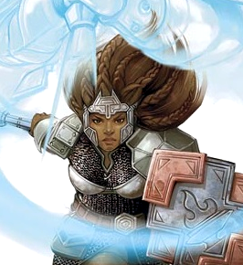

# Riswynn

- :octicons-info-24:{ .lg .middle } __Biographical Information__

    A [Nardith](<../../../gazetteer/greater-dunmar/realms/nardith/nardith.md>) [dwarf](<../../../creatures/species/dwarves.md>) (she/her), of the [Dunmar Fellowship](<dunmar-fellowship.md>), and the [Brawnanvil Clan](<../../../groups/dwarven-clans/brawnanvils.md>)  
    { .bio }

## Pre-Campaign Events
- Mar 10, 1748 DR: Riswynn leaves Tharn Todar, heading north for Raven's Hold
- Mar 24, 1748 DR: Riswynn leaves Askandi, heading for Karawa.
- Apr 26, 1748 DR: Riswynn arrives in Tokra.
- Apr 30, 1748 DR: Riswynn arrives in Askandi.
- May 05, 1748 DR: Riswynn arrives in Tharn Todor.