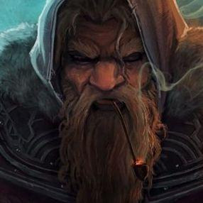

# Seeker

- :octicons-info-24:{ .lg .middle } __Biographical Information__

    A [dwarf](<../../../species/children-of-the-embodied-gods/dwarves/dwarves.md>) (he/him)  
    Member of the The Dunmar Fellowship  
    { .bio }

{align="right"; width="400"}

## Pre-Campaign Events

- Oct 04, 1747 DR: Seeker arrives in Chardon
- Dec 26, 1747 DR: Seeker leaves Chardon
- Feb 15, 1748 DR: Seeker arrives in [Songara](<../../../gazetteer/greater-dunmar/realms/dunmar/central-dunmar/songara.md>)
- Feb 21, 1748 DR: Seeker leaves [Songara](<../../../gazetteer/greater-dunmar/realms/dunmar/central-dunmar/songara.md>)
- Mar 05, 1748 DR: Seeker arrives in Tokra.
- Mar 09, 1748 DR: Seeker leaves Tokra for Karawa
- Mar 21, 1748 DR: Seeker arrives in Karawa

> [!warning]- Seeker's Backstory
> 
> I grew up in the city of Darakan, on the western frontier of Sembara, in the dwarven kingdom of [Khatridun](<../../../gazetteer/sentinel-range/dwarven-kingdoms/khatridun.md>). Darakan, my home, is famous for its fine marbleworks, especially the elaborate stonework marking the gates of the city, set high in a cliff face and reached by a series of marble steps and arches. My parents, proud Stoneworkers from Clan Highkeep, contributed much to the fame of the city, and were renowned as architects. I trained early in my life expecting to become a Stoneworker like them.
> 
> When I traveled to [Heart of the Mountain](<../../../cosmology/multiverse/spiritual-realms/divine-realms/heart-of-the-mountain.md>) for my rite of passage to adulthood, I was indeed confirmed in the Stoneworker caste as I expected. However, then I saw something I did not expect. I saw myself floating in a vast, complex space, extending in more than three dimensions all around me. The mountain is above me, and beyond that the twisting strands of the [Plane of Magic](<../../../cosmology/multiverse/plane-of-magic.md>), caught into runes in the ancient ways of our people. Below me, a sea of sparkling lights extending across the world. In this moment, I had an instant of lucidity and saw the complex, indescribable geometry of the cosmos: magic above, consciousness and dreams below, and the world itself in the middle, but of course "above" and "below" are just crude, imprecise terms for what I actually saw. The moment ended, and the clarity faded, but the memory remained, and the conviction that magic, and consciousness, and the geometry of the worlds are all bound together in some cosmic way.
> 
> I had to find a way back to that moment of lucidity. Convinced this vision was not an accident, I took the name Seeker, and left my family and my home to study the ways the world and the planes of magic intersect. Near Darakan, a volcano erupted and a series of ley lines that used to cross all broke apart and avoided the place where the volcano had erupted. This led me to became interested in the physical connections between magic and the world of Taelgar, studying the properties of the material plane itself -- the shape of stones, of mountains, and the forces that change them, slowly, or suddenly. I traveled south to the Great Rift, studying the patterns of magical energy in ley lines around this cataclysm, and saw that the regularity of the intersections between planes was shattered, with ley lines that twisted and turned and just ended in chaotic patterns.
> 
> Amazed but still not understanding how everything fit together, I traveled east and spent some time with the Lizardfolk on the coast of the [Green Sea](<../../../gazetteer/green-sea.md>), learning more about the [Dreamworld](<../../../cosmology/multiverse/echo-realms/dreamworld.md>) and how they perceived the cosmos. From these Lizardfolk, I learned of mystical cults far to the south that perhaps knew more about the connections between dreams, magic, and the architecture of the cosmos. Seeking knowledge, I set off, under the mountains to [Chardon](<../../../gazetteer/west-coast/chardonian-empire/chardon/chardon.md>), where I met the dwarven scholar [Ulfgar Frostbeard](<../../dwarves/ulfgar-frostbeard.md>), and learned of the Dunmari goddess [Shakun](<../../../cosmology/gods/incorporeal-gods/dunmari-pantheon/shakun.md>), goddess of magic and dreams.
> 
> I was told that in the small village of [Karawa](<../../../gazetteer/greater-dunmar/realms/dunmar/eastern-dunmar/karawa.md>), in eastern [Dunmar](<../../../gazetteer/greater-dunmar/realms/dunmar/dunmar.md>), a cult of [Shakun](<../../../cosmology/gods/incorporeal-gods/dunmari-pantheon/shakun.md>) could be found, at a point near where the new lands that arose with the fall of [Cha'mutte](<../../extraplanar-powers/cha-mutte.md>) began. Deeply interested in the effects of cataclysmic change on the material and magical worlds, I headed to [Dunmar](<../../../gazetteer/greater-dunmar/realms/dunmar/dunmar.md>). Traveling through [Dunmar](<../../../gazetteer/greater-dunmar/realms/dunmar/dunmar.md>), making maps and drawing multidimensional diagrams to extrapolate the shape of the [Plane of Magic](<../../../cosmology/multiverse/plane-of-magic.md>), I heard rumors again of [Karawa](<../../../gazetteer/greater-dunmar/realms/dunmar/eastern-dunmar/karawa.md>), that it was a nexus of connection between the [Dreamworld](<../../../cosmology/multiverse/echo-realms/dreamworld.md>) and the [Plane of Magic](<../../../cosmology/multiverse/plane-of-magic.md>), and that [Candrosa](<../../dunmari/candrosa.md>), the Speaker of [Shakun](<../../../cosmology/gods/incorporeal-gods/dunmari-pantheon/shakun.md>), would be the person to talk to. So I set off, traveling to [Karawa](<../../../gazetteer/greater-dunmar/realms/dunmar/eastern-dunmar/karawa.md>), eager to learn more.
> 
> Dates from backstory:
> 
> 5844: Seeker is born in Darakan (1711 DE, 154th year of the Nayan Dynasty)
> 5863: Brother [Frankar](<../../dwarves/frankar.md>) vanishes in a storm, after constructing a giant machine of gears and stone and gems and magic that is destroyed, leaving behind a dead white salamander burned to a crisp. 
> 5878: Seeker travels to [Heart of the Mountain](<../../../cosmology/multiverse/spiritual-realms/divine-realms/heart-of-the-mountain.md>) and has a vision (1745 DE, 188th year of the Nayan Dynasty)
> 5879: Seeker leaves home, spending a season with the Lizardfolk in Sembara, and then traveling across the mountains to [Chardon](<../../../gazetteer/west-coast/chardonian-empire/chardon/chardon.md>), and then east to [Dunmar](<../../../gazetteer/greater-dunmar/realms/dunmar/dunmar.md>) (1746 DE, 189th year of the Nayan Dynasty)
> 
> Travels from 5879-5881:
> - Oct - Nov 5879: left home, traveled east into Sembara
> - Nov 5879 - May 5880: stayed with lizardfolk on eastern border of Sembara
> - Jun - Sept 5880:  travel from lizardfolk to [Chardon](<../../../gazetteer/west-coast/chardonian-empire/chardon/chardon.md>)
> - Oct - Dec 5880: stayed in [Chardon](<../../../gazetteer/west-coast/chardonian-empire/chardon/chardon.md>) with [Ulfgar Frostbeard](<../../dwarves/ulfgar-frostbeard.md>)
> - Dec 5880 - Mar 5881: traveled to [Karawa](<../../../gazetteer/greater-dunmar/realms/dunmar/eastern-dunmar/karawa.md>) overland, stopping briefly at [Songara](<../../../gazetteer/greater-dunmar/realms/dunmar/central-dunmar/songara.md>) and [Tokra](<../../../gazetteer/greater-dunmar/realms/dunmar/central-dunmar/tokra/tokra.md>), where stayed at the [The Iron Swan](<../../../gazetteer/greater-dunmar/realms/dunmar/central-dunmar/tokra/the-iron-swan.md>) an inn, run by a retired Dwarven adventurer, [Vistra Fireforge](<../../dwarves/vistra-fireforge.md>), and located in the small dwarvish quarter of the city behind the [Archives](<../../../gazetteer/greater-dunmar/realms/dunmar/central-dunmar/tokra/archives.md>). In [Tokra](<../../../gazetteer/greater-dunmar/realms/dunmar/central-dunmar/tokra/tokra.md>) he also met the Hardstone clan, especially [Fallthra Hardstone](<../../dwarves/fallthra-hardstone.md>), the matriarch, [Delig Hardstone](<../../dwarves/delig-hardstone.md>), her brother, and [Dag Hardstone](<../../dwarves/dag-hardstone.md>), her son, still only a teenager, not yet having traveled to [Heart of the Mountain](<../../../cosmology/multiverse/spiritual-realms/divine-realms/heart-of-the-mountain.md>). They work at the [Archives](<../../../gazetteer/greater-dunmar/realms/dunmar/central-dunmar/tokra/archives.md>), as architects, janitors, supers. Work some minor runic magic to protect scrolls, mend damage, and the like, as well as making magical runic imprints of particularly valuable material that can then be copied and sent to [Nayahar](<../../../gazetteer/greater-dunmar/realms/dunmar/western-dunmar/nayahar.md>) or [Darba](<../../../gazetteer/greater-dunmar/realms/dunmar/coastal-dunmar/darba/darba.md>) or [Chardon](<../../../gazetteer/west-coast/chardonian-empire/chardon/chardon.md>) without risk of error.
> 
> 5881: Seeker arrives in [Karawa](<../../../gazetteer/greater-dunmar/realms/dunmar/eastern-dunmar/karawa.md>) and our adventures begin (1748 DE, 191st year of the Nayan Dynasty)
 
> [!warning]- Mesa Tour, Session 32
> 
> ### Red Mesa Tour, Session 32
> 
> Having promised you a tour of the mesa, one morning [Candrosa](<../../dunmari/candrosa.md>) comes to meet you, saying the mystai are ready for you. You enter the temple, following the same route you took when you were here for the ritual of [Shakun](<../../../cosmology/gods/incorporeal-gods/dunmari-pantheon/shakun.md>)’s Heart. But rather than descending to the deepest level, you turn on a side path. 
> 
> You are walking through the rock of the Mesa here, and it feels like nothing you have experienced before. The rock itself seems to move out of your way as the mystai ahead speaks, a rough hewn tunnel opening in front of you as you walk. 
> 
> After a short while, the passage opens into a huge cavern. There is no light, except a dim reddish glow that seems to emanate from the rocks themselves. You can feel the open space though, extending beyond the range of you darkvision. 
> 
> The mystai speaks a word in a language you don’t know, and suddenly the cavern flairs into light, the reddish glow of a sunset. 
> 
> In front of you, you see a grove of low bushes, each with a giant inflorescence, all made of stone, but waving slightly in the air. 
> 
> On the far wall, there is a waterfall, cascading down, but not of water, it seems to be of white smooth limestone or something, flowing slowly into a pool. Around the pool are a series of small vines, also made of red sandstone. 
> 
> Finally, there is a low tree of a dark granite, with lighter quartz leaves. Growing from it are two red stone apples. 
> 
> [Candrosa](<../../dunmari/candrosa.md>) turns to you and says “Welcome to our gardens! They are normally much lusher, but we have harvested everything we can to turn to potions, and these stones grow very slowly.” 
> 
> Seeker says, "These gardens are beautiful nonetheless, and I am grateful for even a glimpse of this magical place. My gratitude to [Shakun](<../../../cosmology/gods/incorporeal-gods/dunmari-pantheon/shakun.md>), to you, and to the mystai of this order who have tended this garden surely for generations. I am especially curious to know the source and power of this waterfall, seemingly of stone! May I investigate more closely, and perhaps make some sketches? The shrubs and flowers and vines... all very strange... and the apples! What potions beyond the healing mud can be made here?"
> 
> [Candrosa](<../../dunmari/candrosa.md>) is happy for you to sketch and investigate as much as you like, and tells you some of what they have made. The apples, when ripe, can make an elixir of health that cures all poison, disease, blindness and sickness, but requires four apples and it takes months for them to ripen. They just harvested the four ripest a few days ago, and [Candrosa](<../../dunmari/candrosa.md>) hopes to present your party with one of these potions before you leave. Berries grow on the vines which can be used to make potions that allow you to resist damage of certain types. The petals of the giant flowers can be harvested to make healing mud, when mixed with the flowing rock of the waterfall. These have all been harvested, you can see, for the shrubs just have the giant central inflorescence of the flower left, no petals. But [Candrosa](<../../dunmari/candrosa.md>) says they will regrow over the next month or two. 
> 
> The waterfall looks kind of like flowstone. It just emerges from the wall of the cavern, without an obvious source, and is used to mix with all the other living stone to make potions. When you approach the stone pool below the waterfall, and investigate a bit more, it seems very strange. If you touch it and slowly dip your hand, it parts for you, and you can draw up something that feels almost like a liquid, but if you push hard on it, it is solid rock (basically, this is a non-Newtonian fluid). 
> 
> As for the power of this place, [Candrosa](<../../dunmari/candrosa.md>) tells you that the magical energy to grow these things comes from [Heart of Shakun](<../../../things/artifacts-of-power/heart-of-shakun.md>), and that he has always liked to think that this is the garden that [Shakun](<../../../cosmology/gods/incorporeal-gods/dunmari-pantheon/shakun.md>) imagines for herself, manifest of the living rock that is now [Shakun](<../../../cosmology/gods/incorporeal-gods/dunmari-pantheon/shakun.md>)'s body. When [Heart of Shakun](<../../../things/artifacts-of-power/heart-of-shakun.md>) was missing, the rock ceased to grow, the waterfall turned brittle and hard, and the delicate stone of the vines and flowers began to crack and crumble. 
> 

> [!warning]- Seeker's Dream Journey, Session 32
> 
> ### Dream Journey, Session 32
> 
> [Candrosa](<../../dunmari/candrosa.md>) asks Seeker to meet him at the top of the mesa, at dusk. When Seeker arrives, [Candrosa](<../../dunmari/candrosa.md>) is waiting, holding his dream staff, the same staff of white ash with a silver crescent design on the top. He seems relaxed and at peace in a way that you have not seen before. The staff seems to shimmer slightly -- somehow the return of [Shakun](<../../../cosmology/gods/incorporeal-gods/dunmari-pantheon/shakun.md>)'s Heart has added to its power, allowing it to recharge. [Candrosa](<../../dunmari/candrosa.md>) asks you to focus on an image, an anchor that will guide and shape your experience in the [Dreamworld](<../../../cosmology/multiverse/echo-realms/dreamworld.md>). 
> 
> As you concentrate on the image of [Frankar](<../../dwarves/frankar.md>), he brings the staff down, and it seems to pass through you. Looking down, your body is translucent, and you are floating, the light rapidly fading from the sky. You float, or are pulled, rapidly upward, the ground below vanishing, only a thin line of energy stretching back towards your distant body below. As you ascend, lights begin to appear, almost like stars, but full of dazzling color. They surround you in all directions -- above, below, to all sides -- moving and shifting in a hypnotic pattern. As you stare, dazed, you can hear [Candrosa](<../../dunmari/candrosa.md>)'s voice in the back of your mind, "Concentrate on your anchor!"
> 
> As you focus on [Frankar](<../../dwarves/frankar.md>), sitting and studying with him, the stars start to dim and fade, except for one, in the distance, the grows brighter and brighter as it pulls you towards it, until you crash through the bright white light into a empty stone chamber, completely circular, filled with salamanders. But these are not white salamanders. Each is unique. You see one that seems to be made of pure flame, one that is green and seems to be covered in moss, one that is heavy dark gray stone with earth that shakes from its body with each step, one that has horns and a spiked tail and is chasing the others nipping at them, one that seems to a wave in salamander form, one that is covered in runes, one that is lumbers with heavy footfalls and seems to grow and shrink with each step, one that appears almost as a storm cloud in salamander form.  Possibly others as well, they move quickly, running around and across each other. 
> 
> There is only one exit from the chamber, straight ahead. The salamanders seem to avoid the exit. 
> 
> You grab the fiery salamander by the tail, dragging it to the exit. 
> 
> As you step through the exit, the salamander burns to a crisp, but keeps wiggling and squirming in your grasp. The hall itself starts to shift then, the walls falling away and the room you were in vanishing, the stone falling away until you are standing on nothing but a scaffolding. 
> 
> You are looking at the inside of what seems like a complicated, whirling orrery. There are spheres within spheres turning and turning. 
> 
> From where you are standing, you can see below you what looks like a roiling sea, but not of water. It looks almost like shifting multicolored sands, sometimes a flare of flame or lightning or other intense energy, but mostly just swirling smooth sand that flows like water. 
> 
> Above you, you can see turning crystal spheres, opaque, spinning on a matte black background. Stars shine on the black background, multi colored, winking in and out as the opaque spheres pass them, reminding you of what you saw when you started this journey. 
> 
> Then, drifting on the sea of sand, an arch of fire. The salamander wiggles, trying to get to it, and as the arch floats past you can see, beyond it, a land of fire. Huge pillars of fire surround a city of brass, shining in the orange light of the fire the surrounds it. A river of magma flows past. In the fiery sky, an ash cloud drops rain of liquid mercury. 
> 
> The arch floats closer and closer, the salamander struggling to get through, it’s burnt body energetic and eager. 
> 
> You close your eyes for a moment, grimacing, wincing away from the image of the land of fire and its city of brass, thinking, is that where you've gone, Frank, child? What power has tempted you there? I'll find you, rescue you! 
> 
> You open my eyes again and face the arch of fire, now holding hidden in your left palm a tiny intricately worked figurine of white stone, depicting your fond memory of an innocent childhood [Frankar](<../../dwarves/frankar.md>). With your right hand you trace a spherical rune of protection around your body, a sphere of ice as clear as glass. You release the burnt salamander and follow it.  
> 
> You step forward into the arch of fire. For a brief moment, you step into darkness, an empty void, and feel a sensation of falling, as if you are diving into a clear pool. Above you, you can see a distorted reflection of your childhood home, as if seen through rippling water. There are multiple layers of images, each more twisted and blurred than the last. Below you, you are diving towards the "bottom" of this space, the shifting multicolored sands bubbling and boiling. Around you, a mist clings like water, thin and wispy in some directions, thick and opaque in others, seeming to reflect the colors of the sands below. As you dive, you are being pulled by a thin stream of flame, the burnt salamander ahead of you. You can see, briefly, laid out almost like a map on the "bottom" of this space, the burning land of fire and magme; a land of swirling clouds and flashes of lightning; a land of earth and stone; and a land of pure water reaching to endless depths.
> 
> You glimpse this arrangement just for a moment -- the mists and fogs of the "water", the energetic multicolored sands "below", the map of elemental realms floating above the sands, surrounded by fogs, some parts hidden and opaque, others only lightly obscured -- before you are pulled toward the arch of fire. 
> 
> As you approach the arch of fire, the thin silvery tether connecting you to [Candrosa](<../../dunmari/candrosa.md>), the [Red Mesa](<../../../gazetteer/greater-dunmar/realms/dunmar/eastern-dunmar/red-mesa.md>), and the Dream staff grows taunt. You can see, clearly, the land of fire beyond the arch as the salamander dives forward, passing beyond the portal into this strange fiery realm. But the tether prevents you from going further, and you are pulled back, swirling back through the twisting stars and crashing back into your body, the memory of the smoke and fire and ash that consumed everything in that land. 
> 
> [Candrosa](<../../dunmari/candrosa.md>) looks at you as you open your eyes, with concern. "I know not what you saw, but I could feel you approaching a portal to elsewhere. Had you stepped through, you would have broken your tether and I could not have retrieved you. I am sorry I had to pull you back."