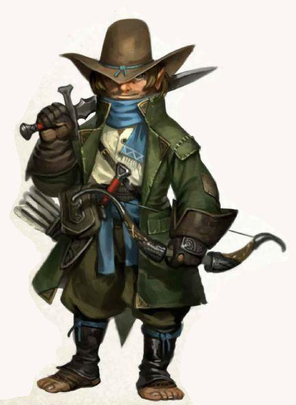

# Wellby

- :octicons-info-24:{ .lg .middle } __Biographical Information__

    A [halfling](<../../../species/children-of-the-embodied-gods/halflings/halflings.md>) (he/him), of the Goodbarrels  
    Member of the [Dunmar Fellowship](<./dunmar-fellowship.md>)  
    { .bio }

{width="400"}

## Pre-Campaign Events

- Aug 02, 1747 DR: Wellby leaves [Sembara](<../../../gazetteer/greater-sembara/sembara/sembara.md>), heading south. Spends some time wandering.
- Dec 02, 1747 DR: Wellby arrives at the mountains, but cannot cross to Dunmar because of snow. Travels around in frontier lands waiting for the passes to open.
- Feb 12, 1748 DR: Wellby crosses the lower passes on the Karawa road into Dunmar, cutting overland to Tokra.
- Mar 03, 1748 DR: Wellby arrives in Tokra, spends the night before heading east towards Karawa for the Festival of Rebirth
- Mar 04, 1748 DR: Wellby leaves Tokra for Karawa
- Mar 19, 1748 DR: Wellby arrives in Karawa.

> [!warning]- Wellby's Backstory
> 
> What Wellby wants from life is to explore: to meet new people, go new places, have new experiences. For many years, the Halfling road life was perfect: he honed his craft scouting ahead of the wagons; exploring roadside ruins; practicing bow skills on wolves and the occasional bandit.
> 
> While Wellby's grandparents tried in vain to teach him double-entry bookkeeping and exchange rate variances, he preferred to spend time with the animals, and trade stories with the hired guards. While Wellby's friends would jam around the campfires playing halfling music, he would read and re-read the maps in his treasured compendium: "A Comparative Approach to Map-Making with Special Emphasis on Terrain Elevation Measurement."
> 
> For most of his life, his family crisscrossed the [Green Sea](<../../../gazetteer/green-sea.md>), [Sembara](<../../../gazetteer/greater-sembara/sembara/sembara.md>), Cymea and [Tollen](<../../../gazetteer/western-green-sea/tollen/tollen.md>), rarely travelling the same roads twice. But a few years ago, his extended family settled into a permanent -- and, to Wellby, profoundly dull -- seasonal trade route along tame, well-patrolled roads to well-defended and orderly cities. Within a few years, the urge to explore the new at last overwhelmed his loyalty to family and business. Wellby set out for a life on the road, promising some day to return to his family and the family business, a promise which hangs heavy on his heart.
> 
> The Songs of Years:
> 
> The Year of Restless Winds (1722 DE): Wellby is born on the road, in [Sembara](<../../../gazetteer/greater-sembara/sembara/sembara.md>)
> 
> The Year of Singing Grass (1747 DE): Wellby leaves his family to travel in August, wandering around but gradually moving south. Arrives at the mountain passes too late to cross this season.
> 
> The Year of Shadowed Dreams (1748 DE): Wellby crosses the mountains as soon as the passes clear, and arrives in [Dunmar](<../../../gazetteer/greater-dunmar/realms/dunmar/dunmar.md>), meeting [Kenzo](<./kenzo.md>), [Seeker](<./seeker.md>), [Delwath](<./delwath.md>) and [Riswynn](<./riswynn.md>) in [Karawa](<../../../gazetteer/greater-dunmar/realms/dunmar/eastern-dunmar/karawa.md>) in March.

> [!warning]- Memories and Dreams from the Halfing Ancestral Mind
> 
> *Examining the [Blackened Claw](<../../../groups/hobgoblin-clans/blackened-claw.md>) symbol, [Session 9 (DuFr)](<../../../campaigns/dunmari-frontier/session-notes/session-9-dufr.md>)*
> A memory drifting out of the past. A determined group of halflings, organized, with bows and spears. A battle banner bearing this mark, at the front of a large column of hobgoblin troops, maybe 150 years ago. They are too many to face. You turn and see the doubt in the eyes of your troop. Quickly sending the message to scatter and hide and live to fight again. Running, vanishing into the grass….
> 
> *[Raven's Hold](<../../../gazetteer/greater-dunmar/dunmari-basin/raven-s-hold.md>) nightmares, [Session 11 (DuFr)](<../../../campaigns/dunmari-frontier/session-notes/session-11-dufr.md>)*
> As you dream, you catch fragments of thoughts. A wild dog, "His hunger is all that matters, it is greater than us all."
> 
> A jackal, running behind you, then with you: "He drives us. He eats what we eat. He kills what we kill. He will come if we eat well."
> 
> A hyena, tearing into flesh: "He will come if we kill well. We will kill and He will eat, and we shall be He and He shall be we, never alone, never afraid, never hungry."
> 
> Then a soft, quiet voice in the back of your mind, a small dog, just a pup, in danger of being trampled: "I want my pack. I want the shelter of my brothers and sisters. Not this. Not this."**
> 
> *Examining a locket found in [Raven's Hold](<../../../gazetteer/greater-dunmar/dunmari-basin/raven-s-hold.md>), [Session 13 (DuFr)](<../../../campaigns/dunmari-frontier/session-notes/session-13-dufr.md>)*
> An image in your mind, a memory. A small caravan, a young family traveling across the plains. Maybe a hundred years ago? Two young halfling men, scouting ahead. Brothers maybe? Swooping down from the sky, a three headed beast - a dragon, a goat, a lion. Fire erupting from the dragon’s head, blasting the ground. Running, fleeing. Your companion falling behind, caught. Diving into a ditch, hiding. Tears, sadness telling his husband….
> 
> *The Tale of Sigga the Storm Giant, [Session 15 (DuFr)](<../../../campaigns/dunmari-frontier/session-notes/session-15-dufr.md>)*
> Recalling a story from your childhood in the [Green Sea](<../../../gazetteer/green-sea.md>), of Sigga the Storm Giant. The stories, as is the case for many halfling stories, are somewhat lacking in detail: after the fall of the [Drankorian Empire](<../../../history/drankorian-era/drankorian-empire.md>), a petty king in the area now [Sembara](<../../../gazetteer/greater-sembara/sembara/sembara.md>) made a pact with a dragon, grew in power, until he was betrayed and the dragon ruled with an iron fist, demanding tribute in slaves and treasure from all under his sway, until the people of the [Green Sea](<../../../gazetteer/green-sea.md>), led by seagoing peoples who had escaped the worst (the halflings and the Skagish) turned in desperation to the power of the sea, and out of the waves the giant Sigga strode to battle the dragon. 
> 
> The memories, however, are vivid: 
> 
> Human soldiers wearing red scale armor rushing aboard a ship at dock, seizing not just the goods but people, threatening with sword and bow, too many to fight, marching in chains, tired, until finally you are kneeling before a great beast, scaled and red with eyes of black and gold and flame, immense and looming over you, as realization dawns that you are going to die here, but at least you are not alone as your soul drifts into the embrace of your ancestors as the flames wash around you.
> 
> On a ship in a storm, sailing against all sense into the heart of the winds, battered and buffeted by waves towering over the masts, halfling crew working with human crew to keep the ship afloat, the captain shouting commands as you scurry to secure a line, until suddenly all is calm and out of the sea a person emerges - but not a person, vast in scale, almost ten times bigger than a halfling, long silver hair tied in a topknot, a grim face, as she speaks in a booming voice, “I am Sigga. I have seen the threads of our fates intertwined, growing strong or fading as one. Come, we must discuss,” as a pale blue glow washes over the captain and his human first mate, and they sink below the waves to bargain with the giant.
> 
> A powerful storm, a hurricane of epic proportions, battering a line of soldiers in red scale armor manning coastal fortifications. Other humans, in light armor with axes and wooden shields rushing the beach. Behind them, Sigga striding onto land, nearly 30’ tall, the wind and waves following her command. With Sigga, a grim battalion of halflings, many with bows and shortswords, but in the front one carrying no visible weapons. As Sigga strides forward, tossing giant rocks at the stone walls of the fort, you feel the power of the storm rushing through you, lightning gathering in your mind, unleashing a bolt to strike down your enemies as the epic battle of Sigga against a dragon rages above you.
> 
> A cold morning on a wavy beach, waking at dawn, offering a word of thanks to Sigga the giant beneath the waves, a wild storm passing offshore, flashes of lightning and peals of thunder seeming to acknowledge your presence, as if the storm itself were the manifestation of Sigga herself.
> 
> *Holding a shortbow summoned from shadow by [Delwath](<./delwath.md>), [Session 26 (DuFr)](<../../../campaigns/dunmari-frontier/session-notes/session-26-dufr.md>)*
> A very brief memory. A clear pool, deep in the woods, the shadows of the forest around you, calm, peace, the twilight above.
> 
> *Halfling patriarch traveling, [Session 27 (DuFr)](<../../../campaigns/dunmari-frontier/session-notes/session-27-dufr.md>)*
> As you examine the painted wooden statue of an old halfling man recovered from [Agata](<../../fey/agata.md>), you kind of you kind of fade back and fall backwards into memory. It's hard to tell how long ago this memory is, but you see a well-defended caravan of five wagons, a whole extended clan of halflings, traveling across the Dunmari scrublands. As you zoom in you sense this is probably the road between [Karawa](<../../../gazetteer/greater-dunmar/realms/dunmar/eastern-dunmar/karawa.md>) and [Bas Udda](<../../../gazetteer/greater-dunmar/realms/dunmar/eastern-dunmar/bas-udda.md>). Sitting in the front of the first wagon is the old halfling man depicted by [Agata](<../../fey/agata.md>)’s statue.

> [!warning]- Wellby's Time in Karawa, Session 32
> 
> ### [Karawa](<../../../gazetteer/greater-dunmar/realms/dunmar/eastern-dunmar/karawa.md>) Downtime, [Session 32 (DuFr)](<../../../campaigns/dunmari-frontier/session-notes/session-32-dufr.md>)
> 
> #### Dream Staff Journey
> 
> [Candrosa](<../../dunmari/candrosa.md>) asks Wellby to meet him at the top of the mesa, at dusk. When Wellby arrives, [Candrosa](<../../dunmari/candrosa.md>) is waiting, holding his dream staff, the same staff of white ash with a silver crescent design on the top. He seems relaxed and at peace in a way that you have not seen before. The staff seems to shimmer slightly -- somehow the return of [Shakun](<../../../cosmology/gods/incorporeal-gods/dunmari-pantheon/shakun.md>)'s Heart has added to its power, allowing it to recharge. [Candrosa](<../../dunmari/candrosa.md>) asks you to focus on an image, an anchor that will guide and shape your experience in the [Dreamworld](<../../../cosmology/multiverse/spiritual-realms/proximate-realms/dreamworld.md>). 
> 
> You concentrate on an image of the map you've followed from your home to [Dunmar](<../../../gazetteer/greater-dunmar/realms/dunmar/dunmar.md>) and added onto through the last months of travels.
> 
> [Candrosa](<../../dunmari/candrosa.md>) asks Wellby to sit and empty his mind of everything but the image. Wellby settles down on the top of the mesa, concentrating on the vision of his map, the sense of being on the road, the feeling of coming to new places.
> 
> He brings the staff down, and it seems to pass through you. Looking down, your body is translucent, and you are floating, the light rapidly fading from the sky. You float, or are pulled, rapidly upward, the ground below vanishing, only a thin line of energy stretching back towards your distant body below. As you ascend, lights begin to appear, almost like stars, but full of dazzling color. They surround you in all directions -- above, below, to all sides -- moving and shifting in a hypnotic pattern. As you stare, dazed, you can hear [Candrosa](<../../dunmari/candrosa.md>)'s voice in the back of your mind, "Concentrate on your anchor!"
> 
> As you refocus on the image of the map, imagining the noonday sun on a long road, the smell of food cooking on a campfire at night, the slow steady eating away of miles as you walk, the dazzling stars begin to wash away, as if a dirty window were being cleaned. You find yourself on a road. A familiar road, in fact, the road that winds south from [Sembara](<../../../gazetteer/greater-sembara/sembara/sembara.md>) to the mountain passes and eventually to [Tokra](<../../../gazetteer/greater-dunmar/realms/dunmar/central-dunmar/tokra/tokra.md>), the road you set out on now almost a year ago. It is early spring, the birds are singing, the plants just putting out leaves, the mountains still covered in snow. It is a beautiful day to be walking in the world. 
> 
> You take a step, and the world stretches, shifts. It is as if the world itself shrinks for a moment, or your stretch impossibly large, because with one step you seem to have traveled leagues and leagues, and somehow backwards in time. It is deep winter, and you are south, maybe 100 miles, in the foothills of the great mountains, chilly and wet as a cold rain begins to fall. 
> 
> You pause for a moment, looking around. To the north, your home: the road back to [Sembara](<../../../gazetteer/greater-sembara/sembara/sembara.md>), the river valleys, forests, and farms of that green country. To the west, the looming sharp peaks of the mountains, snow covered in the depths of winter. To the south, the passes into the plains of north [Dunmar](<../../../gazetteer/greater-dunmar/realms/dunmar/dunmar.md>). To the east, the desolate wastes of the [Plaguelands](<../../../gazetteer/istaros-watershed/plaguelands.md>), where most fear to tread.
> 
> You turn east, towards the clouds and darkness of the [Plaguelands](<../../../gazetteer/istaros-watershed/plaguelands.md>), and take a step. 
> 
> The world shifts again, compressing and expanding again as your stride carries you over lightly wooded foothills. On the horizon, a barren, gray plain of ash seems to accelerate towards you, passing under your feet as the earth still shifts. Dust storms blow from the ground below, swirling around you. Choking ash, dry, an acrid taste of a burned forest, fills your mouth and nose. 
> 
> As your foot approaches the ground, a great cliff is racing towards you, smooth and glass-like, but dull, matte grays and blacks. As your foot lands, you find yourself teetering on the top of this glassy cliff. Below you, continuing to the east, you see a valley, forests stretching for miles, just beginning to leaf out in the early spring filling the valley floor, a swift river running from the north to the south in the center. Beyond the valley, gently rolling hills rise and fall, and in the far distance, the glimmer of another river. Behind you, dust still blows on the ashy plains. 
> 
> The silver line of the river winds south, and in the distance along the river, many, perhaps hundreds of miles away (you are not really clear on distances in this strange, shifting land), you see a city, though whether ruined or inhabited is impossible to tell from here. To the north, the river valley continues, the forest seeming to grow darker and deeper, a hint of shadows and movement lurking the far-distance trees. 
> 
> You turn north, where the forest grows deeper and darker, and take a step. As you step, the world compresses for a moment, and you see the land lain out before you. 
> 
> To your left, the way you came, the mountains seem to grow and grow, until they are looming over you, pristine and beautiful, until darkness and alien horrors begin to bubble up from beneath them, all tentacles and beaks and giant floating eyes, spreading across the land for a moment before the world in that direction seems to curl up and burn away with the sound of hammer banging on shields and dwarven and elven voices singing together, a song of war and death. From the song, mountains rise, seeming to grow and grow, until they are looming over you, pristine and beautiful, until darkness and alien horrors begin to bubble up from beneath them.....again and again in a loop, repeating. 
> 
> To your right, in the distance, beyond the second river, hundreds of miles away, a great forest stands, ancient and vast and dead. Your vision must be playing tricks on you, because despite the distance, as you glance in that direction you see clearly a young elf, running from the south into the vast dead forest, carrying a flower. As she sits playing with the flower, singing a song, life begins to grow beneath her, every time she repeats the song trees growing taller and taller, vast, ancient trees standing taller than the tallest towers of [Tollen](<../../../gazetteer/western-green-sea/tollen/tollen.md>), reaching for the sky until she stops, and looks in fear, as fire rains from the sky and the forest begins to burn, the young elf running north, until the fire stops, and a great forest stands, ancient and vast and dead. Your vision must be playing tricks on you, because despite the distance, as you glance in that direction you see clearly a young elf, running from the south into the vast dead forest, carrying a flower....and again and again in a loop, repeating. 
> 
> Beyond the dead forest, you glimpse the shining water of the [Green Sea](<../../../gazetteer/green-sea.md>), impossibly far, a thousand miles or more, and yet somehow you can see the long slow slope of the land to the ocean, vast marshy land covering mile upon mile of shore, an endless sea of untamed wild, dotted only with lizardfolk villages blending into the terrain. As you watch, a giant wave washes in, flooding the swamps, but as it pulls away all you see is the long slow slope of the land to the ocean, dotted with a vast marsh and lizardfolk villages. Again and again the wave crashed, in a loop, repeating. 
> 
> Ahead, the darkness grows deeper beneath the woods. Beyond the dark woods, you can see the five rivers of [Sembara](<../../../gazetteer/greater-sembara/sembara/sembara.md>) laid out before you, hundreds of miles to the north. You catch a glimpse of familiar roads, of the docks of [Tollen](<../../../gazetteer/western-green-sea/tollen/tollen.md>) and Embry and the smaller ports where you docked many times as a child, still not understanding how you can see detail from hundreds or thousands of miles away. Somehow your eye is drawn to a ship at sea, crossing the [Western Gulf](<../../../gazetteer/western-green-sea/western-gulf.md>), with steady seas and a following wind. You can see the captain of the watch, a grizzled old halfling patriarch, holding the wheel steady and smiling to the wind and the spray, until he turns to look directly at you. 
> 
> His face turns grim, his smile fades. Behind him, a man stands, probably Drankorian from his features. Sharp eyes, dark hair, a proud, haughty demeanor, old, and strong, and confident. He is wearing a [shimmering cloak](<../../../things/artifacts-of-power/cloak-of-rainbows.md>), carries a [familiar scepter](<../../../things/artifacts-of-power/scepter-of-command.md>) around his waist, and looks down with disgust at the halfling captain. The Drankorian spits out a string of words you cannot clearer hear, and red mist begins to rise up around him. As he chants the mist gets deeper and deeper, filling the ship, filling the sea, stretching across [Sembara](<../../../gazetteer/greater-sembara/sembara/sembara.md>) and the world, and you hear the sounds of halflings across the world choking and dying as one. The face of the captain begins to melt away, until there is just a skeleton looking at you. The ship sinks, and your eye is drawn to the [Western Gulf](<../../../gazetteer/western-green-sea/western-gulf.md>), where a ship is sailing with steady seas and following winds, and old halfling patriarch at the wheel, smiling, until he turns to look at you, and speaks:
> 
> "You see all the pasts, the maybes and might have beens of the turning of time. Do not despair, for this past is not your past, nor is it your future, it is a branch of time avoided."
> 
> And then, "Look where you step!"
> 
> As your foot lands awkwardly in the dark, shadowy forest, and you fall through the world, tumbling into a deeper shadow, the melting flesh of halflings all around you, nightmares growing and chasing you as all light leaves the world.
> 
> Until, in the distance, you hear [Candrosa](<../../dunmari/candrosa.md>)'s voice, faintly, calling, "Wellby! Follow my voice!" You see a faint gray thread growing behind you, and as you listen for [Candrosa](<../../dunmari/candrosa.md>), the thread grows stronger and stronger, pulling you back, until your eyes snap open.
> 
> #### Journey with [Havdar](<../../dunmari/havdar.md>)
> 
> Wellby travels with [Havdar](<../../dunmari/havdar.md>) and some troops back to [Bas Udda](<../../../gazetteer/greater-dunmar/realms/dunmar/eastern-dunmar/bas-udda.md>), to help collect the treasure buried there. On the journey, [Havdar](<../../dunmari/havdar.md>) is just brimming with excitement about the return of the Nayan [Sura](<../../dunmari/sura.md>). You get an earful of Dunmari politics -- how the old Samraat, Nayan Marathu, was supposed to be just a caretaker, having taken the throne at 60 in DR 1736 (12 years ago) but he starts to bring back the traditional ways, traveling east with the court instead of staying in the palace in [Nayahar](<../../../gazetteer/greater-dunmar/realms/dunmar/western-dunmar/nayahar.md>), organizing a census of all Dunmari, not just the settled ones in the cities to the west, and even proposing a new capitol, more centrally located between [Tokra](<../../../gazetteer/greater-dunmar/realms/dunmar/central-dunmar/tokra/tokra.md>) and [Darba](<../../../gazetteer/greater-dunmar/realms/dunmar/coastal-dunmar/darba/darba.md>), and in the original Dunmari tradition of being a waypoint and meeting place. It was a time of great hope, and especially because [Sura](<../../dunmari/sura.md>), from a prominent family south of [Tokra](<../../../gazetteer/greater-dunmar/realms/dunmar/central-dunmar/tokra/tokra.md>), but who was seen as committed to a greater [Dunmar](<../../../gazetteer/greater-dunmar/realms/dunmar/dunmar.md>) that acknowledged all Dunmari, east and west, had a prominent role in court and was seen as the obvious successor. The court even came to [Karawa](<../../../gazetteer/greater-dunmar/realms/dunmar/eastern-dunmar/karawa.md>) one year. This was about 10 years ago, when [Havdar](<../../dunmari/havdar.md>) was in his late teens, and you get the sense he was infatuated with [Sura](<../../dunmari/sura.md>), in addition to his support of her political positions.
> 
> Then it all fell apart. [Sura](<../../dunmari/sura.md>) vanished, and shortly after Marathu was killed in an [orc](<../../../species/children-of-the-embodied-gods/orcs/orcs.md>) ambush, when he personally led the search for [Sura](<../../dunmari/sura.md>). [Sura](<../../dunmari/sura.md>)'s brother, Karnas, who had been general of the southern armies (west of the mountains), ended up as Samraat, but he has been a disaster (according to [Havdar](<../../dunmari/havdar.md>)), ignoring the east and growing rich off Chardonian trade and Chardonian money that seems to flow constantly to [Nayahar](<../../../gazetteer/greater-dunmar/realms/dunmar/western-dunmar/nayahar.md>). 
> 
> Now, [Havdar](<../../dunmari/havdar.md>) is convinced everything will change, and has already sworn himself to [Sura](<../../dunmari/sura.md>)'s service. 

> [!warning]- Wellby in Tokra, Session 34
> 
> ### Wellby in [Tokra](<../../../gazetteer/greater-dunmar/realms/dunmar/central-dunmar/tokra/tokra.md>) , [Session 34 (DuFr)](<../../../campaigns/dunmari-frontier/session-notes/session-34-dufr.md>)
> 
> As the party reaches [Tokra](<../../../gazetteer/greater-dunmar/realms/dunmar/central-dunmar/tokra/tokra.md>), Wellby leaves briefly to take [Garret](<../../halflings/garret-tealeaf.md>) Tealeft to [The Red Lily Inn](<../../../gazetteer/greater-dunmar/realms/dunmar/central-dunmar/tokra/the-red-lily-inn.md>), which he knows from before. He has not spoken to anyone he knows from his old life since being freed, and Lily and [Wes Strongbones](<../../halflings/wes-strongbones.md>) were once, if not exactly close friends, at least good acquaintances. As you ride along the walls of [Tokra](<../../../gazetteer/greater-dunmar/realms/dunmar/central-dunmar/tokra/tokra.md>), he, slightly stammeringly, says: "I know that I owe you everything, and I hate to even ask this. But I know you are going to go off on your next adventure, and I'll have to fend for myself. I have nothing but the clothes on my back. Could you spare some coin for me?"
> 
> You arrive at [The Red Lily Inn](<../../../gazetteer/greater-dunmar/realms/dunmar/central-dunmar/tokra/the-red-lily-inn.md>), just inside the city walls near the west gate. A cozy, comfortable place, with mostly "small people" rooms, but a bunk room to share for the occasional human travelers who want to stay. It has a renowned kitchen, which tends to attract a diverse crowd for meals. [Wes Strongbones](<../../halflings/wes-strongbones.md>) is shocked to see [Garret](<../../halflings/garret-tealeaf.md>), and introduces his twin sons [Tye Strongbones](<../../halflings/tye-strongbones.md>) and [Cade Strongbones](<../../halflings/cade-strongbones.md>), who were little when they last saw [Garret](<../../halflings/garret-tealeaf.md>). His wife, Lily Strongbones, died 10 years ago to illness, sadly.
> 
> While getting [Garret](<../../halflings/garret-tealeaf.md>) settled, you pick up a few bits of news:
> 
> - About a month ago, there was a big todo when something was stolen from the [Archives](<../../../gazetteer/greater-dunmar/realms/dunmar/central-dunmar/tokra/archives.md>), and four people who worked there murdered or disappeared. Things have quieted down a bit, but everyone still on edge. One of the bodies supposedly looked like it was torn to pieces by a wild animal, the throat ripped out.
> - Most of the refugees have left - they were often blamed for the murders, people said they brought some evil from beyond the borders with them, some curse of the blasted plains.
> - Times have been tough. Between the huge number of refugees and Karnas' army eating up all the stores, the rains can't come soon enough. Everything is expensive and people are starving.
> 
> As you turn to go, you catch sight of a familiar face: [Callie Charmheart](<../../halflings/callie-charmheart.md>). Apparently the [Charmhearts](<../../../groups/halfling-families/charmhearts.md>) stayed here, trying to help [Ander Charmheart](<../../halflings/ander-charmheart.md>). They have sold most of their goods to pay for food and lodging, things have been rough, but Ander is improving every day and they hope to leave soon, for [Chardon](<../../../gazetteer/west-coast/chardonian-empire/chardon/chardon.md>) or for the coast. She says Ander describes his madness more clearly now. He says it felt like a wave of something, washing over him, this chaotic dark energy, almost like a bomb and then the shrapnel embedded in his mind. Now the shrapnel has vanished but the wounds remain, healing slowly. Speaks slowly, cautiously, struggles for words, and still sometimes has dark dreams, but is freed of the worst of his affliction.
> 
> After leaving [Garret](<../../halflings/garret-tealeaf.md>) at the Red Lily, you ride on [Baxter](<companions/baxter.md>) for the [Lakan Monastery](<../../../gazetteer/greater-dunmar/realms/dunmar/central-dunmar/tokra/lakan-monastery.md>), about five miles distance. Riding across the open plains, in a new place, urging [Baxter](<companions/baxter.md>) forward as you and he skillfully leap across obstacles and dodge between rocks, you think of how far you have traveled in the nearly a year now since you left your family, and how much you have learned and seen.
> 
> As you ride, you realize you are constantly aware of the world around you, noticing things you would have missed before: the sparrows fliting in the distance, flying away from you and [Baxter](<companions/baxter.md>), the snake slithering away as you ride past, the far-distant hawk on the wind. As the terrain gets steep and you begin climbing towards the road, you dismount, leading [Baxter](<companions/baxter.md>) over the rocky terrain. Then, suddenly, as you turn to climb the final hill, you see out of the corner of your eye a rockslide beginning. Before you are even consciously aware of the danger coming your way, you find yourself dodging for cover, the last months of adventuring clicking together. You catch your breath, the rocks harmlessly falling behind you, and finish your climb, reaching the monastery.
> 
> As you reach the gates, a Dunmari monk in white robes trimmed in blue greats you. "Come, you are expected."

> [!warning]- Letter from Dee Wildcloak to Wellby, Session 61
> 
> ### Letter from Dee Wildcloak to Wellby, Session 61
> 
> a short note, writing in the halfling language and addressed to Wellby, in the letter from Dee]
> 
> Wellby,
> 
> If this note finds you, I just want you to know my offer still stands. Come find me south of the Sea of Storms, and let’s start that inn together. It will be a grand adventure full of new places to see.
> Hugs and kisses,
> Dee

