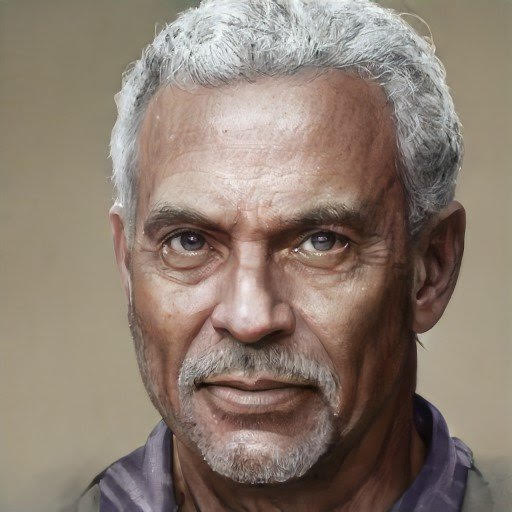

# Wazir

- :octicons-info-24:{ .lg .middle } __Biographical Information__

    A Mawaran [human](<../../../species/humans.md>) (he/him)  
    Owner of the [Leviathan Inn](<../../../gazetteer/northwest-coast/mawar-confederacy/leviathan-inn.md>)  
    { .bio }

    Based in [Hamri](<../../../gazetteer/northwest-coast/mawar-confederacy/hamri.md>), the [Mawar Confederacy](<../../../gazetteer/northwest-coast/mawar-confederacy/mawar-confederacy.md>), the [Mawakel Peninsula](<../../../gazetteer/northwest-coast/mawar-confederacy/mawakel-peninsula.md>)

The owner of the Levithan Inn in Hamri, and unofficial guardian of the town. Tinkering and student of the arcane, especially his magical armor he crafted himself. Spent time in Chardon before returning home to Hamri

