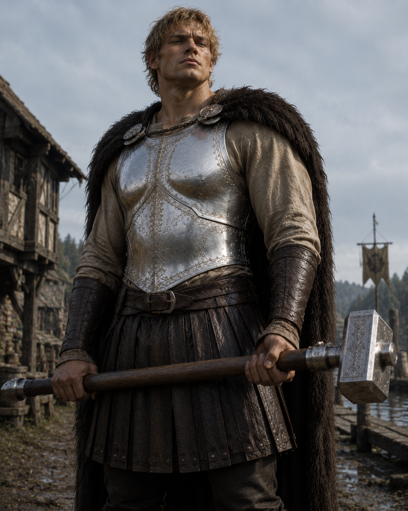

# Edric

- :octicons-info-24:{ .lg .middle } __Biographical Information__

    A [human](<../../../../creatures/species/humans.md>) (he/him)  
    Born DR 1729 (21 years old)  
    { .bio }

    Originally from: Wickerley
    Based in the [Free City of Tollen](<../../../../gazetteer/greater-sembara/tollen/tollen.md>)

    A [human](<../../../../creatures/species/humans.md>) (he/him)  
    Born DR 1729 (21 years old)  
    { .bio }

    Originally from: Wickerley
    Based in the [Free City of Tollen](<../../../../gazetteer/greater-sembara/tollen/tollen.md>)

Edric was born in the small village of Wickerley, a good two day's walk north of the [Great South Road](<../../../../gazetteer/greater-sembara/roads/great-south-road.md>), in the [Duchy of Telham](<../../../../gazetteer/greater-sembara/sembara/northlands/duchy-of-telham.md>).  Wickerly is known for very little, although there are two brewers who sell to the surrounding villages, and the barley is said to be at least a bit better than average. It is a poor place, with little excitement and few reasons to stop. The most interesting event in the last hundred years, it is said, was Edric's birth. 

