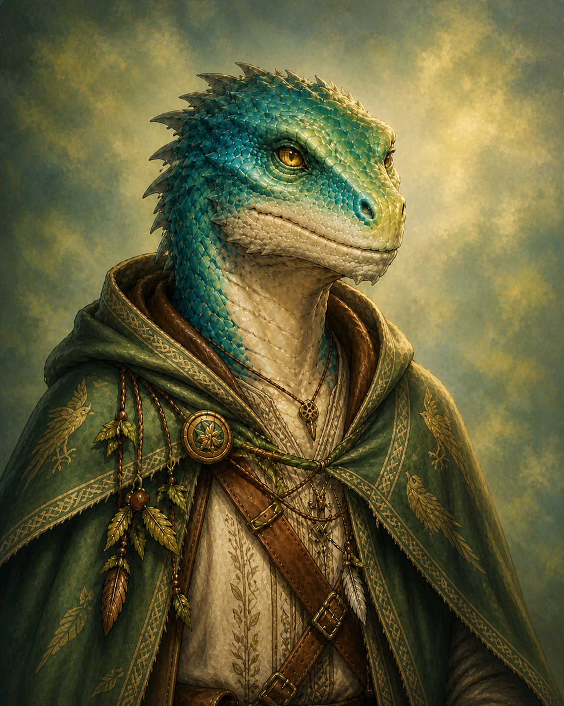

# Txarro
:speaker:{ .middle } *(CHAH-roh)*  

- :octicons-info-24:{ .lg .middle } __Biographical Information__

    A [lizardfolk](<../../../../creatures/species/lizardfolk.md>) (he/him)  
    Born DR 1717 (33 years old)  
    { .bio }

    Originally from: the [Greywash](<../../../../gazetteer/greater-sembara/rivers/volta-watershed/greywash.md>), the [Free City of Tollen](<../../../../gazetteer/greater-sembara/tollen/tollen.md>)
    Based in the [Free City of Tollen](<../../../../gazetteer/greater-sembara/tollen/tollen.md>)

    A [lizardfolk](<../../../../creatures/species/lizardfolk.md>) (he/him)  
    Born DR 1717 (33 years old)  
    { .bio }

    Originally from: the [Greywash](<../../../../gazetteer/greater-sembara/rivers/volta-watershed/greywash.md>), the [Free City of Tollen](<../../../../gazetteer/greater-sembara/tollen/tollen.md>)
    Based in the [Free City of Tollen](<../../../../gazetteer/greater-sembara/tollen/tollen.md>)

{align="right"; width="350"}Txarro was born in a small lizardfolk village along the Greywash. His community was fairly isolated, even from other lizardfolk, in a marshy curve about a day and a half walk from Tollen. The Greywash provided a rich abundance for his village, and has a child and young adult he rarely interacted with other species, preferring to wander upriver along the marshy banks of the river, searching for hidden life among the reeds and rushes. He discovered he had some skill with animals, and could often charm small birds into his hand, or convince the shy mammals of the riverbank to be still in his presence. 

Over the years, he often wandered further and further afield, traveling for days along the Volta and its tributaries, exploring aimlessly, never sure what he was looking for. He learned to observe quietly, coax animals to do his bidding, and even began to sense the flow of extraplanar energy moving through Taelgar, experimenting with channeling the ambient soulstuff that accretes in small quantities to all sentient things. Slowly, through these experiments, he began to learn a bit of magic, and increasingly spent his time wandering, often venturing a week or more from home, sometimes to the dismay of the elders of his village who wished for him to contribute more productively to the community. 

A year or two ago, everything changed. Exploring several days upriver from Tollen along the eastern banks of the Volta, Txarro stumbled across an abandoned woodcutter's homestead, and was attacked by several cursed tree blights. He fled for his life, but soon found himself surrounded and outmatched. It was only the timely arrival of a (pair/trio) of adventurers from Tollen that saved him. 

The experience shook him. In gratitude, he promised to help these travelers however he could, and ended up agreeing to travel with them for the next three months. Three months turned to six, which turned to a year, as he realized he liked these people, and had found in this group of misfits and outcasts a community that had been missing all his life. He decided to move to Tollen and join this group, even though he disliked the noise and crowds of the city. 

This was not a popular decision with his village: the elders and his ancestors did not think it right for him to devote his talents to these strangers and not his own people. His parting was difficult, and some harsh words were said he sometimes regrets. But for now, he continues, searching for something to give his life direction and purpose. 

