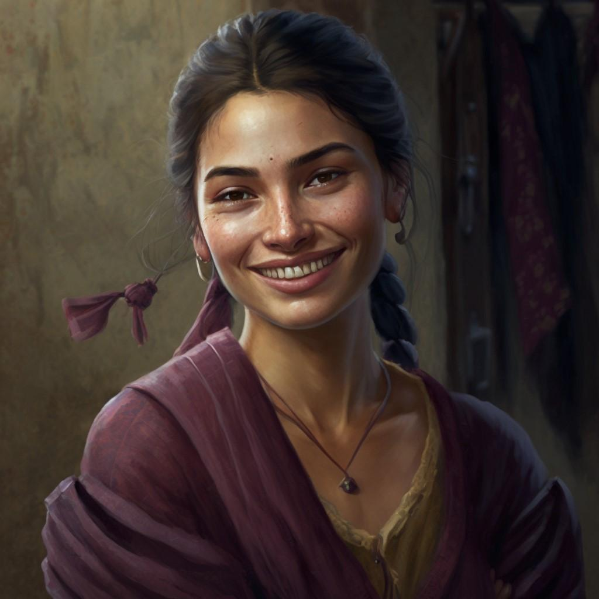

# Abigail Moss

- :octicons-info-24:{ .lg .middle } __Biographical Information__

    A [Sembaran](<../../gazetteer/greater-sembara/sembara/sembara.md>) [human](<../../species/children-of-divine-creation/humans/humans.md>) (she/her)  
    Born DR 1698 (51 years old)  
    { .bio }

    Based in [Taviose](<../../gazetteer/greater-sembara/sembara/barony-of-aveil/cleenseau-region/taviose.md>), the [Manor of Cleenseau](<../../gazetteer/greater-sembara/sembara/barony-of-aveil/cleenseau-region/manor-of-cleenseau.md>), the [Barony of Aveil](<../../gazetteer/greater-sembara/sembara/barony-of-aveil/barony-of-aveil.md>)

{align="right"; width="320"}Abigail is a somewhat shy farmer whose orchard was infected with the remains of the giant spiders that plagued [Taviose](<../../gazetteer/greater-sembara/sembara/barony-of-aveil/cleenseau-region/taviose.md>). [Robin](<../pcs/cleenseau/robin-of-abenfyrd.md>) was able to disinfect it with his lay on hands ability. Her family was killed in the spider attacks, and she has struggled to maintain the family orchard, which is mostly walnuts and chestnuts and hugs the edge of [Cleenseau Wood](<../../gazetteer/greater-sembara/sembara/barony-of-aveil/cleenseau-region/cleenseau-wood.md>).

Her family holds the orchard and several buildings in [Taviose](<../../gazetteer/greater-sembara/sembara/barony-of-aveil/cleenseau-region/taviose.md>) as freeholders, and her two uncles are successful pig farmers.

