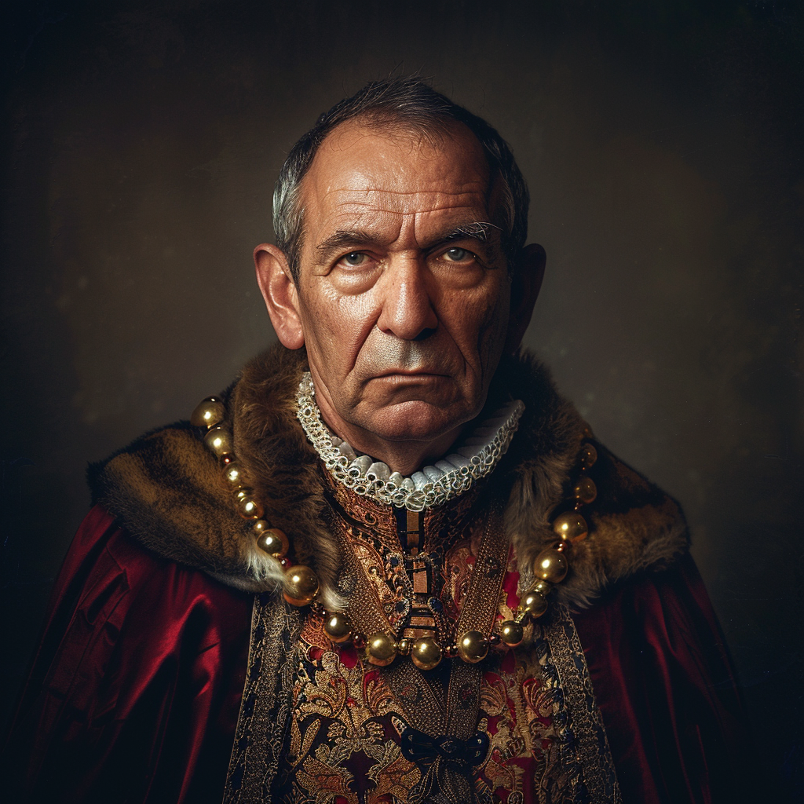

# Alaric Benec

- :octicons-info-24:{ .lg .middle } __Biographical Information__

    A [Sembaran](<../../gazetteer/greater-sembara/sembara/sembara.md>) [human](<../../species/humans.md>) (he/him)  
    Lord Mayor of [Rinburg](<../../gazetteer/greater-sembara/sembara/barony-of-aveil/rinburg.md>)  
    { .bio }

    Based in [Rinburg](<../../gazetteer/greater-sembara/sembara/barony-of-aveil/rinburg.md>), the [Barony of Aveil](<../../gazetteer/greater-sembara/sembara/barony-of-aveil/barony-of-aveil.md>), [Sembara](<../../gazetteer/greater-sembara/sembara/sembara.md>)

{align="right"; width="400"}