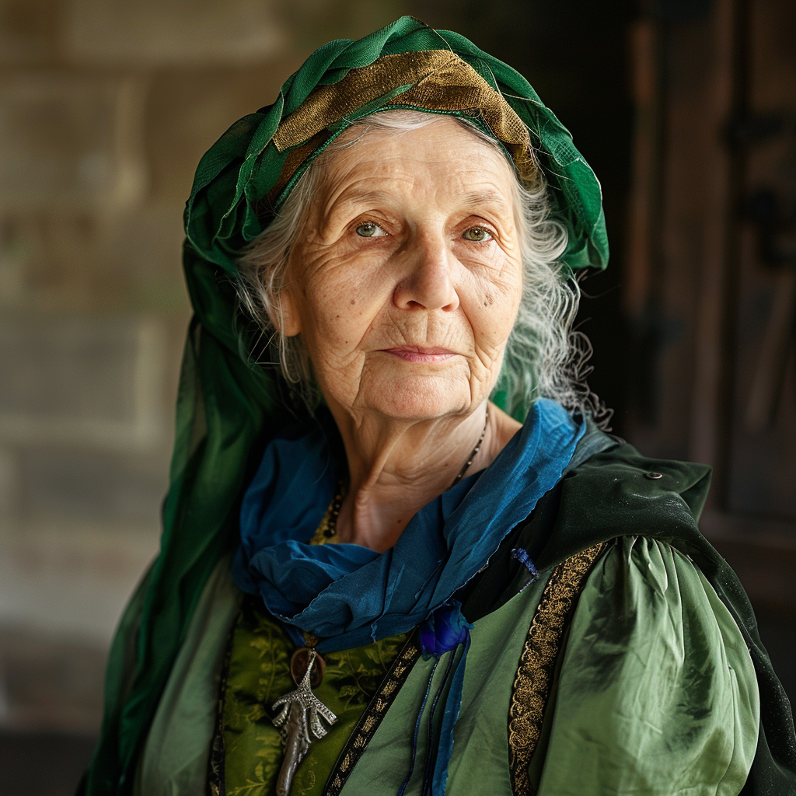

# Ameline Evynwood
:speaker:{ .middle } *(Am-leen Evan-wood)*  

- :octicons-info-24:{ .lg .middle } __Biographical Information__

    A [human](<../../species/humans.md>) (she/her)  
    { .bio }

    Based in [Ashcombe](<../../gazetteer/greater-sembara/sembara/barony-of-aveil/ashcombe.md>), the [Barony of Aveil](<../../gazetteer/greater-sembara/sembara/barony-of-aveil/barony-of-aveil.md>), [Sembara](<../../gazetteer/greater-sembara/sembara/sembara.md>)

{align="left"; width="200"} 

