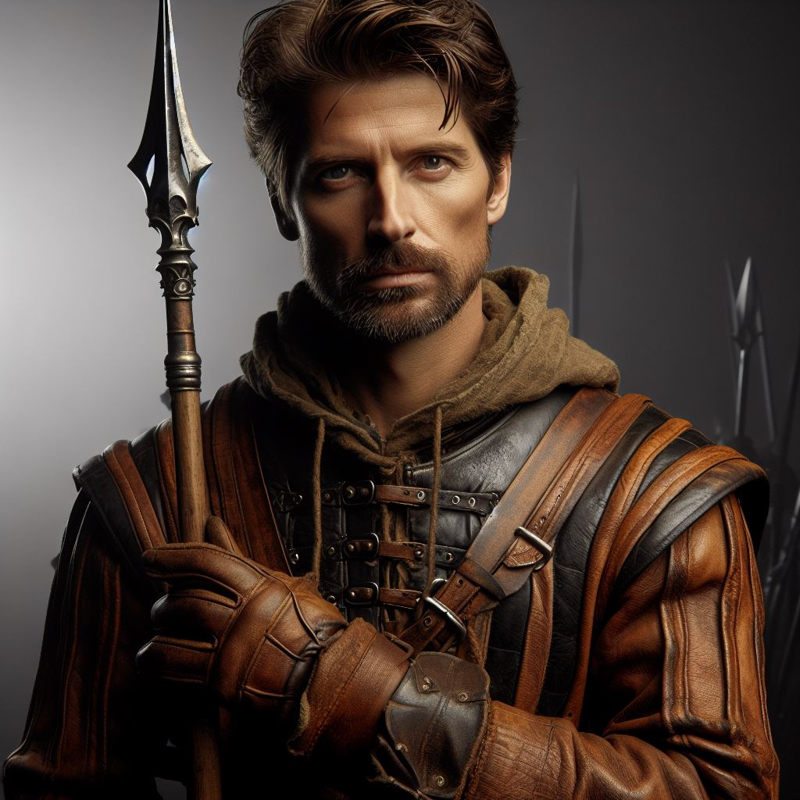

# Ancer Benthey

- :octicons-info-24:{ .lg .middle } __Biographical Information__

    A [Sembaran](<../../gazetteer/greater-sembara/sembara/sembara.md>) [human](<../../species/children-of-divine-creation/humans/humans.md>) (he/him)  
    Born DR 1689 (60 years old)  
    Sergeant of the Bridge Patrol, and the [Army Garrison of Cleenseau](<../../groups/sembaran-army/army-garrison-of-cleenseau.md>) (since November 20th, 1719)  
    { .bio }

    Based in [Cleenseau](<../../gazetteer/greater-sembara/sembara/barony-of-aveil/cleenseau-region/cleenseau/cleenseau.md>), the [Manor of Cleenseau](<../../gazetteer/greater-sembara/sembara/barony-of-aveil/cleenseau-region/manor-of-cleenseau.md>), the [Barony of Aveil](<../../gazetteer/greater-sembara/sembara/barony-of-aveil/barony-of-aveil.md>)

:octicons-location-24:{ .lg .middle } Currently with the [Army Garrison of Cleenseau](<../../groups/sembaran-army/army-garrison-of-cleenseau.md>), in [Cleenseau](<../../gazetteer/greater-sembara/sembara/barony-of-aveil/cleenseau-region/cleenseau/cleenseau.md>), the [Manor of Cleenseau](<../../gazetteer/greater-sembara/sembara/barony-of-aveil/cleenseau-region/manor-of-cleenseau.md>)

{align="right"; width="320"}The nephew of [Ames Benthey](<./ames-benthey.md>), recently appointed sergeant of the [Bridge Patrol](<../../groups/sembaran-army/army-garrison-of-cleenseau.md>) after [Odo Cordwaner](<./odo-cordwaner.md>) was dismissed. He is untested and rumored to be somewhat stern, and not very close to his uncle. 