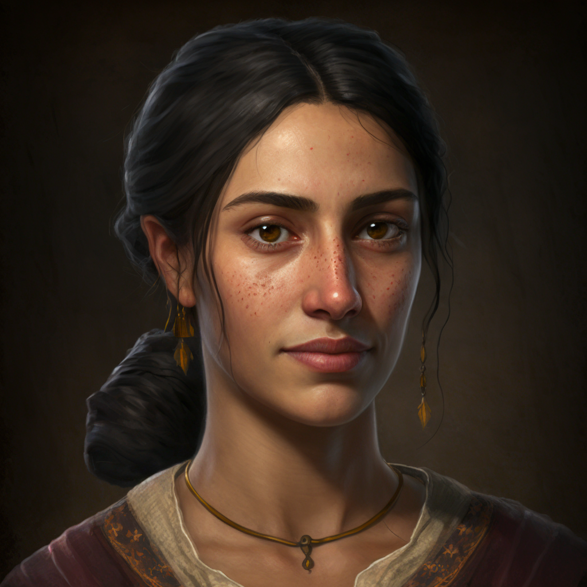

# Annet Bybet

- :octicons-info-24:{ .lg .middle } __Biographical Information__

    A [Sembaran](<../../gazetteer/greater-sembara/sembara/sembara.md>) [human](<../../species/children-of-divine-creation/humans/humans.md>) (she/her), of the Bybets  
    Born DR 1692 (57 years old)  
    Chamberlain of the Essfords  
    Member of the [Lord's Council of Cleenseau](<../../gazetteer/greater-sembara/sembara/barony-of-aveil/cleenseau-region/cleenseau/lord-s-council-of-cleenseau.md>)  
    { .bio }

    Originally from: [Ainwick](<../../gazetteer/greater-sembara/sembara/barony-of-ainwick/ainwick.md>), the [Barony of Ainwick](<../../gazetteer/greater-sembara/sembara/barony-of-ainwick/barony-of-ainwick.md>), [Sembara](<../../gazetteer/greater-sembara/sembara/sembara.md>)
    Based in [Cleenseau](<../../gazetteer/greater-sembara/sembara/barony-of-aveil/cleenseau-region/cleenseau/cleenseau.md>), the [Manor of Cleenseau](<../../gazetteer/greater-sembara/sembara/barony-of-aveil/cleenseau-region/manor-of-cleenseau.md>), the [Barony of Aveil](<../../gazetteer/greater-sembara/sembara/barony-of-aveil/barony-of-aveil.md>)

{align="right"; width="320"}A cousin of [Arthur Essford](<./arthur-essford.md>) and the chamberlain of the Essford household.