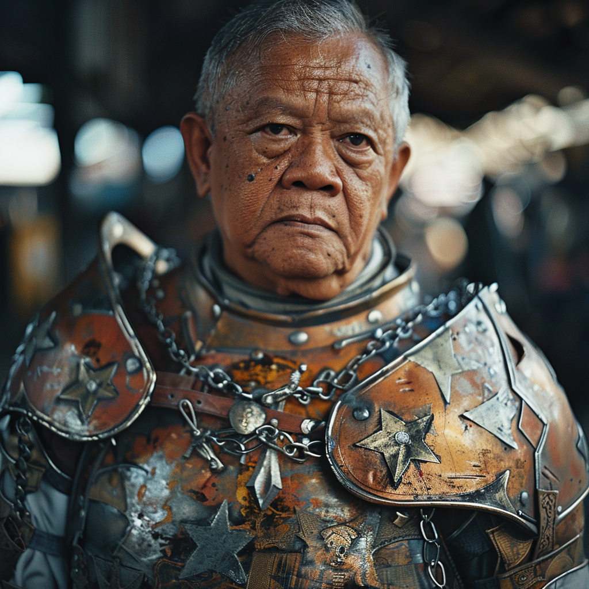

# Armand

- :octicons-info-24:{ .lg .middle } __Biographical Information__

    A [Sembaran](<../../gazetteer/greater-sembara/sembara/sembara.md>) [human](<../../species/humans.md>) (he/him)  
    { .bio }

    Based in [Embry](<../../gazetteer/greater-sembara/sembara/heartlands/embry.md>), [Sembara](<../../gazetteer/greater-sembara/sembara/sembara.md>)

:octicons-location-24:{ .lg .middle } Last known location (as of January 14th, 1720): [Eftly](<../../gazetteer/greater-sembara/sembara/barony-of-aveil/eftly.md>), the [Barony of Aveil](<../../gazetteer/greater-sembara/sembara/barony-of-aveil/barony-of-aveil.md>), [Sembara](<../../gazetteer/greater-sembara/sembara/sembara.md>)

{align="right"; width="400"}A warrior and disciple of the Night Queen. 

