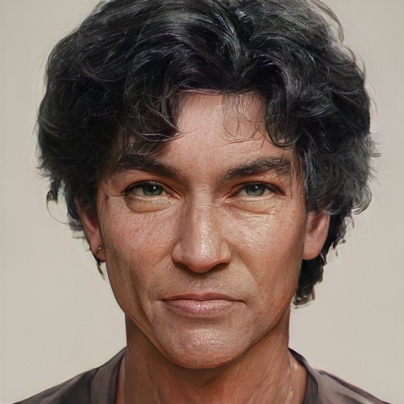

# Arthur Bybet

- :octicons-info-24:{ .lg .middle } __Biographical Information__

    A [Sembaran](<../../gazetteer/greater-sembara/sembara/sembara.md>) [human](<../../species/humans/humans.md>) (he/him), of the [Bybets](<../../groups/sembaran-noble-houses/bybets.md>)  
    Born DR 1682 (67 years old)  
    Lord Consort of the [Essfords](<../../groups/sembaran-noble-houses/essfords.md>) (since DR 1706)  
    { .bio }

    Originally from: [Ainwick](<../../gazetteer/greater-sembara/sembara/barony-of-ainwick/ainwick.md>), the [Barony of Ainwick](<../../gazetteer/greater-sembara/sembara/barony-of-ainwick/barony-of-ainwick.md>), [Sembara](<../../gazetteer/greater-sembara/sembara/sembara.md>)
    Based in [Cleenseau](<../../gazetteer/greater-sembara/sembara/barony-of-aveil/cleenseau-region/cleenseau/cleenseau.md>), the [Manor of Cleenseau](<../../gazetteer/greater-sembara/sembara/barony-of-aveil/cleenseau-region/manor-of-cleenseau.md>), the [Barony of Aveil](<../../gazetteer/greater-sembara/sembara/barony-of-aveil/barony-of-aveil.md>)

:octicons-location-24:{ .lg .middle } Currently in [Embry](<../../gazetteer/greater-sembara/sembara/heartlands/embry.md>), [Sembara](<../../gazetteer/greater-sembara/sembara/sembara.md>)

The husband of [Rosalind](<./rosalind-essford.md>) (whom he married in 1706), he wisely takes a back seat in local affairs. He hails from a prominent family in [Ainwick](<../../gazetteer/greater-sembara/sembara/barony-of-ainwick/ainwick.md>). He is a aficionado of stories and songs and often frequents [The Crossroads Inn](<../../gazetteer/greater-sembara/sembara/barony-of-aveil/cleenseau-region/cleenseau/the-crossroads-inn.md>) to hear the latest news.

In the fall of 1719, he lost his three children during the [Tragic Flood of the River Enst](<../../events/1700s/1719/10/tragic-flood-of-the-river-enst.md>) and his and [Rosalind's](<./rosalind-essford.md>) sadness over this has been profound. 

