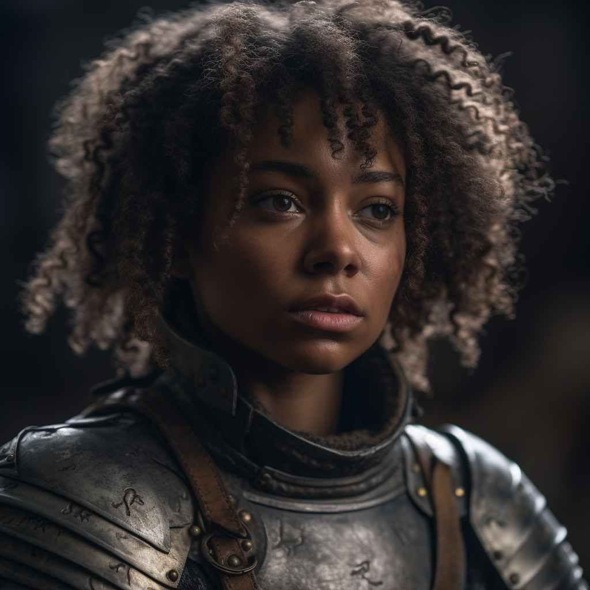

# Béatrix Thorne

- :octicons-info-24:{ .lg .middle } __Biographical Information__

    A [Sembaran](<../../gazetteer/greater-sembara/sembara/sembara.md>) [human](<../../species/children-of-divine-creation/humans/humans.md>) (she/her)  
    Born DR 1696 (53 years old)  
    Soldier of the [Army Garrison of Cleenseau](<../../groups/sembaran-army/army-garrison-of-cleenseau.md>) (until November 2nd, 1719)  
    Guardswoman of the [Lord's Guard of Cleenseau](<../../gazetteer/greater-sembara/sembara/barony-of-aveil/cleenseau-region/cleenseau/lord-s-guard-of-cleenseau.md>) (since November 23th, 1719)  
    Sheriff of the [Lord's Guard of Cleenseau](<../../gazetteer/greater-sembara/sembara/barony-of-aveil/cleenseau-region/cleenseau/lord-s-guard-of-cleenseau.md>) (since January 11th, 1720)  
    { .bio }

    Based in [Cleenseau](<../../gazetteer/greater-sembara/sembara/barony-of-aveil/cleenseau-region/cleenseau/cleenseau.md>), the [Manor of Cleenseau](<../../gazetteer/greater-sembara/sembara/barony-of-aveil/cleenseau-region/manor-of-cleenseau.md>), the [Barony of Aveil](<../../gazetteer/greater-sembara/sembara/barony-of-aveil/barony-of-aveil.md>)

{align="right"; width="320"}A solider in the Bridge Patrol of the [Cleenseau Garrison](<../../groups/sembaran-army/army-garrison-of-cleenseau.md>) of the [Army of the West](<../../groups/sembaran-army/army-of-the-west.md>), she accompanied the [Heroes of Cleenseau](<../pcs/cleenseau/heroes-of-cleenseau.md>) into the [Cleenseau Wood](<../../gazetteer/greater-sembara/sembara/barony-of-aveil/cleenseau-region/cleenseau-wood.md>) following a trail of spiders. 

After her recent marriage to [Gabriel Thorne](<./gabriel-thorne.md>), she left the army and joined the [Lord's Guard of Cleenseau](<../../gazetteer/greater-sembara/sembara/barony-of-aveil/cleenseau-region/cleenseau/lord-s-guard-of-cleenseau.md>). She miscarried during the Zombie Plague in Cleenseau.