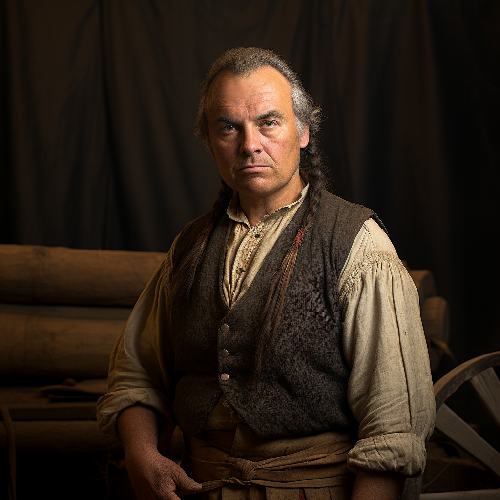

# Bertram Northwoods

- :octicons-info-24:{ .lg .middle } __Biographical Information__

    A [Sembaran](<../../gazetteer/greater-sembara/sembara/sembara.md>) [human](<../../species/children-of-divine-creation/humans/humans.md>) (he/him)  
    Born DR 1673 (76 years old)  
    { .bio }

    Based in [Asineau](<../../gazetteer/greater-sembara/sembara/barony-of-aveil/cleenseau-region/asineau.md>), the [Manor of Asineau](<../../gazetteer/greater-sembara/sembara/barony-of-aveil/cleenseau-region/manor-of-asineau.md>), the [Barony of Aveil](<../../gazetteer/greater-sembara/sembara/barony-of-aveil/barony-of-aveil.md>)

{align="right"; width="320"}The groom and stablemaster for [Lorin Valbert](<./lorin-valbert.md>). A cousin of [Phillipa Northwood](<./phillipa-northwood.md>).