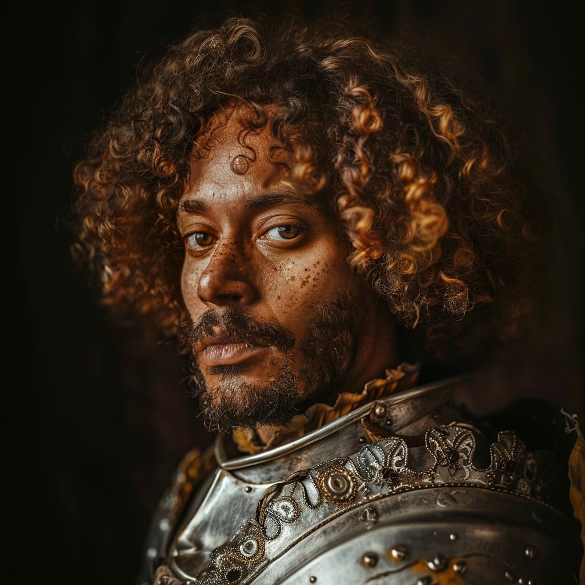

# Bertrand Leclerc

- :octicons-info-24:{ .lg .middle } __Biographical Information__

    A [Sembaran](<../../gazetteer/greater-sembara/sembara/sembara.md>) [human](<../../species/children-of-divine-creation/humans/humans.md>) (he/him)  
    { .bio }

    Originally from: [Dunfry](<../../gazetteer/greater-sembara/sembara/western-marches/dunfry.md>), the [Barony of Dunfry](<../../gazetteer/greater-sembara/sembara/western-marches/barony-of-dunfry.md>), [Sembara](<../../gazetteer/greater-sembara/sembara/sembara.md>)
    Based with the [Army of the South](<../../groups/sembaran-army/army-of-the-south.md>), in [Fellburn](<../../gazetteer/greater-sembara/sembara/heartlands/fellburn.md>), the [Duchy of Wisford](<../../gazetteer/greater-sembara/sembara/heartlands/duchy-of-wisford.md>)

{align="right"; width="320"}A sergeant of the Swordsguard of the Ninth Company of the [Army of the South](<../../groups/sembaran-army/army-of-the-south.md>), he is a second cousin of Colonel Claude Leclerc, of the [Army of the West](<../../groups/sembaran-army/army-of-the-west.md>). He is young and ambitious and is eager to prove himself.