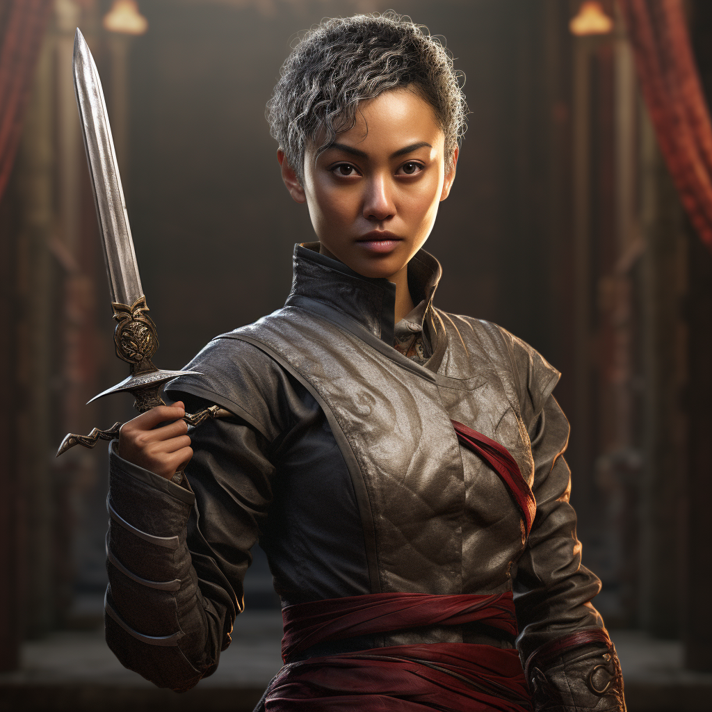

# Blanche

- :octicons-info-24:{ .lg .middle } __Biographical Information__

    A [Sembaran](<../../gazetteer/greater-sembara/sembara/sembara.md>) [human](<../../species/children-of-divine-creation/humans/humans.md>) (she/her)  
    Born DR 1687 (62 years old)  
    { .bio }

    Based in [Beury](<../../gazetteer/greater-sembara/sembara/barony-of-aveil/cleenseau-region/beury.md>), the [Manor of Beury](<../../gazetteer/greater-sembara/sembara/barony-of-aveil/cleenseau-region/manor-of-beury.md>), the [Barony of Aveil](<../../gazetteer/greater-sembara/sembara/barony-of-aveil/barony-of-aveil.md>)

{align="right"; width="320"} [Lionel's](<./lionel-mortagne.md>) right hand, and the magistrate of [Beury](<../../gazetteer/greater-sembara/sembara/barony-of-aveil/cleenseau-region/beury.md>). 
