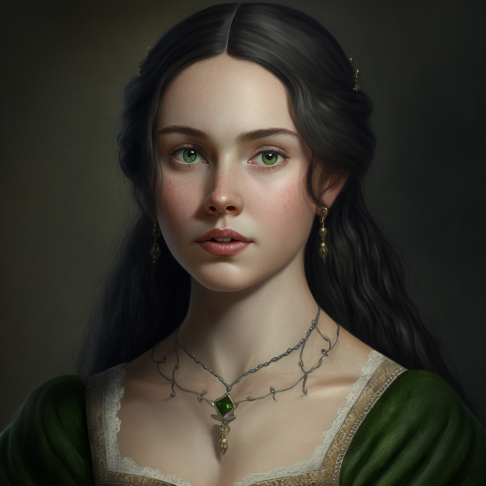

# Catherine de Brune

- :octicons-info-24:{ .lg .middle } __Biographical Information__

    A [Sembaran](<../../gazetteer/greater-sembara/sembara/sembara.md>) [human](<../../species/children-of-divine-creation/humans/humans.md>) (she/her)  
    Born DR 1684 (65 years old)  
    { .bio }

    Based in [Cleenseau](<../../gazetteer/greater-sembara/sembara/barony-of-aveil/cleenseau-region/cleenseau/cleenseau.md>), the [Manor of Cleenseau](<../../gazetteer/greater-sembara/sembara/barony-of-aveil/cleenseau-region/manor-of-cleenseau.md>), the [Barony of Aveil](<../../gazetteer/greater-sembara/sembara/barony-of-aveil/barony-of-aveil.md>)

{align="right"; width="320"}The cousin of [Sabine de Brune](<./sabine-de-brune.md>) and an trading agent for a number of Embry trading families, including the Garay Family. She is a confidant of [Rinault](<./rinault-essford.md>) and it is a rather open secret that she has an on-again, off-again affair with him. She has bought numerous landholdings in [Asineau](<../../gazetteer/greater-sembara/sembara/barony-of-aveil/cleenseau-region/asineau.md>) from [Lorin Valbert](<./lorin-valbert.md>), but is concerned at his mismanagement and questioning whether it is a profitable investment.

Her husband Emmanuel is a doting father to their four children, and somewhat bookish, but their relationship seems cool at best.

