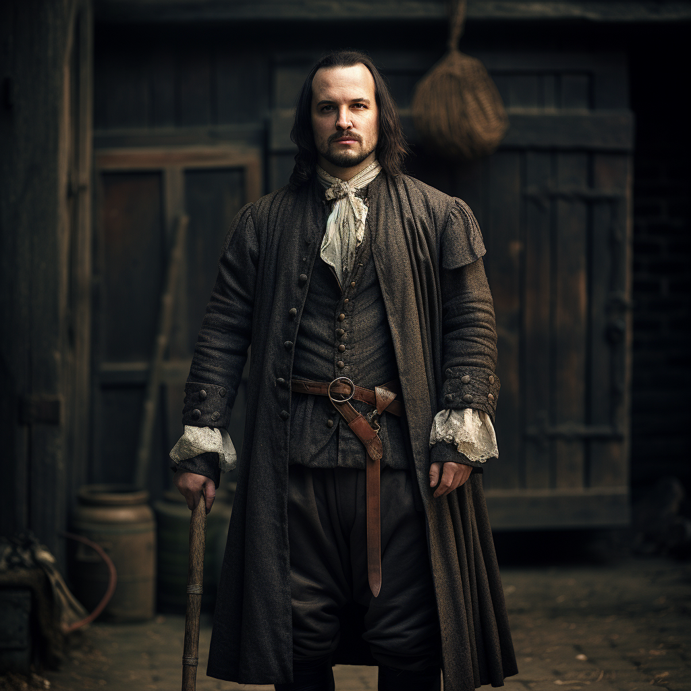

# Connor

- :octicons-info-24:{ .lg .middle } __Biographical Information__

    A [Sembaran](<../../gazetteer/greater-sembara/sembara/sembara.md>) [human](<../../species/children-of-divine-creation/humans/humans.md>) (he/him)  
    Born DR 1684 (65 years old)  
    Guardsman of the Asineau Manor Guard  
    { .bio }

    Based in [Asineau](<../../gazetteer/greater-sembara/sembara/barony-of-aveil/cleenseau-region/asineau.md>), the [Manor of Asineau](<../../gazetteer/greater-sembara/sembara/barony-of-aveil/cleenseau-region/manor-of-asineau.md>), the [Barony of Aveil](<../../gazetteer/greater-sembara/sembara/barony-of-aveil/barony-of-aveil.md>)

{align="right"; width="320"}Connor grew up in Asineau, and his family is still around. He was enthusiastic about carrying out [Lord Valbert's](<./lorin-valbert.md>) orders, and the word around the village is that people thought he was a little bit in love with [Isolde](<./isolde.md>) and was always trying to impress her by copying what she did. He comes across as pretty average in every way, and his wife is often snide to him and he is nasty to her. His younger sister has fond memories of him as a kid though, and tells a story of how he heroically fended off three stray hungry wolves from a pack of village children playing in the woodlot, but worries that man is gone.
