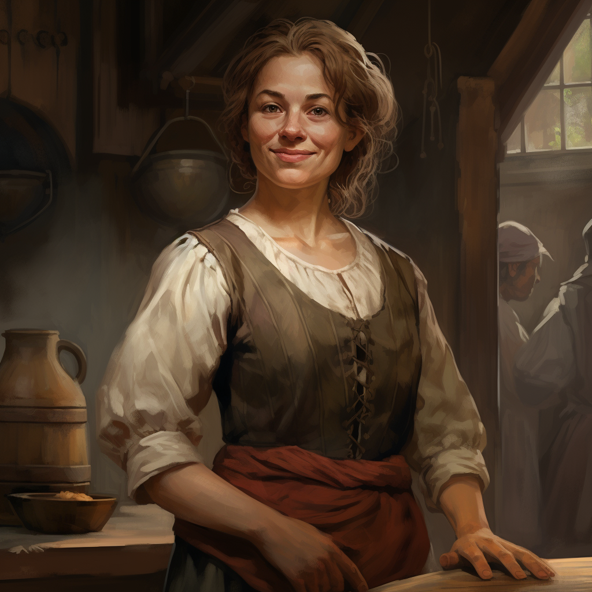

# Constance Farnham

- :octicons-info-24:{ .lg .middle } __Biographical Information__

    A [Sembara](<../../gazetteer/greater-sembara/sembara/sembara.md>) [human](<../../species/children-of-divine-creation/humans/humans.md>) (she/her)  
    Proprietor of [The River's Blessing](<../../gazetteer/greater-sembara/sembara/barony-of-aveil/cleenseau-region/cleenseau/the-river-s-blessing.md>)  
    { .bio }

    Based in [Cleenseau](<../../gazetteer/greater-sembara/sembara/barony-of-aveil/cleenseau-region/cleenseau/cleenseau.md>), the [Manor of Cleenseau](<../../gazetteer/greater-sembara/sembara/barony-of-aveil/cleenseau-region/manor-of-cleenseau.md>), the [Barony of Aveil](<../../gazetteer/greater-sembara/sembara/barony-of-aveil/barony-of-aveil.md>)

{align="right"; width="320"}The innkeeper of [The River's Blessing](<../../gazetteer/greater-sembara/sembara/barony-of-aveil/cleenseau-region/cleenseau/the-river-s-blessing.md>) along with her large family.