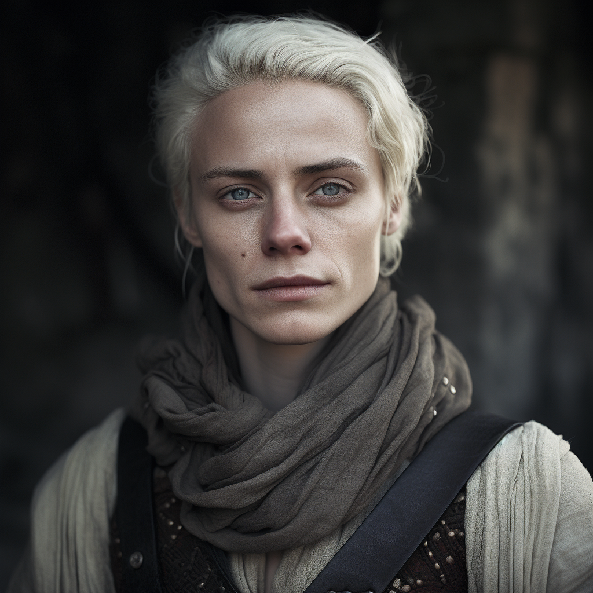

# El

- :octicons-info-24:{ .lg .middle } __Biographical Information__

    A [Sembaran](<../../gazetteer/greater-sembara/sembara/sembara.md>) [human](<../../species/humans/humans.md>) (they/them)  
    Born DR 1683 (66 years old)  
    { .bio }

    Originally from: Unknown
    Based in [Asineau](<../../gazetteer/greater-sembara/sembara/barony-of-aveil/cleenseau-region/asineau.md>), the [Manor of Asineau](<../../gazetteer/greater-sembara/sembara/barony-of-aveil/cleenseau-region/manor-of-asineau.md>), the [Barony of Aveil](<../../gazetteer/greater-sembara/sembara/barony-of-aveil/barony-of-aveil.md>)

{align="right"; width="320"}A disciple of the Wyrdling, recently blessed with several miracles. 
