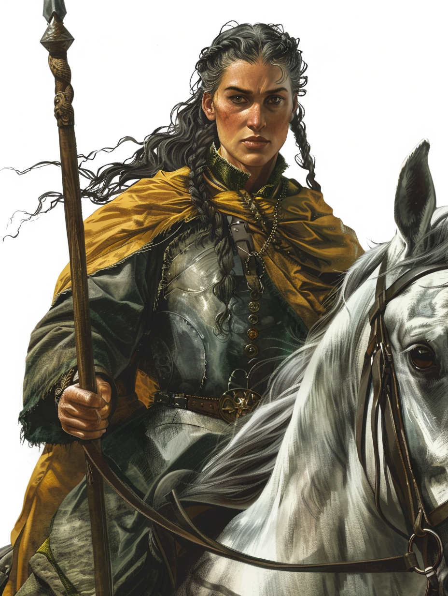

# Elizabeth of Cassen

- :octicons-info-24:{ .lg .middle } __Biographical Information__

    A [Sembaran](<../../gazetteer/greater-sembara/sembara/sembara.md>) [human](<../../species/children-of-divine-creation/humans/humans.md>) (she/her)  
    { .bio }

    Originally from: [Champimont](<../../gazetteer/greater-sembara/sembara/barony-of-aveil/champimont.md>), the [Barony of Aveil](<../../gazetteer/greater-sembara/sembara/barony-of-aveil/barony-of-aveil.md>), [Sembara](<../../gazetteer/greater-sembara/sembara/sembara.md>)
    Based in [Cassen](<../../gazetteer/greater-sembara/sembara/barony-of-aveil/cassen.md>), the [Barony of Aveil](<../../gazetteer/greater-sembara/sembara/barony-of-aveil/barony-of-aveil.md>), [Sembara](<../../gazetteer/greater-sembara/sembara/sembara.md>)

{align="right"; width="420"}A middle aged woman, who became a solider in her later life. She worked for the lord of [Cassen](<../../gazetteer/greater-sembara/sembara/barony-of-aveil/cassen.md>) until the Undead Attacks in Sembara decimated her village.

Her story is here.

