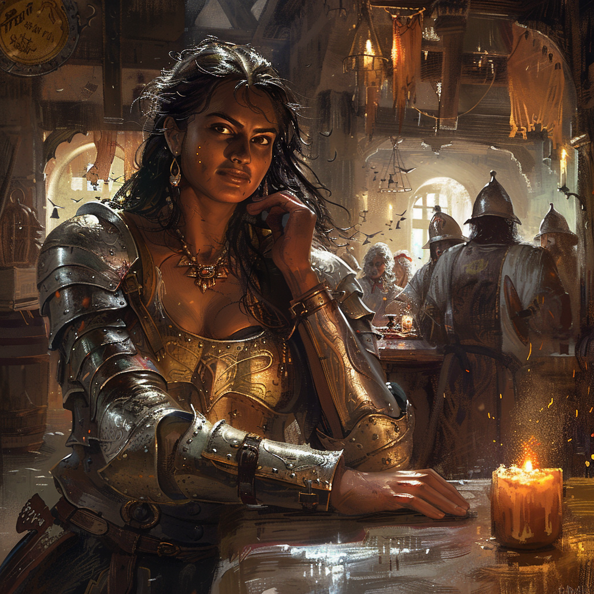

# Emilie
:speaker:{ .middle } *(Ay-mee-lee)*  

- :octicons-info-24:{ .lg .middle } __Biographical Information__

    A [human](<../../species/humans/humans.md>) (she/her)  
    Member of [The Rangers](<../../groups/the-rangers.md>)  
    { .bio }

    Originally from: Unknown

:octicons-location-24:{ .lg .middle } Last known location (as of January 14th, 1720): [Eftly](<../../gazetteer/greater-sembara/sembara/barony-of-aveil/eftly.md>), the [Barony of Aveil](<../../gazetteer/greater-sembara/sembara/barony-of-aveil/barony-of-aveil.md>), [Sembara](<../../gazetteer/greater-sembara/sembara/sembara.md>)

{align="right"; width="400"}A fighter.

