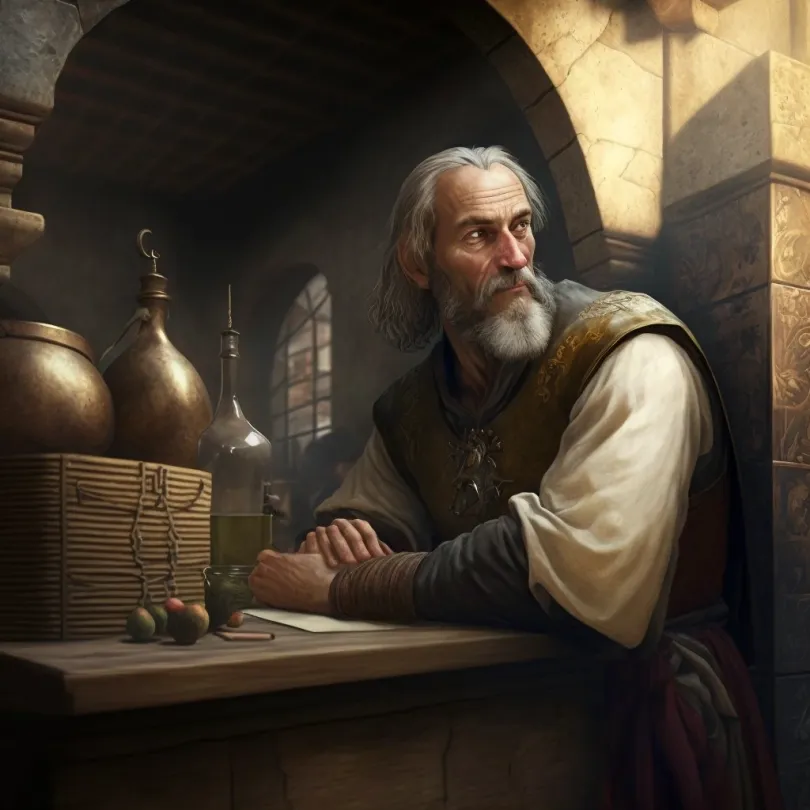

# Eremon

- :octicons-info-24:{ .lg .middle } __Biographical Information__

    A [Sembaran](<../../gazetteer/greater-sembara/sembara/sembara.md>) [human](<../../species/humans/humans.md>) (he/him)  
    Born DR 1663 (86 years old)  
    { .bio }

    Originally from: [Fellburn](<../../gazetteer/greater-sembara/sembara/heartlands/fellburn.md>), the [Duchy of Wisford](<../../gazetteer/greater-sembara/sembara/heartlands/duchy-of-wisford.md>), [Sembara](<../../gazetteer/greater-sembara/sembara/sembara.md>)
    Based in [Cleenseau](<../../gazetteer/greater-sembara/sembara/barony-of-aveil/cleenseau-region/cleenseau/cleenseau.md>), the [Manor of Cleenseau](<../../gazetteer/greater-sembara/sembara/barony-of-aveil/cleenseau-region/manor-of-cleenseau.md>), the [Barony of Aveil](<../../gazetteer/greater-sembara/sembara/barony-of-aveil/barony-of-aveil.md>)

:octicons-location-24:{ .lg .middle } Currently in [Embry](<../../gazetteer/greater-sembara/sembara/heartlands/embry.md>), [Sembara](<../../gazetteer/greater-sembara/sembara/sembara.md>)

A newcomer to town and acolyte of the Night Queen. Eremon is well-travelled and a personal friend of [Rosalind's](<./rosalind-essford.md>). He walks with a pronounced limp.  He was from [Fellburn](<../../gazetteer/greater-sembara/sembara/heartlands/fellburn.md>) originally and left shortly after [Cece I](<../historical-figures/sembaran-royalty/cece-i.md>) died. What he has been doing for the last seven years is not clear.

