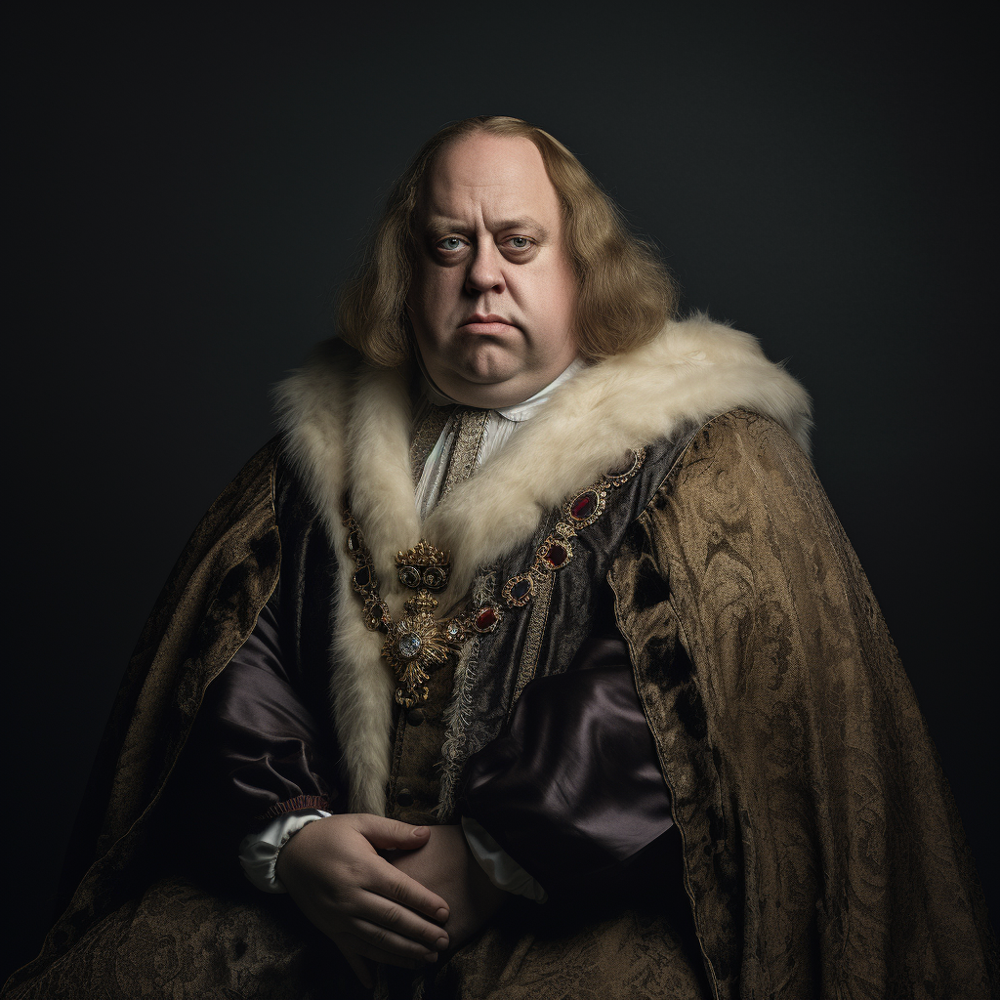

# Lord Erick Murtha

- :octicons-info-24:{ .lg .middle } __Biographical Information__

    A [Sembaran](<../../gazetteer/greater-sembara/sembara/sembara.md>) [human](<../../species/humans.md>) (he/him)  
    Born DR 1671 (78 years old)  
    Lord of the [Manor of Beury](<../../gazetteer/greater-sembara/sembara/barony-of-aveil/cleenseau-region/manor-of-beury.md>)  
    { .bio }

    Based in [Beury](<../../gazetteer/greater-sembara/sembara/barony-of-aveil/cleenseau-region/beury.md>), the [Manor of Beury](<../../gazetteer/greater-sembara/sembara/barony-of-aveil/cleenseau-region/manor-of-beury.md>), the [Barony of Aveil](<../../gazetteer/greater-sembara/sembara/barony-of-aveil/barony-of-aveil.md>)

{align="right"; width="320"}The lord of the manorial town of [Beury](<../../gazetteer/greater-sembara/sembara/barony-of-aveil/cleenseau-region/beury.md>), a vassal of the [Baron of Aveil](<../../gazetteer/greater-sembara/sembara/barony-of-aveil/barony-of-aveil.md>). He is dedicated to his manor and well-liked in the region.

His father, Philip Murtha was especially hard-working and as a young man he often struggled to live up to his father's reputation. 