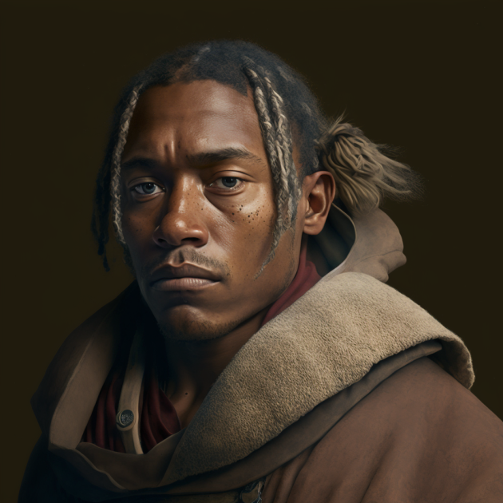

# Guy De Varan
>[!info]+ Biographical Info
> A [Sembaran](<../../gazetteer/greater-sembara/sembara/sembara.md>) [human](<../../species/humans/humans.md>) (he/him)
> 
>> 
>> 

A traveler and caravan expediter, he is relatively well-known along [Bandit's Way](<../../gazetteer/greater-sembara/roads/bandit-s-way.md>) as a man who can help find guards and organize supplies. The de Varan family is well-known in [Maseau](<../../gazetteer/greater-sembara/duchy-of-maseau/duchy-of-maseau.md>) and was originally from far southern [Isingue](<../../gazetteer/istaros-watershed/isingue.md>) before the Great War. 

