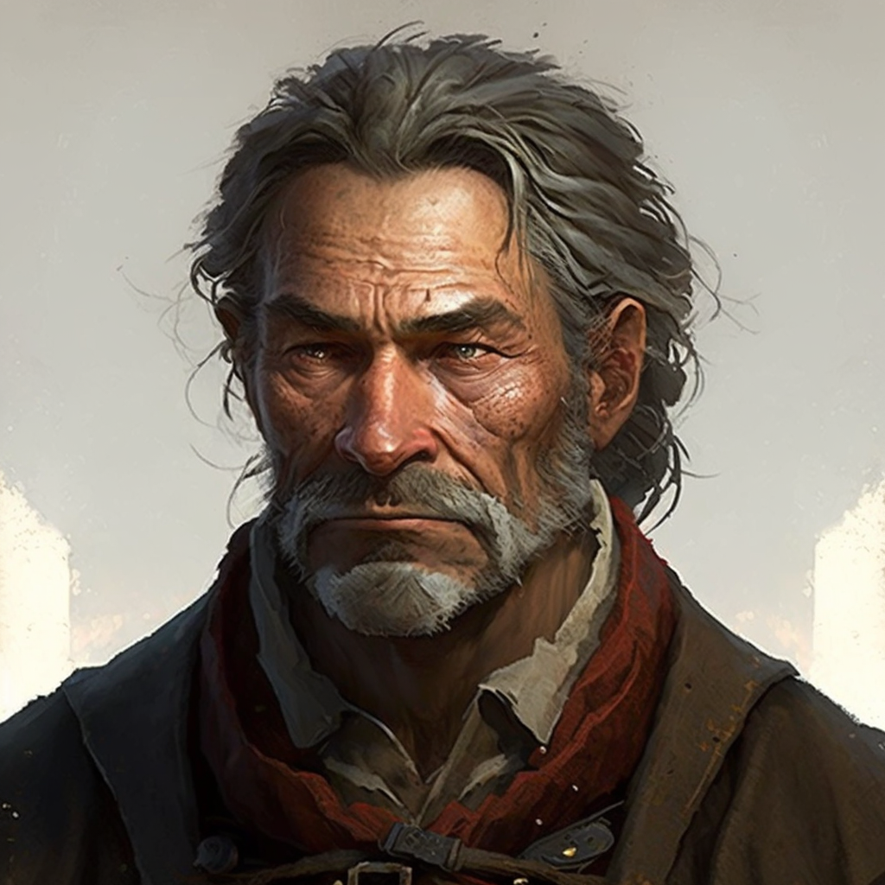

# Hugh Darrow

- :octicons-info-24:{ .lg .middle } __Biographical Information__

    A [Sembaran](<../../gazetteer/greater-sembara/sembara/sembara.md>) [human](<../../species/humans.md>) (he/him)  
    Born DR 1665 (84 years old)  
    { .bio }

    Based in [Taviose](<../../gazetteer/greater-sembara/sembara/barony-of-aveil/cleenseau-region/taviose.md>), the [Manor of Cleenseau](<../../gazetteer/greater-sembara/sembara/barony-of-aveil/cleenseau-region/manor-of-cleenseau.md>), the [Barony of Aveil](<../../gazetteer/greater-sembara/sembara/barony-of-aveil/barony-of-aveil.md>)

{align="right"; width="320"}A charcoal maker in Taviose, and the son of [Remy Darrow](<./remy-darrow.md>). He was one of the leaders of the villagers during the [Cleenseau Spider Attacks](<../../events/1700s/1719/10/cleenseau-spider-attacks.md>).

