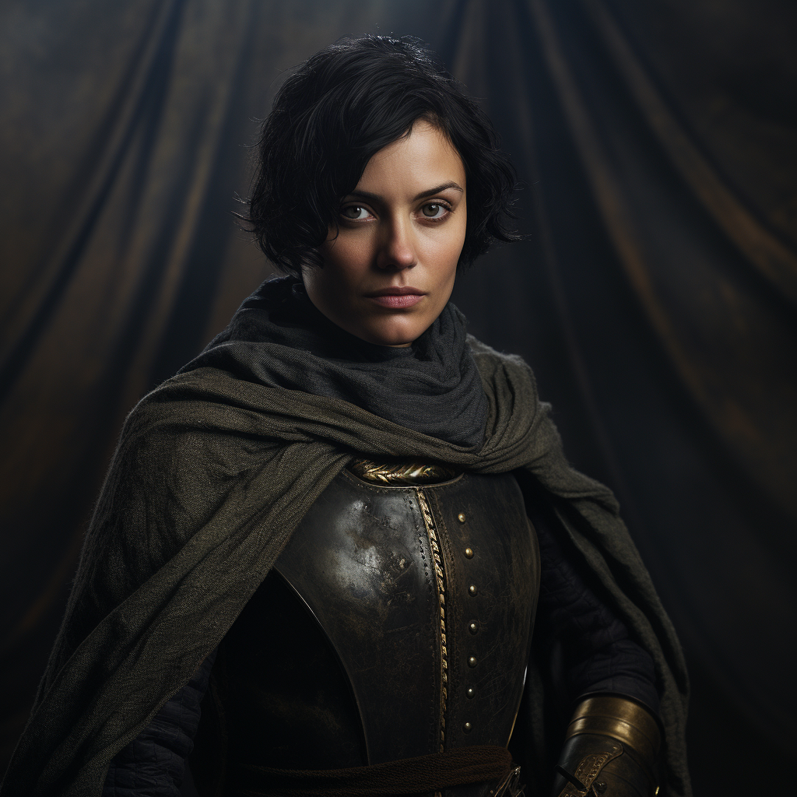

# Captain Ida Rosfeld

- :octicons-info-24:{ .lg .middle } __Biographical Information__

    A [Sembaran](<../../gazetteer/greater-sembara/sembara/sembara.md>) [human](<../../species/humans/humans.md>) (she/her)  
    Born DR 1687 (62 years old)  
    Captain of the [Army Garrison of Cleenseau](<../../groups/sembaran-army/army-garrison-of-cleenseau.md>) (since DR 1718)  
    Advisor of the [Lord's Council of Cleenseau](<../../gazetteer/greater-sembara/sembara/barony-of-aveil/cleenseau-region/cleenseau/lord-s-council-of-cleenseau.md>)  
    { .bio }

    Based in [Cleenseau](<../../gazetteer/greater-sembara/sembara/barony-of-aveil/cleenseau-region/cleenseau/cleenseau.md>), the [Manor of Cleenseau](<../../gazetteer/greater-sembara/sembara/barony-of-aveil/cleenseau-region/manor-of-cleenseau.md>), the [Barony of Aveil](<../../gazetteer/greater-sembara/sembara/barony-of-aveil/barony-of-aveil.md>)

{align="right"; width="320"}Ida is the captain of the [Cleenseau Garrison](<../../groups/sembaran-army/army-garrison-of-cleenseau.md>) of the [Army of the West](<../../groups/sembaran-army/army-of-the-west.md>). She is a no-nonsense commander who respects very few people other than [Rosalind Essford](<./rosalind-essford.md>) and is known for her sharp tongue.