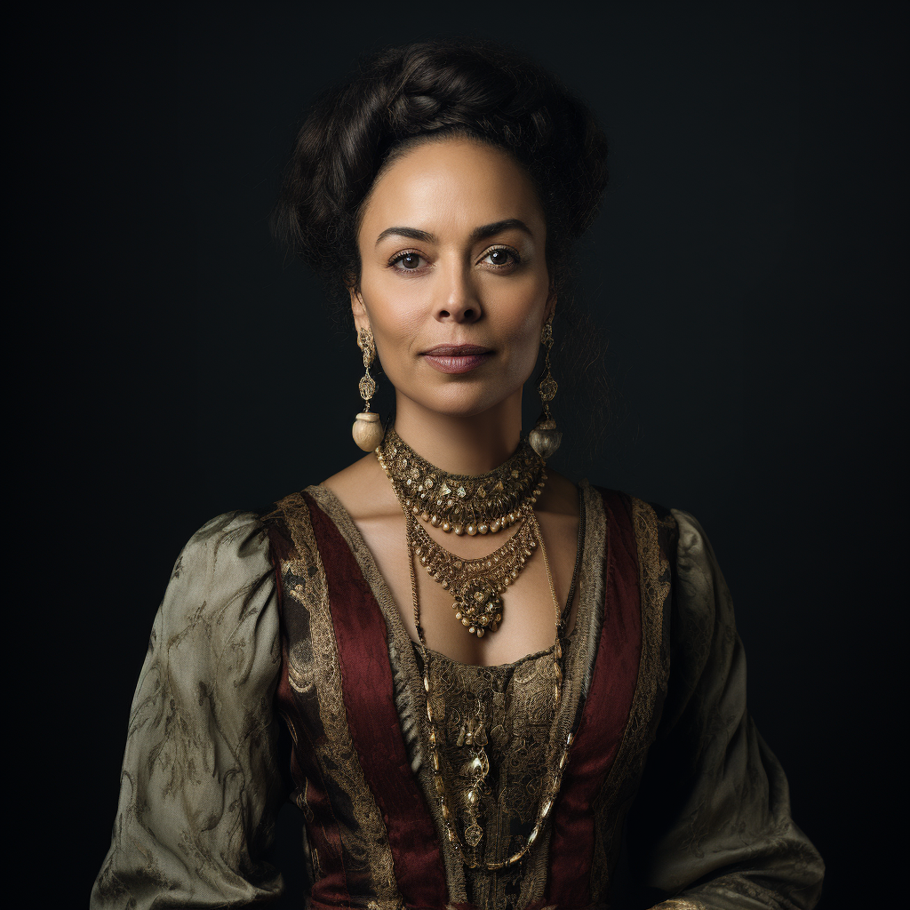

# Baroness Isabeau D'Aslain

- :octicons-info-24:{ .lg .middle } __Biographical Information__

    A [Sembaran](<../../gazetteer/greater-sembara/sembara/sembara.md>) [human](<../../species/children-of-divine-creation/humans/humans.md>) (she/her), of the [d'Aslains](<../../groups/sembaran-noble-houses/d-aslains.md>)  
    Born DR 1672 (77 years old)  
    Baroness of the [Barony of Aveil](<../../gazetteer/greater-sembara/sembara/barony-of-aveil/barony-of-aveil.md>) (since April 1719)  
    { .bio }

    Originally from: [Aslain](<../../gazetteer/greater-sembara/sembara/barony-of-aveil/aslain.md>), the [Barony of Aveil](<../../gazetteer/greater-sembara/sembara/barony-of-aveil/barony-of-aveil.md>), [Sembara](<../../gazetteer/greater-sembara/sembara/sembara.md>)
    Based in [Veltor](<../../gazetteer/greater-sembara/sembara/barony-of-aveil/veltor.md>), the [Barony of Aveil](<../../gazetteer/greater-sembara/sembara/barony-of-aveil/barony-of-aveil.md>), [Sembara](<../../gazetteer/greater-sembara/sembara/sembara.md>)

{align="right"; width="320"}The baroness of the [Barony of Aveil](<../../gazetteer/greater-sembara/sembara/barony-of-aveil/barony-of-aveil.md>). 

