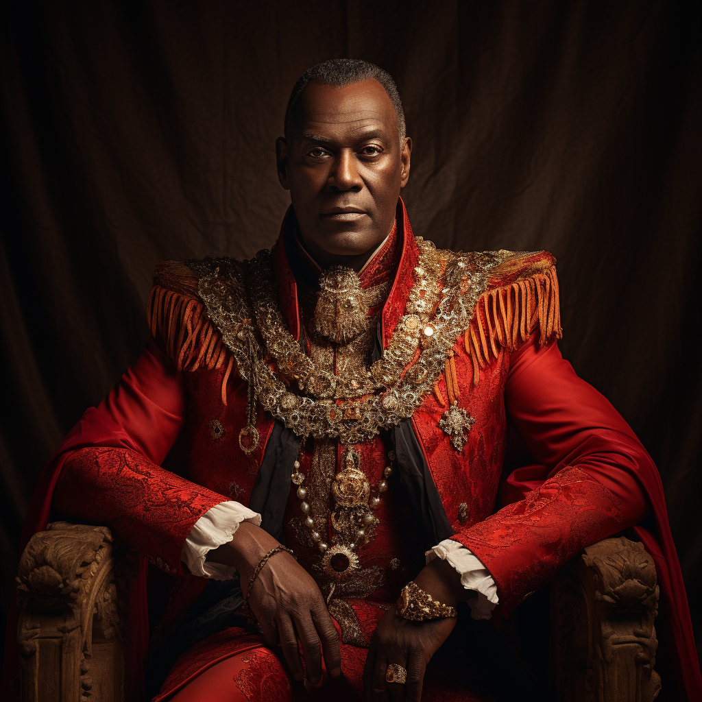

# Jacques Bellemont

- :octicons-info-24:{ .lg .middle } __Biographical Information__

    A [Sembaran](<../../gazetteer/greater-sembara/sembara/sembara.md>) [human](<../../species/humans.md>) (he/him)  
    Born DR 1659 (90 years old)  
    Duke of the [Duchy of Wisford](<../../gazetteer/greater-sembara/sembara/heartlands/duchy-of-wisford.md>) (since DR 1700)  
    { .bio }

    Based in the [Duchy of Wisford](<../../gazetteer/greater-sembara/sembara/heartlands/duchy-of-wisford.md>), [Sembara](<../../gazetteer/greater-sembara/sembara/sembara.md>)

{align="right"; width="320"}The Duke of Wisford is energetic for his age, and is an active campaigner and astute political observer. 