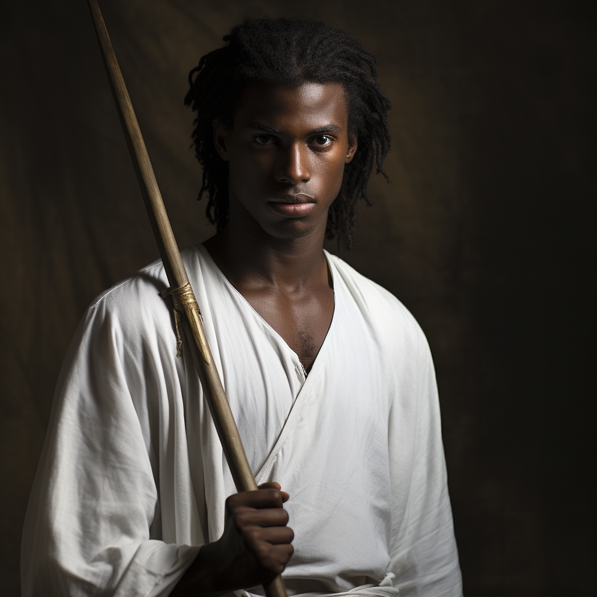

# Jean-Luc D'Aslain

- :octicons-info-24:{ .lg .middle } __Biographical Information__

    A [Sembaran](<../../gazetteer/greater-sembara/sembara/sembara.md>) [human](<../../species/humans/humans.md>) (he/him)  
    Born DR 1690 (59 years old)  
    { .bio }

    Originally from: [Aslain](<../../gazetteer/greater-sembara/sembara/barony-of-aveil/aslain.md>), the [Barony of Aveil](<../../gazetteer/greater-sembara/sembara/barony-of-aveil/barony-of-aveil.md>), [Sembara](<../../gazetteer/greater-sembara/sembara/sembara.md>)
    Based in [Beury](<../../gazetteer/greater-sembara/sembara/barony-of-aveil/cleenseau-region/beury.md>), the [Manor of Beury](<../../gazetteer/greater-sembara/sembara/barony-of-aveil/cleenseau-region/manor-of-beury.md>), the [Barony of Aveil](<../../gazetteer/greater-sembara/sembara/barony-of-aveil/barony-of-aveil.md>)

{align="right"; width="320"}A disciple of the Father, splitting tie between [Dallet](<../../gazetteer/greater-sembara/sembara/barony-of-aveil/dallet.md>) and [Beury](<../../gazetteer/greater-sembara/sembara/barony-of-aveil/cleenseau-region/beury.md>). A cousin of the current baron, Isabeau d'Aslain.

