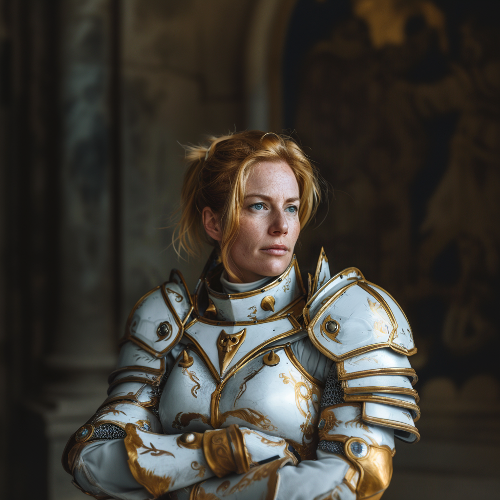

# Lenora Belles

- :octicons-info-24:{ .lg .middle } __Biographical Information__

    A [Sembaran](<../../gazetteer/greater-sembara/sembara/sembara.md>) [human](<../../species/humans.md>) (she/her)  
    { .bio }

    Based in [Embry](<../../gazetteer/greater-sembara/sembara/heartlands/embry.md>), [Sembara](<../../gazetteer/greater-sembara/sembara/sembara.md>)

A paladin of the Night Queen. Saved [Viepuck](<../pcs/cleenseau/viepuck.md>).

