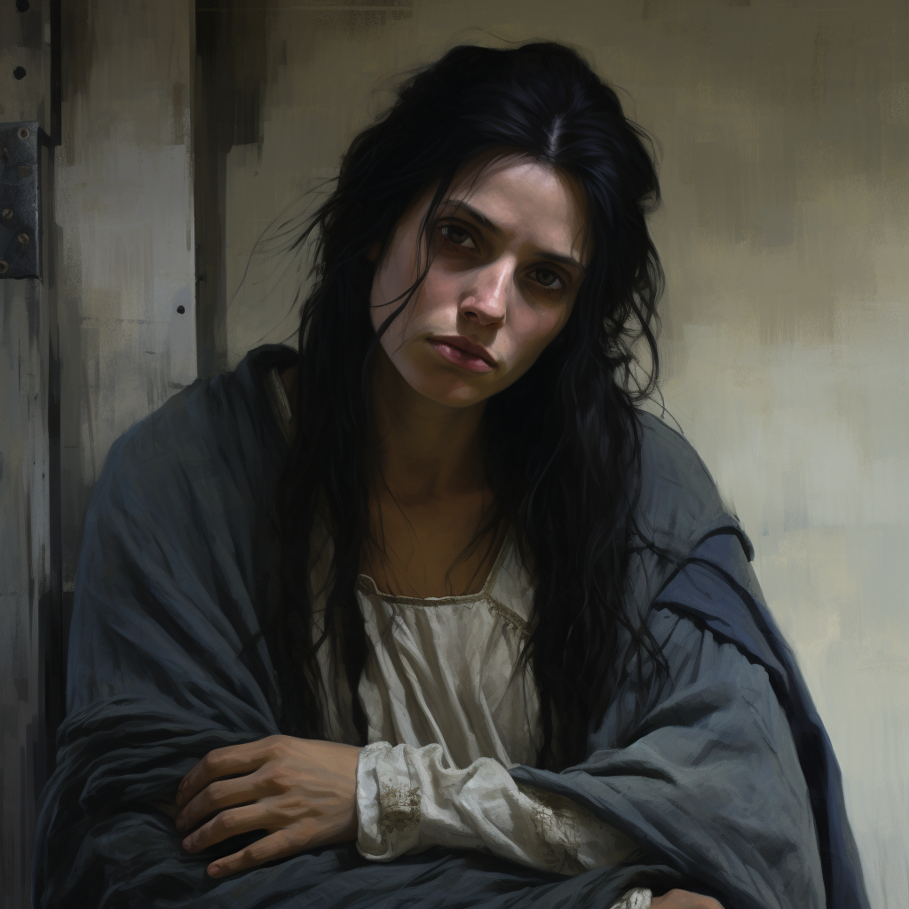

# Mabel of Cleenseau

- :octicons-info-24:{ .lg .middle } __Biographical Information__

    A [Sembaran](<../../gazetteer/greater-sembara/sembara/sembara.md>) [human](<../../species/humans/humans.md>)  
    Born DR 1693 (56 years old)  
    { .bio }

    Based in [Cleenseau](<../../gazetteer/greater-sembara/sembara/barony-of-aveil/cleenseau-region/cleenseau/cleenseau.md>), the [Manor of Cleenseau](<../../gazetteer/greater-sembara/sembara/barony-of-aveil/cleenseau-region/manor-of-cleenseau.md>), the [Barony of Aveil](<../../gazetteer/greater-sembara/sembara/barony-of-aveil/barony-of-aveil.md>)

{align="right"; width="320"}The granddaughter of [Nicholas the Beggar](<./nicholas-the-beggar.md>), her family died in a winter illness in 1702, and for a while she was a scullery maid at the [Essford Manor](<../../gazetteer/greater-sembara/sembara/barony-of-aveil/cleenseau-region/cleenseau/essford-manor.md>). But sleeping in the kitchens gave her nightmares, she said, of bones and she left after a few years. Always a bit of a loner, she prefers to sleep outside, and ended up living with and taking care of her grandfather in Beggar's Way. She eked out a living for the two of them fishing and gathering herbs for [Alain LeBouillon](<./alain-lebouillon.md>), and learned the lands around [Cleenseau](<../../gazetteer/greater-sembara/sembara/barony-of-aveil/cleenseau-region/cleenseau/cleenseau.md>) well. She has a fierce streak and a strong temper, and has not done well with steady employment.

During the [Battle Against Wakog](<../../events/1700s/1719/12/battle-against-wakog.md>) she volunteered to help scout.
