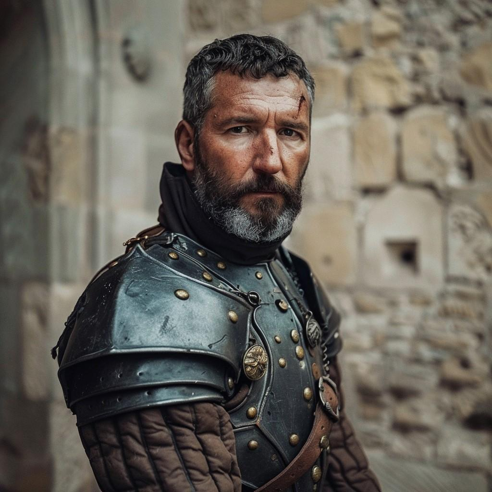

# Marcel Desrosiers

- :octicons-info-24:{ .lg .middle } __Biographical Information__

    A [Sembaran](<../../gazetteer/greater-sembara/sembara/sembara.md>) [human](<../../species/children-of-divine-creation/humans/humans.md>) (he/him)  
    Captain of the Duke's Guard of the [Duchy of Wisford](<../../gazetteer/greater-sembara/sembara/heartlands/duchy-of-wisford.md>)  
    { .bio }

    Based in the [Duchy of Wisford](<../../gazetteer/greater-sembara/sembara/heartlands/duchy-of-wisford.md>), [Sembara](<../../gazetteer/greater-sembara/sembara/sembara.md>)

{align="right"; width="420"}
