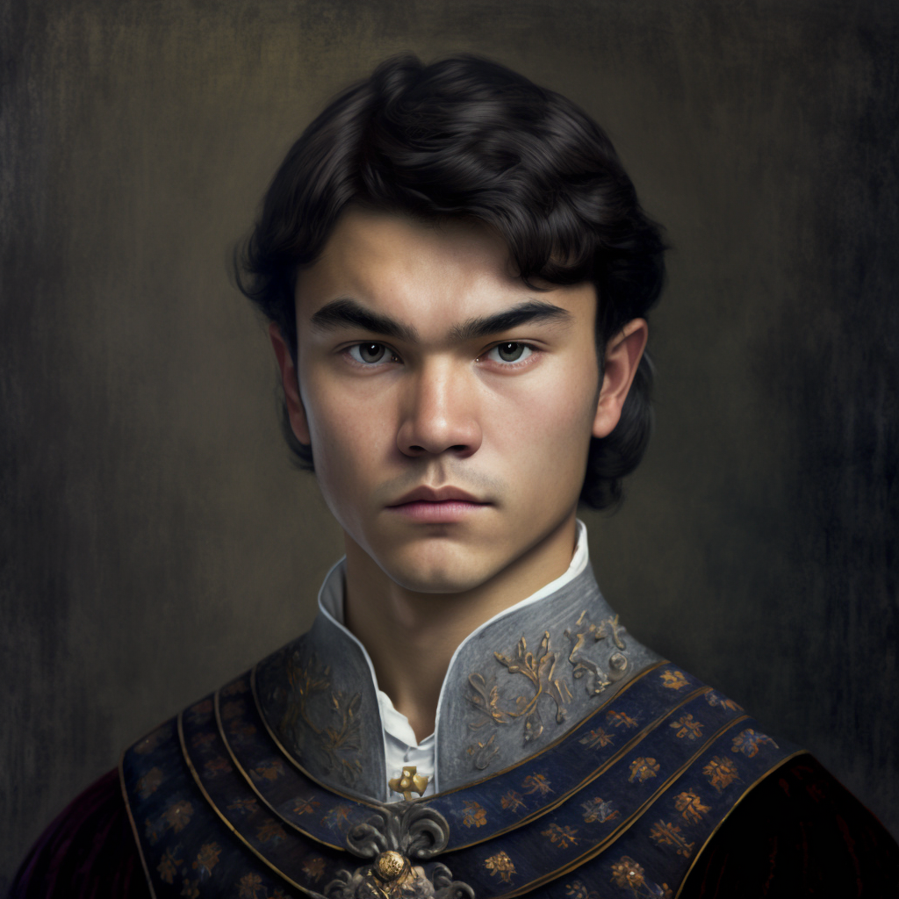

# Matteo Ausson

- :octicons-info-24:{ .lg .middle } __Biographical Information__

    A [Sembaran](<../../gazetteer/greater-sembara/sembara/sembara.md>) [human](<../../species/humans/humans.md>) (he/him)  
    Born DR 1698 (51 years old)  
    { .bio }

{align="right"; width="320"}One of the sons of [Arnaud Ausson](<./arnaud-ausson.md>), something of a ne'er-do-well. Rumored to have been the lover of [Rinault](<./rinault-essford.md>) in the summer of 1719, and still hangs around [Rinault](<./rinault-essford.md>) and his cronies. Also rumored to have been involved in the death of his sister Lizette when he was 10, but no one knows the details.

Full of swagger and bravado on the outside, at least.